# 🚗 광고 따라 만들기 · 제네시스 GV80

광고 도우미와 대화해서 기획하고, Flow에서 이미지와 **멀티샷 영상**을 만들고, CapCut에서 이어 붙여 20초 자동차 광고를 완성합니다. 위에서부터 순서대로 따라 하세요.

<video src="media/gv80_final.mp4" poster="media/gv80_final_poster.jpg" controls playsinline preload="metadata"></video>
<p class="cap">완성본 · 20초 · 16:9</p>

> 🎬 **결과물** 20초 · 16:9 · 멀티샷 클립 9개에서 컷 15개 + BI 엔딩<br>
> **도구** 광고 도우미(Gemini Gem) → Google Flow → CapCut<br>
> **크레딧** 영상 90 (6초 클립 9개, 무료 계정 2개) · 이미지 0

## 0. 시작 전 준비

- 광고 도우미: [gemini.google.com/gem/c3a9e0c2d5cd](https://gemini.google.com/gem/c3a9e0c2d5cd)
- Google Flow: [labs.google/fx/tools/flow](https://labs.google/fx/tools/flow)
- CapCut PC 버전
- 제품 **공식 사진 2장** (가로 1000px 이상) — 이번 예시는 제네시스 공식 홈페이지 GV80 사진

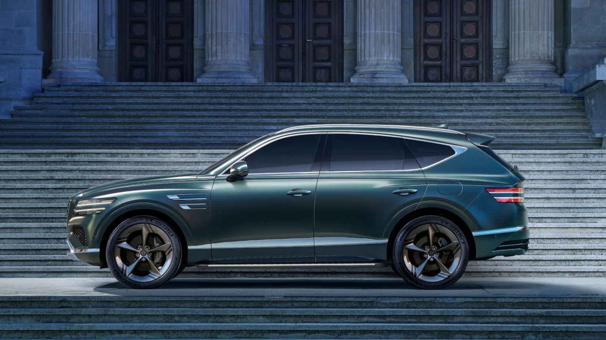

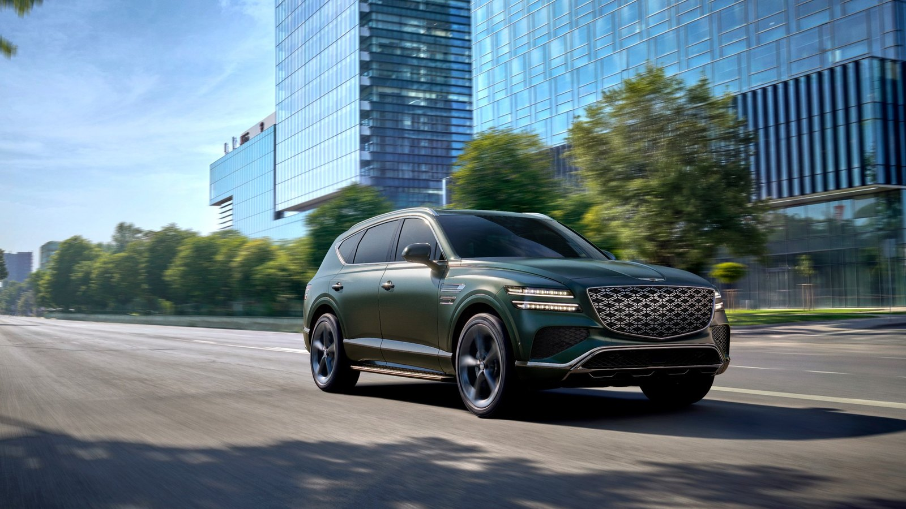
*첫 메시지에 같이 첨부한 공식 사진 2장*

**폴더 만들어 두기**

```text
GV80_광고/
 ├ 00_참고사진
 ├ 01_대화캡처
 ├ 02_시트
 ├ 03_그리드
 ├ 04_컷      cut01~cut09.jpg
 ├ 05_영상    clip01~clip09.mp4
 ├ 06_소리
 └ 08_완성본
```

> 💡 파일 이름에 번호를 맞춰 두면(cut01, clip01) Flow 검색과 CapCut 정리가 쉬워요. 인물은 실존 인물 사진 대신 도우미가 만든 **가상 인물**만 씁니다.

## 1. 도우미와 기획하기

### ① 첫 메시지 — 사진 2장을 같이 첨부

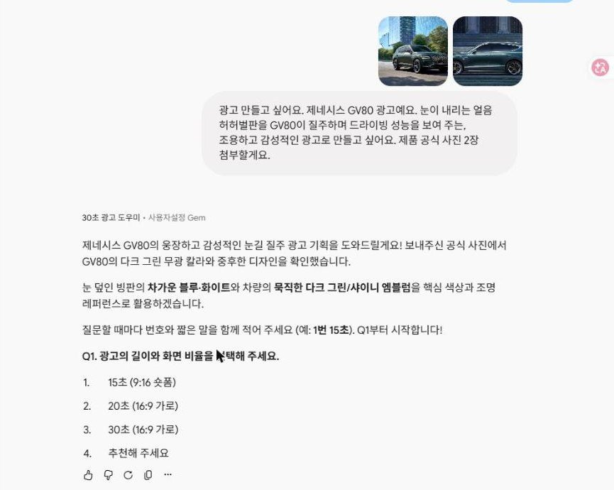

**보낸 말**

```text
광고 만들고 싶어요. 제네시스 GV80 광고예요. 눈이 내리는 얼음 허허벌판을 GV80이 질주하며 드라이빙 성능을 보여 주는, 조용하고 감성적인 광고로 만들고 싶어요. 제품 공식 사진 2장 첨부할게요.
```

### ② 질문에 번호로 답하기

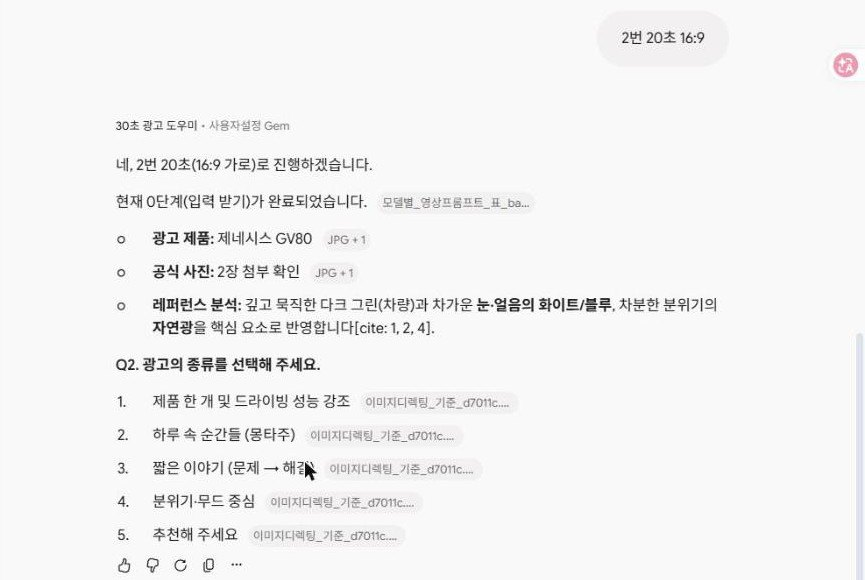
*도우미는 한 번에 하나씩 묻습니다. 번호 + 짧은 말로 답해요*

<details>
<summary>Q1\~Q5 실제로 보낸 답 펼치기</summary>

**Q1 길이 · 비율**

```text
2번 20초 16:9
```

**Q2 광고 종류**

```text
1번 제품 하나와 드라이빙 성능 강조, 분위기는 감성적으로
```

**Q3 주인공**

```text
2번 가상 인물 1명, 30대 한국인 남성 드라이버. 사실적인 실사 느낌으로
```

**Q4 그림 스타일**

```text
1번 실사 광고
```

**Q5 색 · 조명**

```text
1번 차가운 얼음 화이트와 깊은 다크 그린, 눈 내리는 흐린 낮
```

</details>

### ③ 기획 확인

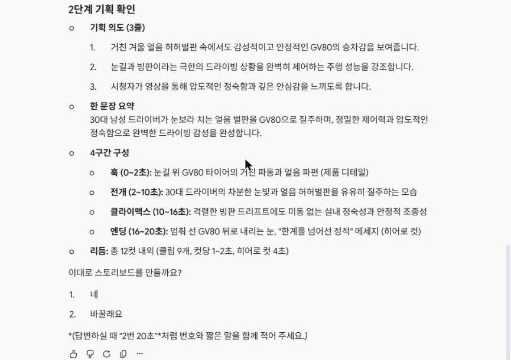
*기획 의도 · 한 문장 · 4구간(훅 → 전개 → 클라이맥스 → 엔딩) · 소리*

**보낸 말**

```text
1번 네
```

> 💡 고치고 싶으면 `2번 바꿀래요. ○○를 △△로`처럼 보내요.

### ④ 고정 문구와 시트 프롬프트 받기

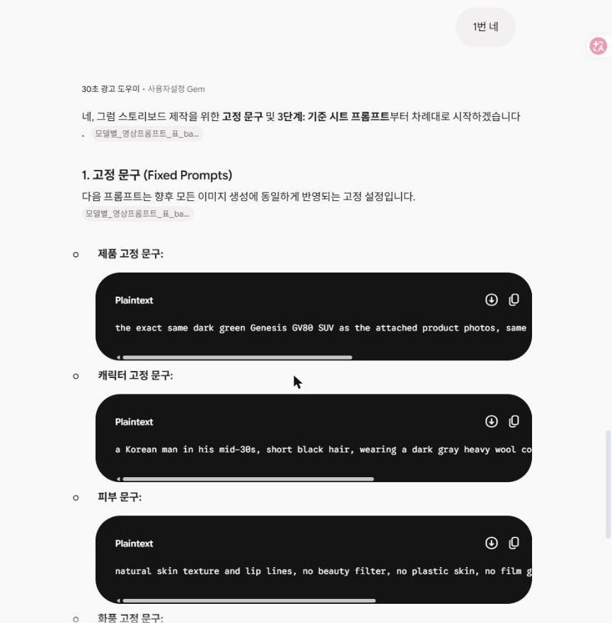
*모든 장면에 똑같이 들어갈 고정 문구 4개 + 제품 시트 · 인물 시트 프롬프트*

## 2. 기준 시트 만들기 (Flow 이미지)

시트는 모든 장면에서 차와 인물이 똑같이 나오게 하는 **기준 사진**입니다. Flow의 이미지 모델(Nano Banana 2.1)은 **크레딧이 들지 않아요**.

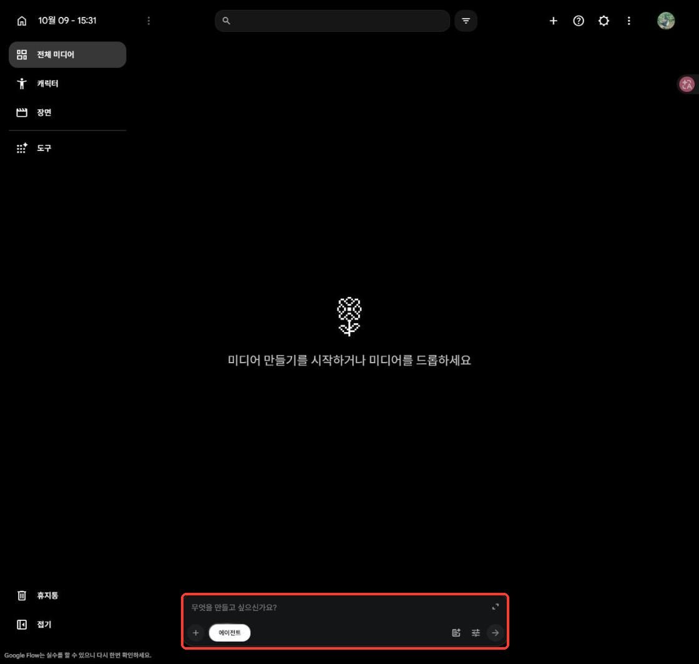
*Flow 첫 화면 → 새 프로젝트. 이름 옆 ⋮ → 이름 바꾸기*

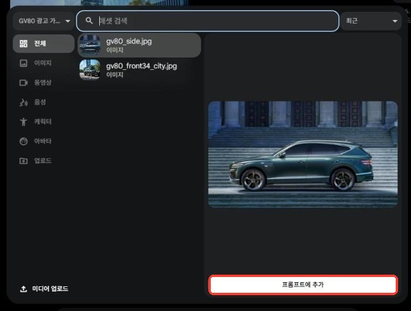
*입력창 + → 파일 이름 검색 → 프롬프트에 추가 (사진은 화면에 끌어다 놓으면 올라가요)*

**Flow에 보낸 말 · 제품 시트 (공식 사진 2장 첨부)**

```text
방금 올린 GV80 공식 사진 2장을 차량 참고 이미지로 써서, 아래 프롬프트로 1:1 이미지를 만들어 줘. 차의 모양·색·그릴·헤드램프·휠은 사진과 똑같아야 해.
Product reference sheet on a plain light gray seamless background: the exact same dark green Genesis GV80 SUV as the attached product photos, same badge, metallic finish, quad LED headlights and Crest Grille. Shown twice side by side: front three-quarter view and side profile view. Soft even studio lighting, crisp focus, no text.
```

**Flow에 보낸 말 · 인물 시트 (첨부 없음)**

```text
아래 프롬프트로 1:1 이미지 1장 만들어 줘.
Photorealistic character reference sheet on a plain light gray seamless background, high-end commercial photography, real photo, not an illustration: a Korean man in his mid-30s, short black hair, wearing a dark gray heavy wool coat and high-neck knit, calm and focused demeanor. Three views side by side: large face close-up, full body front view, full body side view. Same person in all views, natural proportions, not idealized, natural skin texture and lip lines, no beauty filter, no plastic skin, no film grain or over-sharpening, sharp brows and lashes. Soft even studio lighting, no text.
```

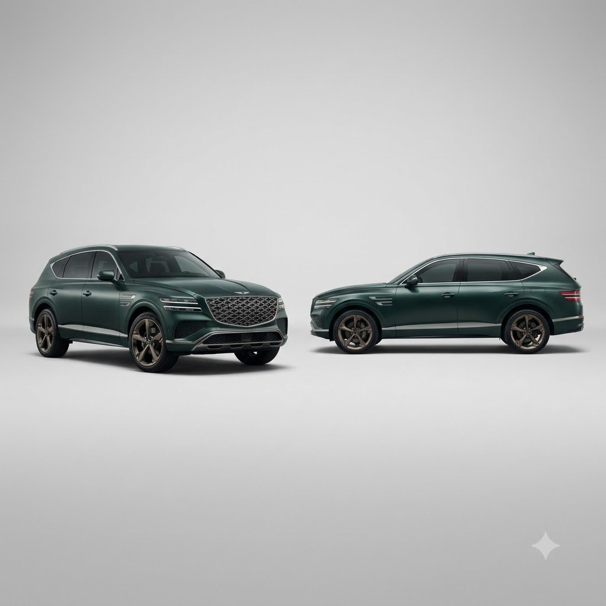

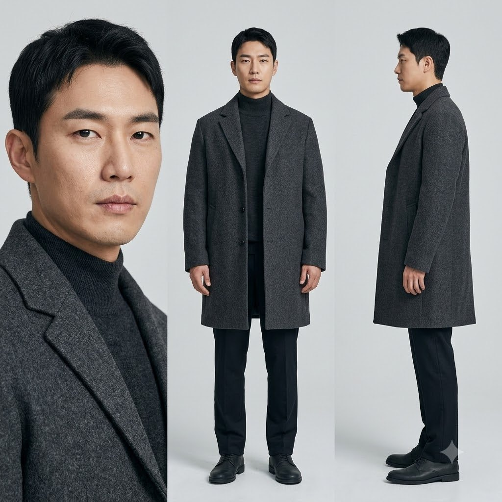
*완성된 제품 시트 · 인물 시트 → 02_시트에 저장 (결과 클릭 → 다운로드 → 1K)*

## 3. 스토리보드 그리드 만들기

**도우미에게**

```text
시트 2장 저장했어요. 4단계 그리드 프롬프트 주세요
```

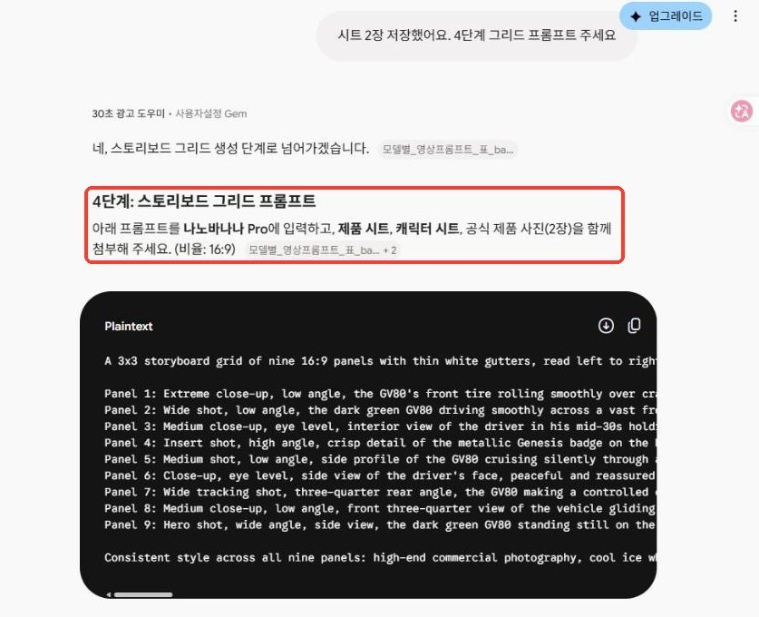
*도우미가 그리드 프롬프트(영어)와 9칸 구성표를 줍니다. 오른쪽 위 복사 버튼으로 복사*

**Flow에 보낸 말 (제품 시트 + 인물 시트 첨부)**

```text
첨부한 2장 중 첫 번째는 제품 시트(차량은 이것만 참고), 두 번째는 캐릭터 시트(얼굴·머리·옷만 참고)야. 아래 프롬프트로 16:9 이미지 1장 만들어 줘.
A 3x3 storyboard grid of nine 16:9 panels with thin white gutters, read left to right, top to bottom, showing a 20-second Genesis GV80 commercial in story order. The attached images are the product and character references: the exact same dark green Genesis GV80 SUV as the attached product photos, same badge, metallic finish, quad LED headlights and Crest Grille. The only person is a Korean man in his mid-30s with short black hair and a dark gray heavy wool coat; he always faces screen right. Each panel has one subject and one moment; the person or vehicle fills at least a third of the panel; simple uncluttered backgrounds of a frozen snowy wasteland with no signs, screens, or extra text; absolutely no written text or letters anywhere except the vehicle badge.

Panel 1: Extreme close-up, low angle, the GV80's front tire rolling smoothly over cracked blue ice, kicking up fine snow powder.
Panel 2: Wide shot, low angle, the dark green GV80 driving smoothly across a vast frozen white plain under an overcast winter sky.
Panel 3: Medium close-up, eye level, interior view of the driver in his mid-30s holding the leather steering wheel, calm and focused expression.
Panel 4: Insert shot, high angle, crisp detail of the metallic Genesis badge on the hood with light snow falling on it.
Panel 5: Medium shot, low angle, side profile of the GV80 cruising silently through a soft snowstorm, maintaining perfect stability.
Panel 6: Close-up, eye level, side view of the driver's face, peaceful and reassured, looking ahead through the clean windshield.
Panel 7: Wide tracking shot, three-quarter rear angle, the GV80 making a controlled curve on the ice, leaving clean tire tracks.
Panel 8: Medium close-up, low angle, front three-quarter view of the vehicle gliding smoothly toward the camera through gentle snowfall.
Panel 9: Hero shot, wide angle, side view, the dark green GV80 standing still on the quiet icy plain as snow falls softly, clean composition with empty space on the right.

Consistent style across all nine panels: high-end commercial photography, cool ice white and deep dark green tones, soft diffused winter daylight under overcast sky, shallow depth of field, crisp detail, clean brand-free finish, key light from top-left.
```

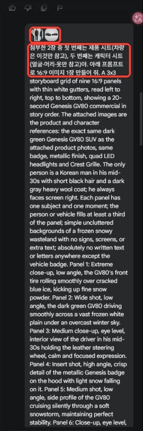

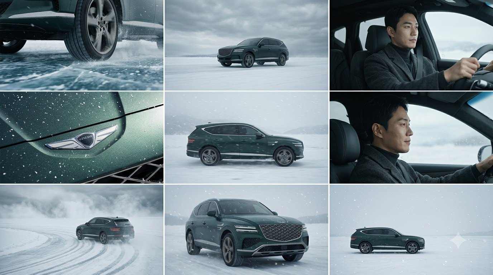
*완성된 9칸 그리드*

> ✅ **9칸 ○✕ 확인** 차와 얼굴이 같은지 · 글자가 생기지 않았는지 · 인물이 너무 작지 않은지. ✕인 칸이 있으면 그리드를 다시 만들어요.

## 4. 컷 9장 뽑기

**도우미에게**

```text
그리드 9칸 모두 ○예요. 5단계 컷 추출 프롬프트 주세요.
```

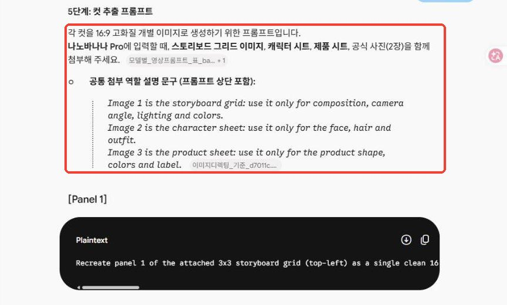
*첨부할 이미지 3장과 역할, 그 아래 Panel 1\~9 프롬프트*

**Flow에 보낸 말 (그리드 + 인물 시트 + 제품 시트 첨부)**

<details>
<summary>전체 메시지 펼치기 (프롬프트 9개 한 번에)</summary>

```text
첫 번째 첨부는 스토리보드 그리드(구도·앵글·빛·색만), 두 번째는 캐릭터 시트(얼굴·머리·옷만), 세 번째는 제품 시트(차량 형태·색·엠블럼만)야. 아래 9개 프롬프트로 16:9 이미지를 프롬프트마다 1장씩, 총 9장 만들어 줘.
[1] Recreate panel 1 of the attached 3x3 storyboard grid (top-left) as a single clean 16:9 frame: Extreme close-up, low angle, the GV80's front tire rolling smoothly over cracked blue ice, kicking up fine snow powder. The attached product sheet shows the exact dark green Genesis GV80 SUV with metallic finish and quad LED headlights. Cool ice white tones, soft diffused winter daylight under overcast sky, shallow depth of field, crisp detail, no text. Use grid only for composition and product sheet for vehicle details.
[2] Recreate panel 2 of the attached 3x3 storyboard grid (top-center) as a single clean 16:9 frame: Wide shot, low angle, the dark green GV80 driving smoothly across a vast frozen white plain under an overcast winter sky. Cool ice white and deep dark green tones, soft winter daylight, clean brand-free finish, no text. Use grid only for composition and product sheet for vehicle details.
[3] Recreate panel 3 of the attached 3x3 storyboard grid (top-right) as a single clean 16:9 frame: Medium close-up, eye level, interior view of a Korean man in his mid-30s with short black hair holding the leather steering wheel, calm and focused expression. The attached character sheet shows the exact driver wearing a dark gray heavy wool coat. Natural skin texture and lip lines, no beauty filter, no plastic skin, sharp brows and lashes, soft interior lighting, no text. Use grid for composition and character sheet for face and hair.
[4] Recreate panel 4 of the attached 3x3 storyboard grid (middle-left) as a single clean 16:9 frame: Insert shot, high angle, crisp detail of the metallic Genesis badge on the hood with light snow falling on it. The attached product sheet shows the exact same badge and dark green metallic paint finish. Crisp detail, shallow depth of field, no text. Use grid for composition and product sheet for badge detail.
[5] Recreate panel 5 of the attached 3x3 storyboard grid (center) as a single clean 16:9 frame: Medium shot, low angle, side profile of the dark green GV80 cruising silently through a soft snowstorm, maintaining perfect stability. Cool ice white tones, overcast light, clean composition, no text. Use grid for composition and product sheet for vehicle details.
[6] Recreate panel 6 of the attached 3x3 storyboard grid (middle-right) as a single clean 16:9 frame: Close-up, eye level, side view of the mid-30s Korean driver's face, peaceful and reassured, looking ahead through the clean windshield. Natural skin texture and lip lines, no beauty filter, sharp lashes, soft diffuse winter daylight, no text. Use grid for composition and character sheet for face.
[7] Recreate panel 7 of the attached 3x3 storyboard grid (bottom-left) as a single clean 16:9 frame: Wide tracking shot, three-quarter rear angle, the dark green GV80 making a controlled curve on the ice, leaving clean tire tracks. Cool ice white tones, smooth motion feel, no text. Use grid for composition and product sheet for vehicle details.
[8] Recreate panel 8 of the attached 3x3 storyboard grid (bottom-center) as a single clean 16:9 frame: Medium close-up, low angle, front three-quarter view of the dark green GV80 gliding smoothly toward the camera through gentle snowfall. Quad LED headlights softly glowing, crisp details, no text. Use grid for composition and product sheet for vehicle details.
[9] Recreate panel 9 of the attached 3x3 storyboard grid (bottom-right) as a single clean 16:9 frame: Hero shot, wide angle, side view, the dark green GV80 standing still on the quiet icy plain as snow falls softly, clean composition with empty space on the right. Soft diffused daylight, crisp details, no text. Use grid for composition and product sheet for vehicle details.
```

</details>

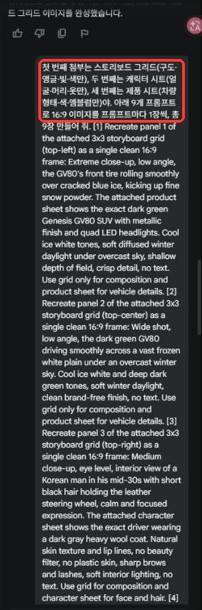

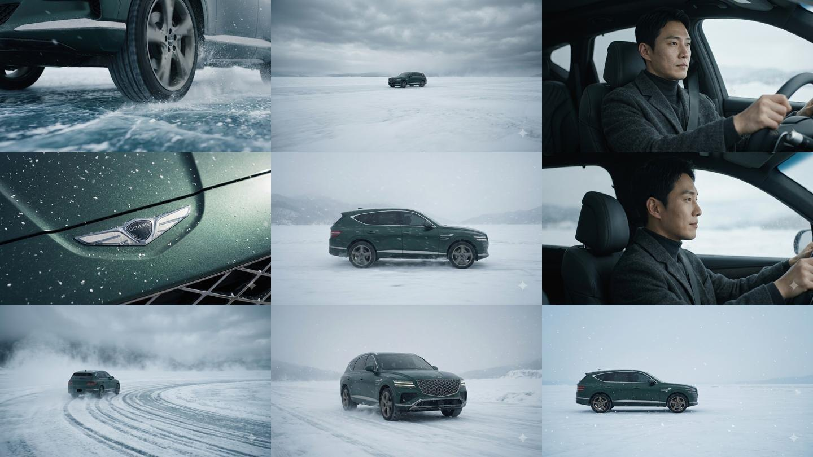
*결과 9장 → cut01\~cut09로 저장*

> 💡 보내기 전에 입력창 위 **썸네일 3개**가 다 보이는지 확인. 결과 카드 아래 '참고 이미지'로 무엇을 참고했는지 볼 수 있어요.

## 5. 멀티샷 영상 만들기

**컷 1장 = 6초 클립 1개.** 클립 안에서 약 3초에 샷이 한 번 바뀌어서, 컷 9장으로 서로 다른 샷 18개를 얻습니다.

<video src="media/gv80_ms05_example.mp4" poster="media/gv80_ms05_example_poster.jpg" controls playsinline preload="metadata"></video>
<p class="cap">예: 5번 클립 — 옆에서 같이 달리다가 3초에 바로 위 탑다운으로 전환</p>

### ① 도우미에게 멀티샷 프롬프트 받기

```text
1번 네. 컷 추출 중이에요. 6단계 영상 프롬프트 표와 편집표 주세요. 영상은 Flow Omni Flash 720p 멀티샷이에요.
```

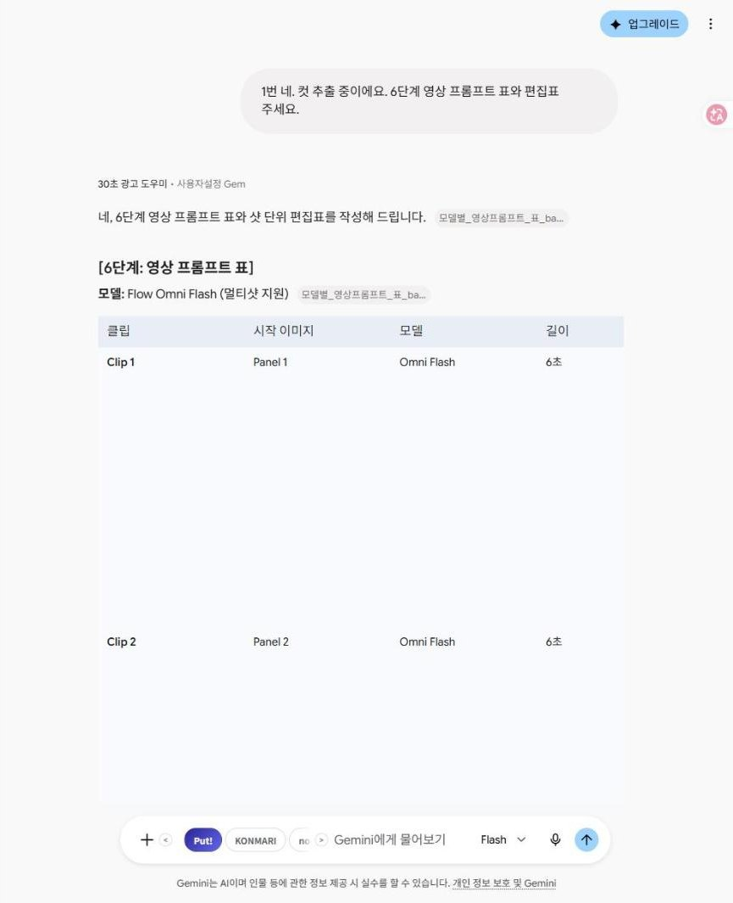
*도우미가 칸마다 클립 길이 · 크레딧 · 멀티샷 프롬프트를 표로 줍니다*

### ② 영상 설정

입력창 오른쪽 아래 설정 → **동영상 · 프레임 · 16:9 · Omni 1.1 Flash · 720p · 6초 · x1** → "생성 시 10 크레딧"

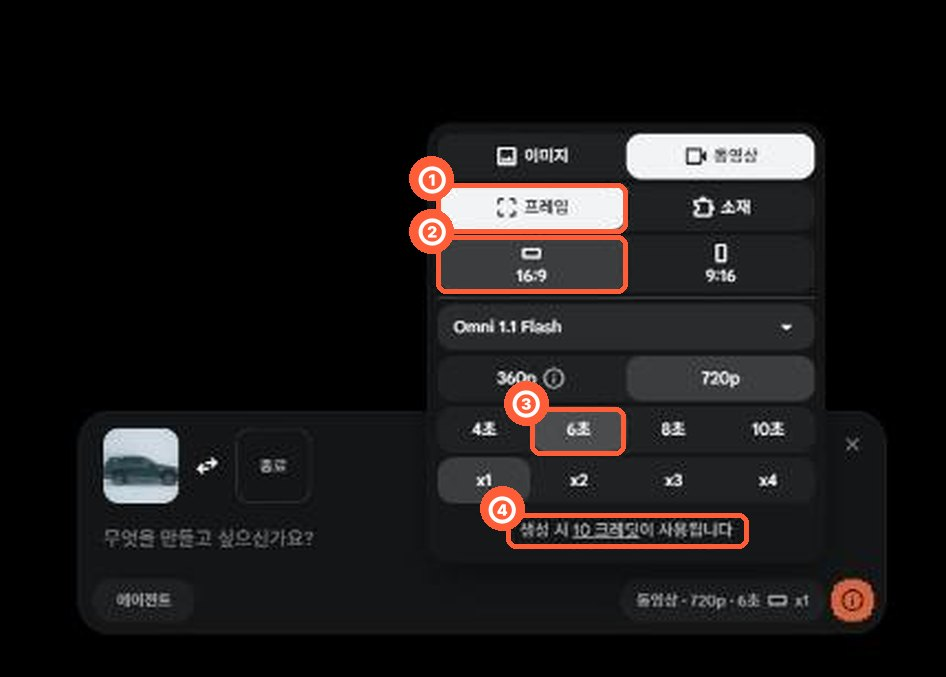
*동영상 → ① 프레임 ② 16:9 · Omni 1.1 Flash · 720p ③ 6초 → ④ 생성 시 10 크레딧*

> ⚠️ 계정에 따라 **소재**가 기본으로 켜져 있어요. 시작 이미지에서 출발하려면 꼭 **프레임**으로 바꿔요.

### ③ 시작 칸에 컷 넣기

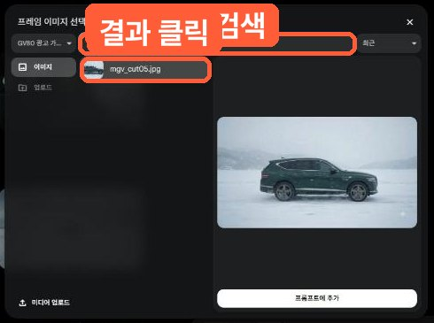
*입력창 '시작' 칸 → 검색창에 파일 이름 → 결과 클릭*

### ④ 프롬프트 붙여 넣고 생성

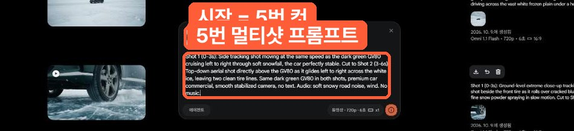
*시작 칸에 5번 컷, 아래에 5번 멀티샷 프롬프트 → 오른쪽 → 를 누르면 10크레딧이 쓰이고 생성 시작*

<details>
<summary>이 영상에 쓴 멀티샷 프롬프트 9개 펼치기</summary>

**클립 1 · 시작 cut01 · 타이어 클로즈업 → 뒤로 빠지며 차 전체**

```text
Shot 1 (0-3s): Ground-level extreme close-up tracking shot beside the front tire as it rolls over cracked blue ice, fine snow powder spraying in slow motion. Cut to Shot 2 (3-6s): Low-angle side tracking shot that slowly pulls back to reveal the whole dark green Genesis GV80 gliding across the frozen plain, a soft trail of snow mist behind it. Same dark green GV80 in both shots, premium car commercial, smooth stabilized camera, no text. Audio: soft tire crunch on ice, low wind. No music.
```

**클립 2 · 시작 cut02 · 멀리서 다가가는 드론 → 옆으로 지나가는 차**

```text
Shot 1 (0-3s): Slow aerial drone shot gliding forward and gently descending toward the small dark green GV80 driving across the vast white frozen plain under a heavy overcast sky. Cut to Shot 2 (3-6s): Low-angle front three-quarter medium shot, the camera trucks sideways as the GV80 drives past, fine snow swirling off the tires. Same dark green GV80 in both shots, premium car commercial, smooth stabilized camera, no text. Audio: distant wind, low engine hum. No music.
```

**클립 3 · 시작 cut03 · 운전자 쪽으로 다가가기 → 핸들 위 손**

```text
Shot 1 (0-3s): Slow dolly in toward the calm driver as he holds the steering wheel, soft winter light from the side window. Cut to Shot 2 (3-6s): Close-up of his hands resting lightly on the leather steering wheel, shallow depth of field, the snowy plain softly blurred through the windshield, slow lateral camera slide. Same man in the same dark gray wool coat, natural skin, premium car commercial, no text. Audio: hushed quiet cabin, faint tire hum. No music.
```

**클립 4 · 시작 cut04 · 엠블럼 매크로 → 헤드램프 초점 이동**

```text
Shot 1 (0-3s): Macro shot slowly sliding across the winged badge on the dark green hood as snowflakes land on the metallic paint. Cut to Shot 2 (3-6s): Extreme close-up of the slim quad LED headlight glowing softly through falling snow, slow rack focus from the snowflakes to the light. Same dark green GV80, the badge keeps its exact shape, no new text or letters, premium car commercial. Audio: gentle wind, soft snowfall. No music.
```

**클립 5 · 시작 cut05 · 옆에서 같이 달리기 → 바로 위에서 내려다보기**

```text
Shot 1 (0-3s): Side tracking shot moving at the same speed as the dark green GV80 cruising left to right through soft snowfall, the car perfectly stable. Cut to Shot 2 (3-6s): Top-down aerial shot directly above the GV80 as it glides left to right across the white ice, leaving two clean tire lines. Same dark green GV80 in both shots, premium car commercial, smooth stabilized camera, no text. Audio: soft snowy road noise, wind. No music.
```

**클립 6 · 시작 cut06 · 옆얼굴 천천히 다가가기 → 보닛 너머 시점**

```text
Shot 1 (0-3s): Very slow push in on the driver's calm side profile, he blinks slowly and breathes out, peaceful and reassured. Cut to Shot 2 (3-6s): Driver's point of view through the clean windshield over the dark green hood, the endless snowy plain gliding toward the camera, light snow drifting. Same man in the same dark gray wool coat, natural skin, premium car commercial, no text. Audio: very quiet cabin, muted outside wind. No music.
```

**클립 7 · 시작 cut07 · 뒤따라가는 코너링 → 공중에서 돌기**

```text
Shot 1 (0-3s): Wide tracking shot from behind as the dark green GV80 carves a smooth controlled arc on the ice, fine snow mist rising from the tires. Cut to Shot 2 (3-6s): High aerial shot slowly orbiting as the GV80 completes the curve, its tire tracks drawing a clean arc on the frozen surface. Same dark green GV80 in both shots, premium car commercial, smooth stabilized camera, no text. Audio: snow crunching under tires, wind. No music.
```

**클립 8 · 시작 cut08 · 정면으로 다가오는 차 → 옆을 스쳐 지나감**

```text
Shot 1 (0-3s): Low-angle slow push in as the dark green GV80 glides toward the camera through gentle snowfall, quad LED headlights glowing. Cut to Shot 2 (3-6s): Low-angle close tracking shot along the front of the car as it slowly passes the camera, the Crest Grille and headlights sliding through frame. Same dark green GV80 in both shots, premium car commercial, smooth stabilized camera, no text. Audio: smooth low engine glide, soft snow. No music.
```

**클립 9 · 시작 cut09 · 멈춘 차 옆 이동 → 크레인 업 와이드**

```text
Shot 1 (0-3s): Slow lateral dolly along the side of the dark green GV80 standing still on the quiet icy plain as snow falls softly. Cut to Shot 2 (3-6s): Slow crane up and pull back to an extreme wide shot, the GV80 small and perfectly still in the vast white plain, empty sky and space on the right. Same dark green GV80 in both shots, premium car commercial, no text. Audio: silent winter atmosphere, soft wind. No music.
```

</details>

> 💡 형식은 `Shot 1 (0-3s): … Cut to Shot 2 (3-6s): …`. 두 번째 샷은 **샷 크기 · 앵글 · 카메라 움직임 중 2가지 이상**을 바꿔야 단조롭지 않아요.

> 💡 생성이 시작되면 입력창이 비워져요. 기다리지 말고 다음 컷을 바로 넣으면 여러 개가 동시에 만들어집니다.

### ⑤ 결과 확인 · 내려받기

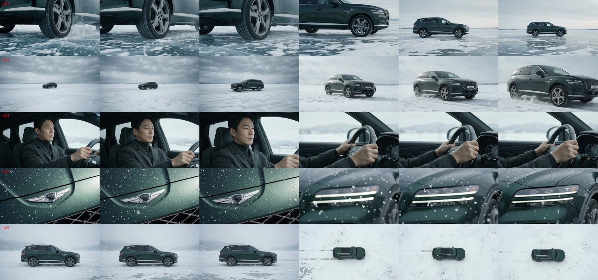

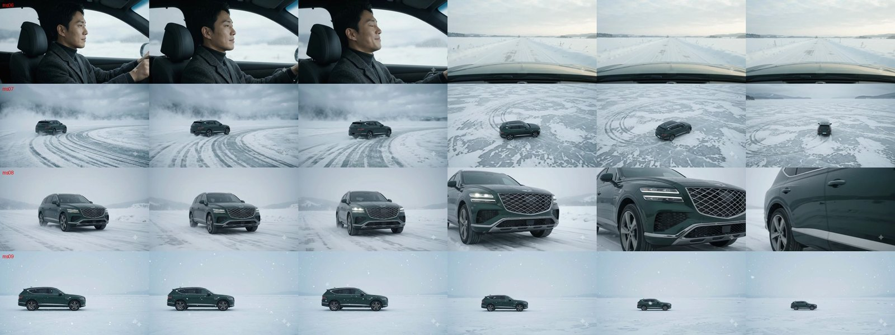
*클립 9개 (한 줄 = 0.3 / 1.5 / 2.7 / 3.3 / 4.5 / 5.7초). 모두 3초 근처에서 샷이 바뀜*

목록에서 클립 오른쪽 위 **다운로드 아이콘** → zip 압축을 풀어 `clip01.mp4`처럼 이름 바꾸기

## 6. 크레딧이 모자랄 때 — 계정 바꾸기

무료 계정은 **하루 50크레딧**이고 매일 정해진 시각에 다시 채워집니다. 이번 예시는 6초 클립(10크레딧) 9개 = 90크레딧이라 **1번 계정 5개 + 2번 계정 4개**로 나눠 만들었어요.


*이 창이 뜨면 이 계정의 크레딧이 바닥난 것. 이미 시작된 영상은 끝까지 만들어지니 먼저 내려받기*

1. 오른쪽 위 **프로필 사진** → 남은 크레딧 확인 → **계정 전환**
1. 크롬에 로그인해 둔 **내 다른 구글 계정** 고르기 (비밀번호 입력 없이 선택만)
1. 새 계정에서 **새 프로젝트** → 남은 컷 이미지를 끌어다 놓기 (처음 한 번 사용 권리 확인 창)
1. 영상 설정(프레임 · 비율 · 720p · 길이)을 **다시 확인**하고 이어서 생성

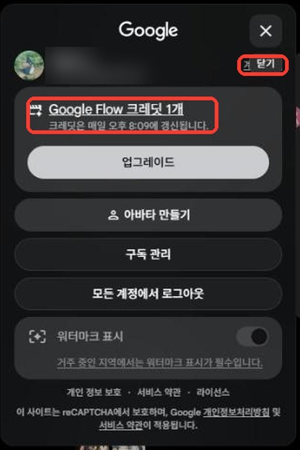
*프로필 → 남은 크레딧과 다시 채워지는 시각, 오른쪽 위 '계정 전환'*

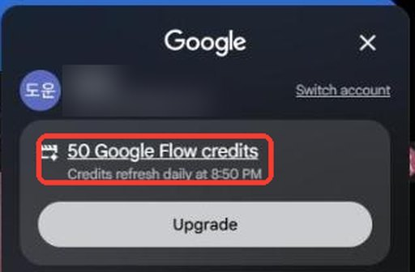
*새 계정은 50크레딧. 화면이 영어여도 버튼 위치는 같아요*

## 7. 소리 준비

- **BGM** 감성 피아노 70BPM (BGM 팩 05) — Suno로 만들 때는 아래 프롬프트
- **나레이션** 낮고 차분한 남성 목소리로 3줄을 따로 녹음 · TTS
- **현장음** 클립에 들어 있는 바람 · 눈 소리를 그대로 사용

**Suno 프롬프트**

```text
instrumental, cinematic ambient, emotional piano and subtle cello, 80 BPM, 20 seconds
```

**나레이션**

```text
차갑고 거친 세상 속,
가장 완벽한 정적.
제네시스 GV80.
```

## 8. CapCut 편집


*CapCut → ① 프로젝트 만들기*

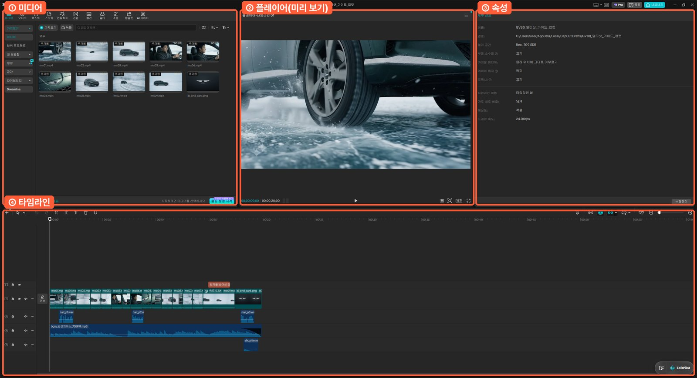
*화면 4구역: ① 미디어(파일) ② 플레이어(미리 보기) ③ 속성(크기 · 속도 · 볼륨 · 글자) ④ 타임라인(순서 · 길이)*

### ① 파일 가져오기 → 순서대로 올리기

1. 미디어 → **가져오기** → clip01\~09, BGM, 나레이션 3개 선택 (끌어다 놓아도 됨)
1. 아래 편집표 순서대로 클립을 타임라인 맨 위 줄에 올리기 (같은 클립을 두 번 쓰는 곳이 있어요)

| # | 시작 | 클립 | 쓸 구간(초) | 처리 | 장면 |
|---|---|---|---|---|---|
| 1 | 0.00 | clip01 | 0.05–1.35 | 좌우 반전 | 타이어 클로즈업 |
| 2 | 1.29 | clip01 | 3.20–4.40 |  | 뒤로 빠지며 차 전체 |
| 3 | 2.50 | clip02 | 0.60–1.90 | 좌우 반전 | 멀리서 다가가는 드론 |
| 4 | 3.83 | clip05 | 0.60–1.60 |  | 옆에서 같이 달리기 |
| 5 | 4.83 | clip05 | 3.30–4.30 |  | 탑다운 |
| 6 | 5.83 | clip03 | 0.40–1.40 |  | 운전자 |
| 7 | 6.83 | clip03 | 3.40–4.20 |  | 핸들 위 손 |
| 8 | 7.62 | clip06 | 0.20–1.30 |  | 옆얼굴 (나레이션 2) |
| 9 | 8.71 | clip04 | 0.50–1.40 |  | 엠블럼 |
| 10 | 9.62 | clip04 | 3.60–4.50 | 좌우 반전 | 헤드램프 |
| 11 | 10.54 | clip08 | 0.90–1.90 |  | 정면으로 다가옴 |
| 12 | 11.54 | clip08 | 3.30–4.30 |  | 옆을 스쳐 감 |
| 13 | 12.54 | clip07 | 0.80–1.70 |  | 멀어지는 코너링 |
| 14 | 13.46 | clip07 | 3.30–4.30 |  | 공중에서 돌기 |
| 15 | 14.46 | clip09 | 3.10–5.35 | 속도 0.75배 | 크레인 업 와이드 + 카피 |
| 16 | 17.46 | BI 카드 | 2.5초 |  | 엠블럼 + GV80 |

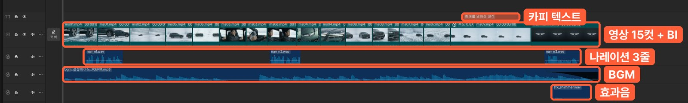
*완성된 타임라인*

### ② 쓸 구간만 남기기

1. 클립을 누르고 재생 바늘을 **쓸 구간 시작**에 놓기 → `Ctrl`+`B`(분할) → 앞 조각 `Delete`
1. 바늘을 **쓸 구간 끝**에 놓기 → `Ctrl`+`B` → 뒤 조각 `Delete` (빈칸은 자동으로 당겨져요)

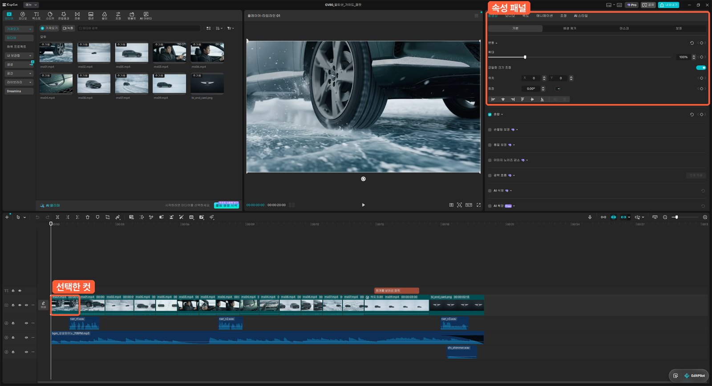
*클립을 누르면 오른쪽 ③ 속성 패널이 열립니다*

> ⚠️ 샷이 바뀌는 **2.9\~3.1초는 쓰지 않아요.** 바뀌는 순간 화면이 한두 장 섞여 보입니다.

### ③ 방향 맞추기 · 속도

차는 처음부터 끝까지 **화면 왼쪽 → 오른쪽**으로 달리게 맞춰요. 반대로 가는 1 · 3 · 10번 컷은 **클립 오른쪽 클릭 → 편집 → 미러링**.

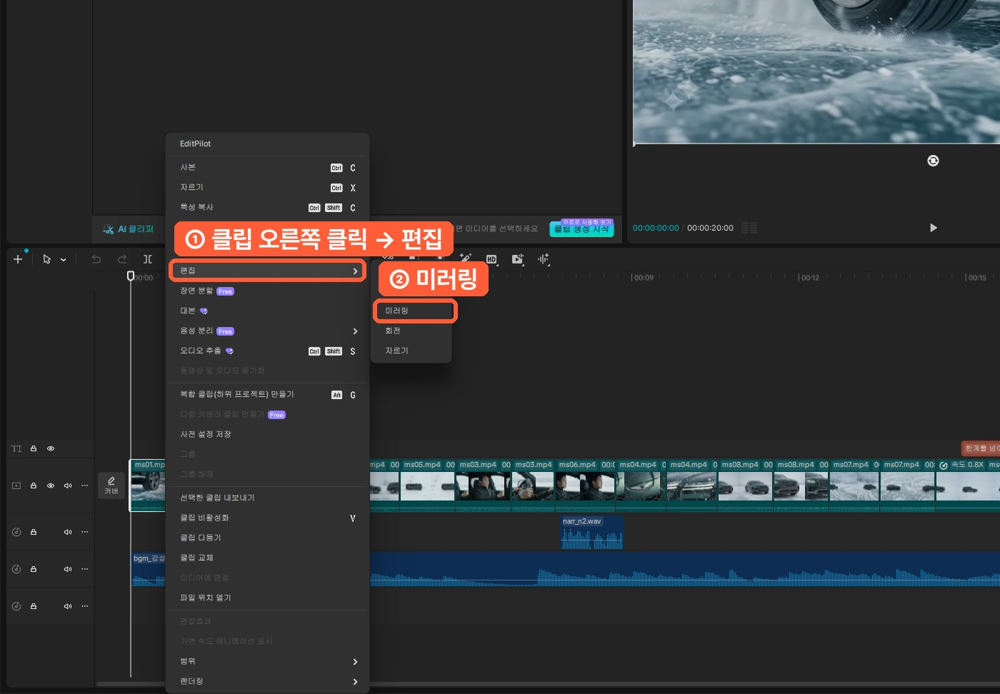
*클립 오른쪽 클릭 → 편집 → 미러링 (좌우 반전)*

15번 컷은 클립 선택 → ③ 속성 **속도 → 0.75x** (천천히 멀어지는 여운)

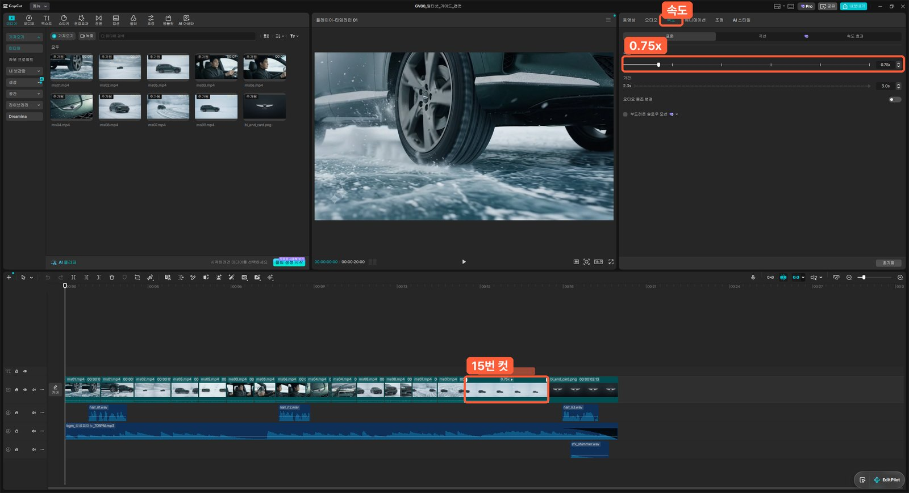
*속도 탭에서 0.75x → 2.3초짜리 컷이 3.0초로 늘어남*

### ④ 엔딩 카피 · BI

- **텍스트 → 기본 텍스트** `한계를 넘어선 정적` · 얇은 고딕(Pretendard Light) · 짙은 회색 · 화면 오른쪽 빈 하늘
- 텍스트 선택 → **애니메이션 → 인**에서 글자가 하나씩 떠오르는 효과, **아웃**에서 페이드
- 마지막 2.5초: 어두운 배경 + 제네시스 엠블럼 PNG + `GV80` (엠블럼은 공식 홈페이지 로고를 저장해 사용)

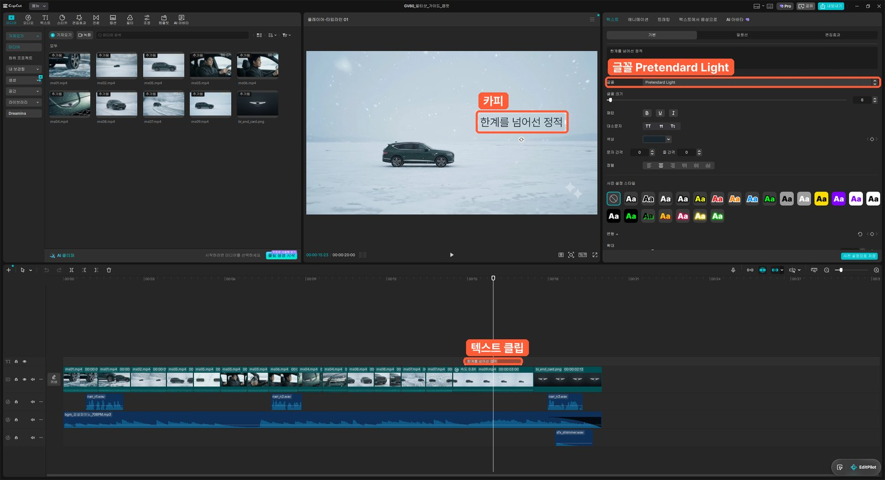
*텍스트 클립 선택 → 텍스트 탭에서 글꼴 · 크기 · 색*

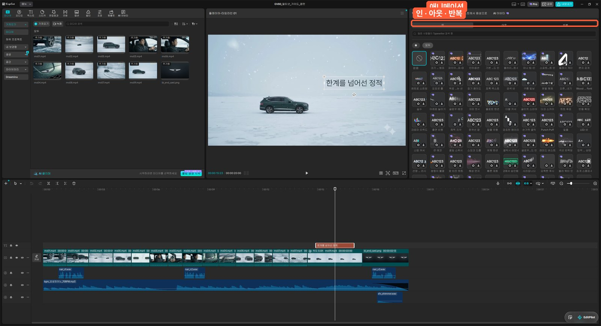
*애니메이션 탭 → 인 · 아웃 · 반복에서 효과 고르기*

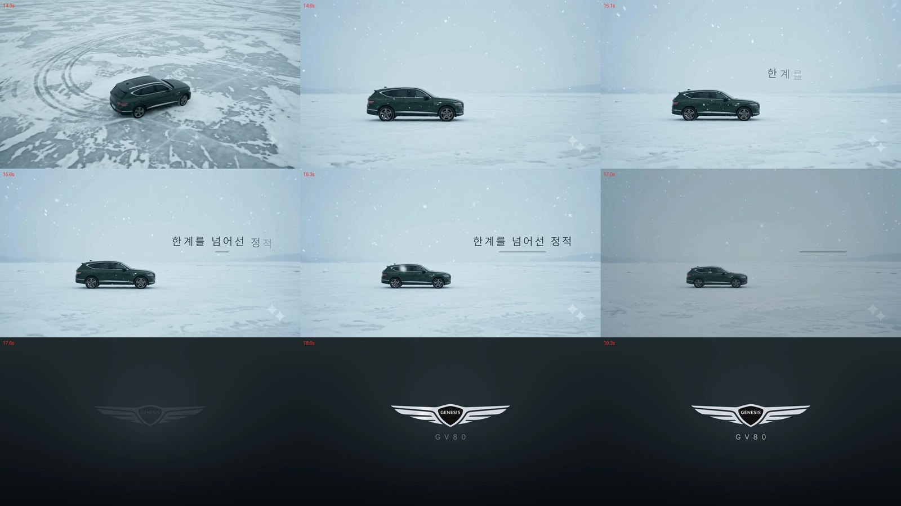
*15번 컷 위 카피 → 17.5초부터 BI 엔딩*

### ⑤ 소리 넣기

- 나레이션 3줄: **0.8초 · 7.7초 · 17.9초** 위치에 놓기
- BGM: 0초부터 20초까지, 볼륨 45%, 끝 2초 페이드 아웃
- 클립 현장음: 볼륨 45%
- 엠블럼에 빛이 지나갈 때 작은 반짝 효과음 (18.2초)

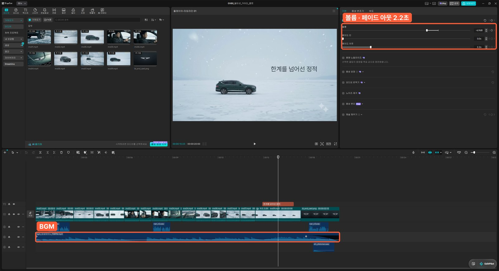
*BGM 선택 → 기본 탭에서 볼륨 · 페이드 아웃*

### ⑥ 내보내기

오른쪽 위 **내보내기** → 해상도 **4K** · 프레임 **24fps**(Flow 원본과 같게) → 08_완성본에 저장

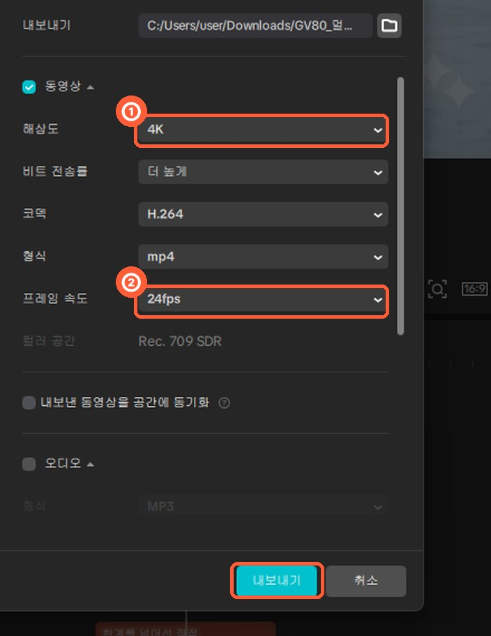
*① 해상도 4K ② 프레임 속도 24fps(원본과 같게) → 내보내기*

> 💡 **해상도 4K · 프레임은 원본과 같게(Flow 영상은 24fps)** 로 내보내요. 4K로 키운다고 그림이 더 선명해지진 않지만, 유튜브는 4K로 올린 영상에 더 좋은 압축(높은 비트레이트)을 써서 올린 뒤 화질이 덜 뭉개져요. 프레임을 30·60으로 바꾸면 없는 프레임을 복제해 끊겨 보이니 원본과 같게 두세요.

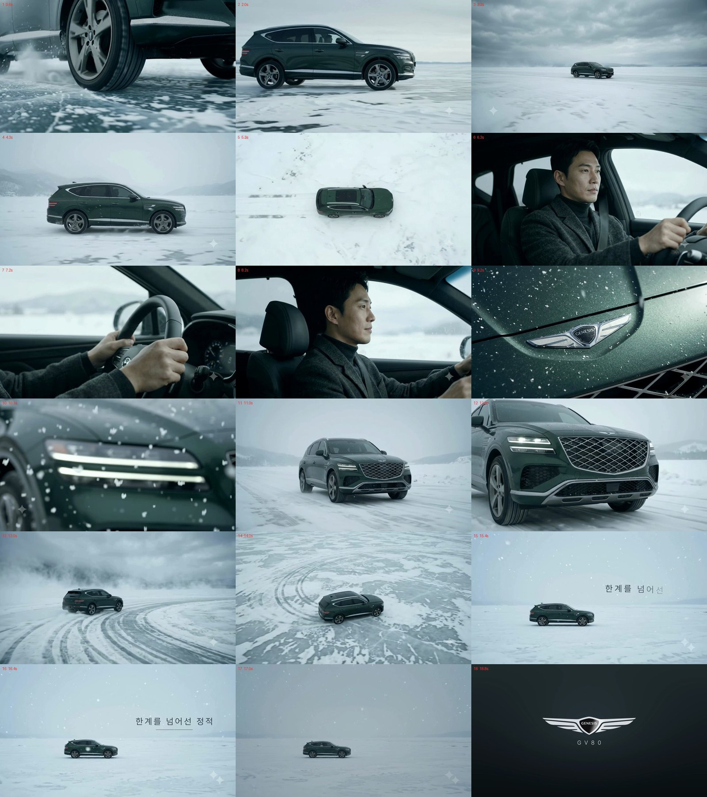
*완성본 컷 흐름 확인*

## 9. 체크리스트

- [ ] 공식 사진 2장 첨부해서 도우미 첫 메시지 보냄
- [ ] 기획 확인 후 고정 문구 · 시트 프롬프트 받음
- [ ] 제품 시트 · 인물 시트 저장
- [ ] 그리드 9칸 ○✕ 확인
- [ ] 컷 9장 저장 (cut01\~09)
- [ ] 영상 설정: 프레임 · 16:9 · Omni 1.1 Flash · 720p · 6초
- [ ] 클립 9개 내려받고 이름 바꿈 (clip01\~09)
- [ ] BGM · 나레이션 준비
- [ ] 편집표대로 자르고, 반전 · 속도 · 카피 · BI 넣음
- [ ] 4K · 24fps로 내보냄
