# 💰 지식 쇼츠 · 경제상식 「렌텐마르크」

유튜브 원카AI의 「AI 건축 쇼츠 30분 만에 만드는 법」 방식 그대로, **제미나이로 기획 → Flow Omni Flash로 이미지 없이 바로 영상 → 나레이션 → CapCut 편집**까지 따라 하는 설명서입니다.

<video src="media/ks_e1_final.mp4" poster="media/ks_e1_final_poster.jpg" controls playsinline preload="metadata"></video>
<p class="cap">완성본 · 46초 · 9:16</p>

> 🎬 **결과물** 46초 · 9:16 · 8초 멀티샷 클립 9개 → 장면 18개<br>
> **도구** Gemini → Google Flow (Omni 1.1 Flash) → 나레이션 TTS → CapCut<br>
> **크레딧** 영상 120 (8초 클립 10개) · 이미지 없음<br>
> **구조** [당연하게 알던 대상] → [뜻밖의 충격적인 문제 발생] → [잘못된 1차 해결책/부작용] → [발상의 전환을 통한 반전의 해결책] → [거대한 스케일과 결론]

## 0. 시작 전 준비

- 참고 영상(원카AI): [www.youtube.com/watch?v=ObvCtB1ATnA](https://www.youtube.com/watch?v=ObvCtB1ATnA)
- 레퍼런스 쇼츠 — 신비한 건축사전 「한강이 강이 아니라 호수인 이유」: [www.youtube.com/shorts/uUN1Bw0elY8](https://www.youtube.com/shorts/uUN1Bw0elY8)
- Gemini: [gemini.google.com](https://gemini.google.com)
- Google Flow: [labs.google/fx/tools/flow](https://labs.google/fx/tools/flow)
- CapCut PC 버전

**폴더 만들어 두기**

```text
shorts_경제_렌텐마르크/
 ├ 01_대화캡처
 ├ 05_영상    e01~e09.mp4
 ├ 06_소리    narr_01~.wav
 ├ 07_편집
 └ 08_완성본
```

> 💡 핵심은 **구조만 빌리고 소재와 문장은 새로** 쓰는 것. 잘된 쇼츠 한 편을 분석해서 그 뼈대에 내 주제를 얹습니다.

## 1. 제미나이 — 잘된 쇼츠 분석

제미나이 새 채팅에 레퍼런스 쇼츠 주소와 함께 보냅니다.

**보낸 말**

```text
https://www.youtube.com/shorts/uUN1Bw0elY8
해당 영상처럼 제작하려고 해. 이때 해당 영상이 어떤 스타일과 시각자료를 바탕으로 구성되어있는지 확인해줘.
스크립트도 왜 조회수가 많이 나올 수 있었는지를 세부적으로 확인해줘.
```

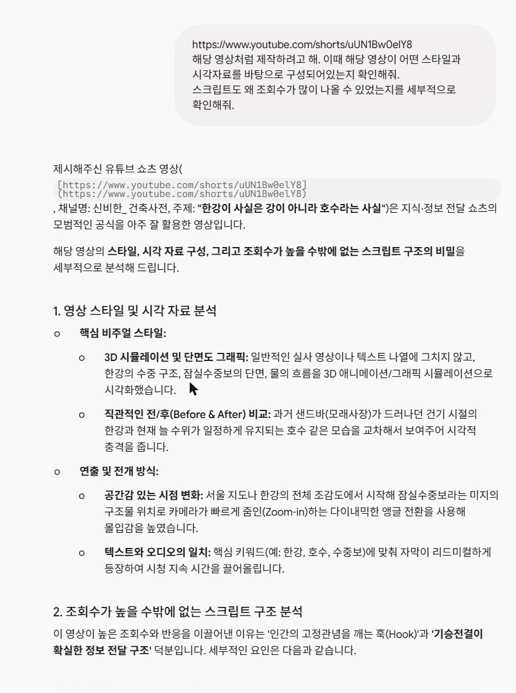
*스타일(3D 단면 그래픽 · 전/후 비교) + 조회수 이유(상식을 깨는 훅 → 문제 → 반전) 분석*

## 2. 제미나이 — 주제 후보 → 스크립트 초안

### ① 주제 후보 받기

**보낸 말**

```text
좋아 이제 해당 영상의 반전 요소, 전개 구조를 고려해서 새로운 나만의 영상을 만들거야. 주제는 경제상식으로, 해외에서 이러한 반전, 문제 및 해결이 필요했던 서사가 있는 경제 사건(ex. 화폐, 물가)으로 할게. 후보를 제시해줘.
```

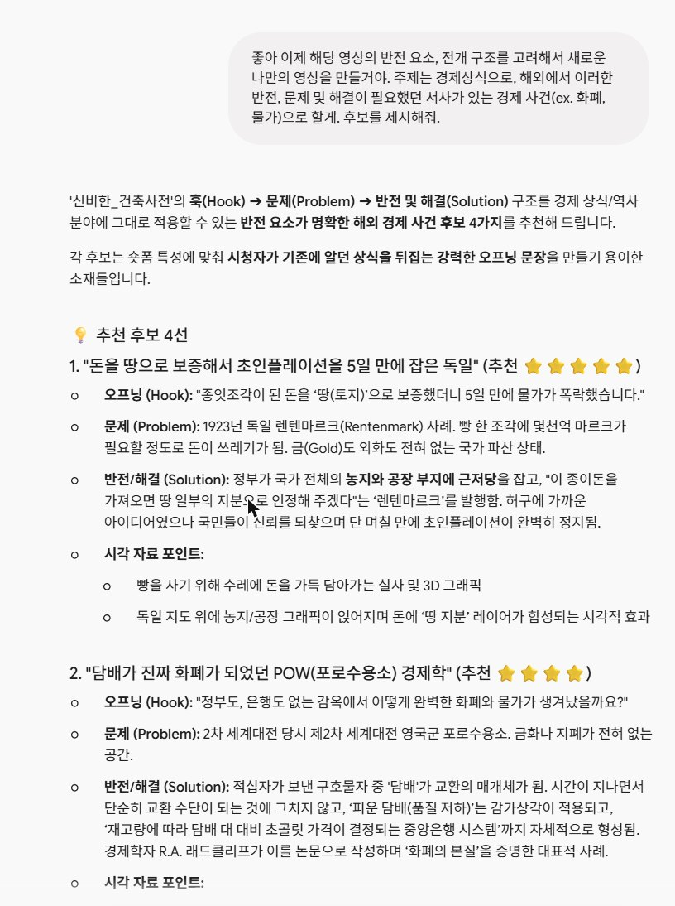
*후보마다 훅 · 문제 · 반전 해결 · 시각 자료 포인트를 정리해 줘요*

### ② 고른 주제로 스크립트 초안

**보낸 말**

```text
1번 렌텐마르크로 할게. 해당 사건의 서사를 담아서 레퍼런스 영상과 비슷한 구조의 스크립트를 만들어줘.
구조는 [당연하게 알던 대상] → [뜻밖의 충격적인 문제 발생] → [잘못된 1차 해결책/부작용] → [발상의 전환을 통한 반전의 해결책] → [거대한 스케일과 결론] 순서로 하고, 나레이션 기준 50초 내외로 시간대별 구간을 나눠줘.
```

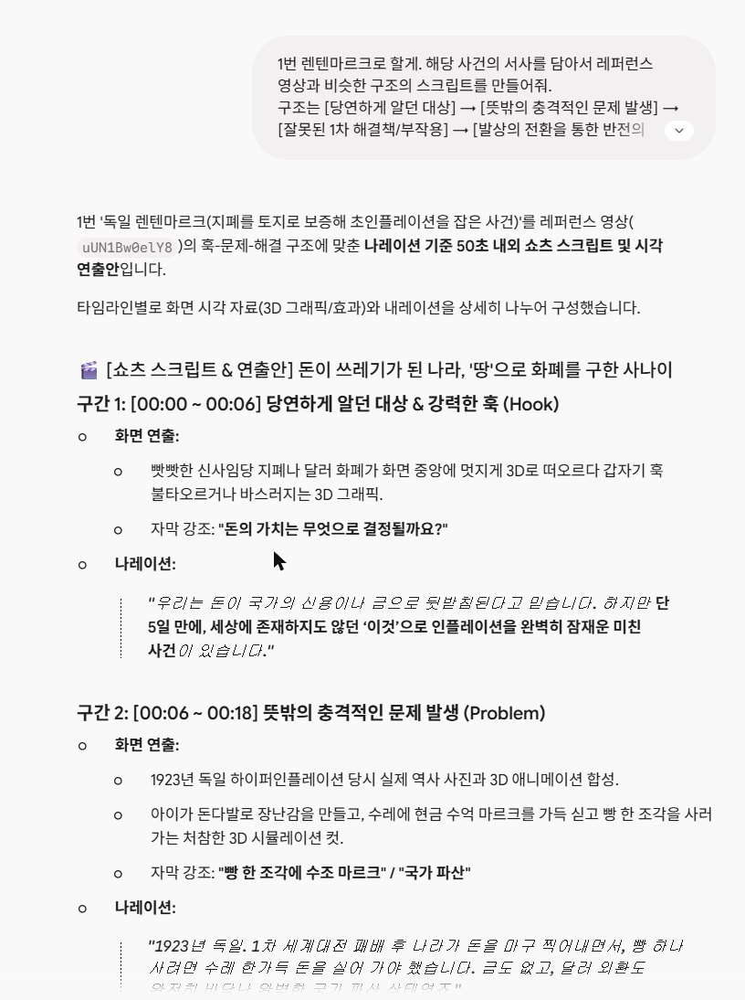
*구간별 화면 연출 + 나레이션 초안*

> 💡 원카AI 영상과 달라진 점 두 가지: 구조 5단계를 프롬프트에 **직접 적었고**, 멀티샷 9개에 맞게 **50초 내외**로 길이를 정했어요.

## 3. 스크립트 고치기 + 팩트체크

초안에는 '단 5일 만에', '땅 지분을 주겠다' 같은 과장된 표현이 섞여 있었어요. 확인되는 사실만 남기고 내 말투로 다시 썼습니다.

**보낸 말 (내가 고친 스크립트)**

```text
다음과 같이 스크립트를 수정했어. 해당 스크립트에 있어서 부족한 점을 확인해 주고 팩트체크도 해줘.

[스크립트]
빵 한 덩이에 2천억 마르크. 1923년 독일 빵집에 실제로 붙어 있던 가격입니다.

1달러를 바꾸려면 4조 2천억 마르크가 필요했습니다. 월급은 하루에 두 번 나눠 받았고, 받자마자 뛰어가서 써야 했죠. 사람들은 지폐로 벽을 바르고, 장작 대신 돈다발을 태웠습니다. 장작보다 지폐가 더 쌌으니까요.

정부의 해결책은 뭐였을까요? 돈을 더 찍는 것이었습니다. 인쇄소를 총동원해 밤낮없이 찍어냈지만, 찍을수록 돈의 가치는 더 빨리 떨어졌습니다. 불을 끄려고 기름을 부은 셈이죠.

그래서 독일은 발상을 뒤집습니다. 금이 없다면, 땅을 담보로 잡자. 전국의 농지와 공장 부지에 저당을 걸고, 새 돈 렌텐마르크를 내놓습니다. 교환 비율은 옛 돈 1조 마르크에 새 돈 1렌텐마르크. 그리고 딱 하나를 약속했습니다. 정해진 양 이상은 절대 찍지 않는다.

결과는 놀라웠습니다. 몇 주 만에 물가가 멈춰 섰고, 사람들은 다시 돈을 받기 시작했습니다.

그런데 진짜 반전은 따로 있습니다. 렌텐마르크를 땅으로 바꿔 갈 방법은 처음부터 없었습니다. 바꿔 주는 건 땅에 걸린 채권뿐이었죠. 돈을 살린 건 땅이 아니라, 더 찍지 않는다는 믿음이었던 겁니다.
```

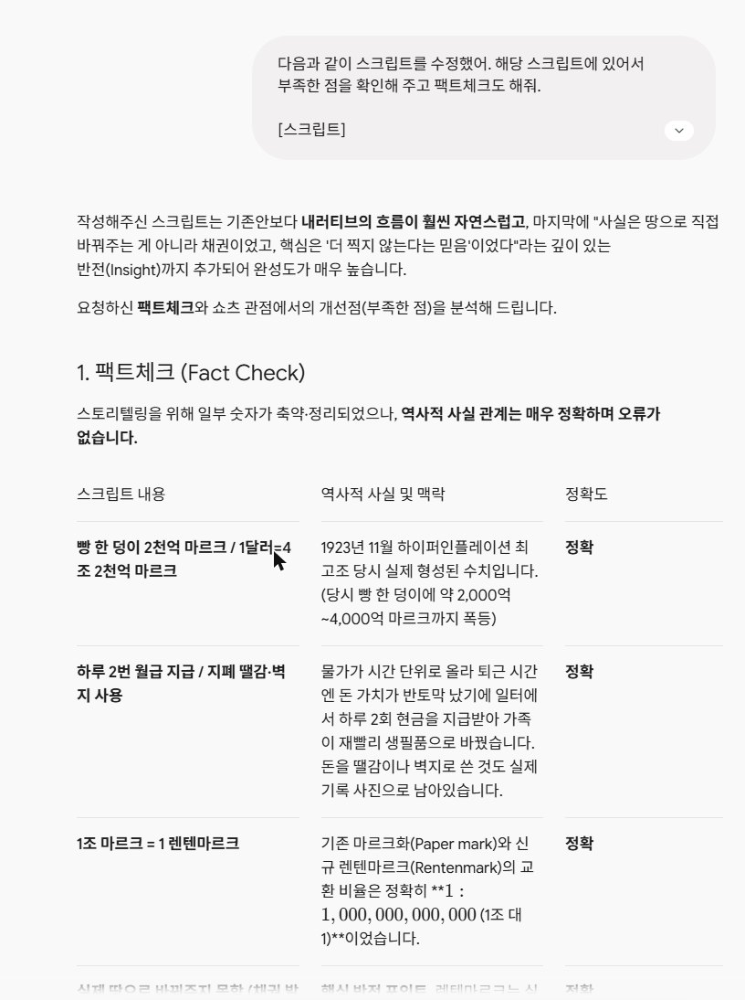
*빵값 · 환율 · 1조 대 1 교환 · 채권(Rentenbriefe) 모두 '정확'. 대신 약 500자라 60초를 넘길 수 있으니 1\~2문장 줄이라는 피드백*

**피드백 반영 후 확정한 스크립트 (9줄 = 클립 9개)**

```text
빵 한 덩이에 2천억 마르크. 1923년 독일 빵집에 실제로 붙어 있던 가격입니다.
1달러를 바꾸려면 4조 2천억 마르크. 월급은 하루 두 번 받아, 받자마자 뛰어가 써야 했죠.
장작보다 지폐가 싸서, 돈다발을 난로에 태웠습니다.
정부의 해결책은? 돈을 더 찍는 것. 밤낮없이 찍어낼수록, 돈의 가치는 더 빨리 무너졌습니다.
그래서 독일은 발상을 뒤집습니다. 금이 없다면, 땅을 담보로 잡자.
전국의 농지와 공장에 저당을 걸고, 새 돈 렌텐마르크를 내놓습니다. 옛 돈 1조 마르크가 새 돈 1렌텐마르크.
그리고 단 하나를 약속했습니다. 정해진 양 이상은 절대 찍지 않는다.
몇 주 만에, 물가가 멈춰 섰습니다.
그런데 진짜 반전은 따로 있습니다. 렌텐마르크를 땅으로 바꿀 방법은 처음부터 없었습니다. 돈을 살린 건 땅이 아니라, 더 찍지 않는다는 믿음이었던 겁니다.
```

> ⚠️ 제미나이 팩트체크도 틀릴 수 있어요. 숫자 · 연도 · 인물 이름은 위키백과 같은 다른 자료로 한 번 더 확인하세요.

## 4. 제미나이 — 멀티샷 영상 프롬프트 18장면 → 9개

원카AI 카페 글의 영상 프롬프트를 **[프롬프트] 예시**로 붙이고, 구조 · 어휘 · 길이는 그대로 두고 내용만 바꾸게 합니다. 8초 클립 하나에 **샷 2개(0\~4초 · 4\~8초)** 를 넣는 멀티샷으로 해서 18장면을 클립 9개(크레딧 절반)로 만들어요.

**보낸 말**

```text
팩트체크와 피드백 반영해서 스크립트를 이렇게 확정했어.

[확정 스크립트]
빵 한 덩이에 2천억 마르크. 1923년 독일 빵집에 실제로 붙어 있던 가격입니다.
1달러를 바꾸려면 4조 2천억 마르크. 월급은 하루 두 번 받아, 받자마자 뛰어가 써야 했죠.
장작보다 지폐가 싸서, 돈다발을 난로에 태웠습니다.
정부의 해결책은? 돈을 더 찍는 것. 밤낮없이 찍어낼수록, 돈의 가치는 더 빨리 무너졌습니다.
그래서 독일은 발상을 뒤집습니다. 금이 없다면, 땅을 담보로 잡자.
전국의 농지와 공장에 저당을 걸고, 새 돈 렌텐마르크를 내놓습니다. 옛 돈 1조 마르크가 새 돈 1렌텐마르크.
그리고 단 하나를 약속했습니다. 정해진 양 이상은 절대 찍지 않는다.
몇 주 만에, 물가가 멈춰 섰습니다.
그런데 진짜 반전은 따로 있습니다. 렌텐마르크를 땅으로 바꿀 방법은 처음부터 없었습니다. 돈을 살린 건 땅이 아니라, 더 찍지 않는다는 믿음이었던 겁니다.

이제 스크립트의 내용을 기준으로 총 18개 장면으로 영상화하려고 해. 크레딧을 아끼기 위해 장면 2개를 8초 멀티샷 1개로 묶어서, 멀티샷 9개 클립으로 만들 거야. veo omni 모델용 프롬프트로 제시해 주고 스크립트의 내용이 적절하게 들어갈 수 있도록 해줘.
하단의 프롬프트와 똑같은 구조·어휘·길이로 만들어주되 내용은 위 스크립트에 맞춰줘. 추가적으로 하단의 내용을 참조 해줘.

멀티샷 형식: 각 클립은 "Shot 1 (0-4s): ... Cut to Shot 2 (4-8s): ..." 로 나누고, 두 샷은 같은 장소·같은 소품·같은 조명으로 이어지게 해줘.
카메라는 샷마다 비트 1개, 사건 중엔 횡이동만, 끝나는 샷은 급속 푸시인 클로즈업.
빨강은 계측선으로만, 고정/이동 보조선을 매번 명시. 빨간 소품 컷엔 계측선 없음.
스타일은 1923년 독일을 재현한 반실사 3D 미니어처 디오라마. 사람은 얼굴이 작게 보이는 미니어처 인형으로만, 얼굴 클로즈업 없음.
지폐에는 읽을 수 있는 글자·숫자 없이 장식 무늬만. 자막과 숫자는 편집에서 넣을 거야.
한국어 설명 + 영문 코드블록 + 설정 표 + 글자수로 주고, 충돌은 미리 점검해서 위험도 같이 알려줘.

[프롬프트]
A 8-second vertical 9:16 shot, semi-stylized 3D architectural visualization render sitting halfway between clean low-poly and photoreal. SUBJECT: two bridge models standing side by side as technical models on a flat neutral pale gray studio ground with soft contact shadows, seen from a low three-quarter angle. The left one is the London Millennium Bridge, its suspension cables running almost flat and straight with only the shallowest sag between its Y-shaped piers. The right one is a conventional suspension bridge of the same length with deep swooping cables sagging far below tall towers. Everything else about them is identical, same white deck, same handrails, modeled anchor plates and turnbuckles at every cable end, clean empty studio space around them. STYLE: simplified readable geometry with real modeled detail, smooth shading with no visible polygon edges, matte materials with brushed steel, no mirror gloss, soft studio daylight with mild ambient occlusion, no sun disc. COLOR IS RICH AND CLEAN: bright white painted steel, pale neutral gray ground, fully saturated, no gray wash and no desaturated grading. CAMERA, BEAT ONE, the first two seconds: the camera tracks fast sideways from left to right past both models at a constant height. CAMERA, BEAT TWO, from two seconds to the end: the camera rushes in fast to a tight close-up on the almost flat cable of the left model, arriving by four seconds and holding locked off on it for the final second. RED: two pure red technical dimension annotations measure how far each cable sags below its anchor line, drafting style, on each model a thin horizontal extension line at the anchor height and another at the cable's lowest point with a vertical dimension line between them and a small sharp arrowhead at each end, glowing, the left one extremely short and the right one very tall, both holding their length for the whole shot. They are the only saturated red in the frame and carry no numbers and no text. No text, no letters, no numbers, no labels, no logos, no watermark, no lens flare, no film grain, no vignette, no close-up faces. No background music. Only realistic location sound: a thin metallic shimmer from the taut cables, quiet studio air, a fast air rush on the push-in.
```

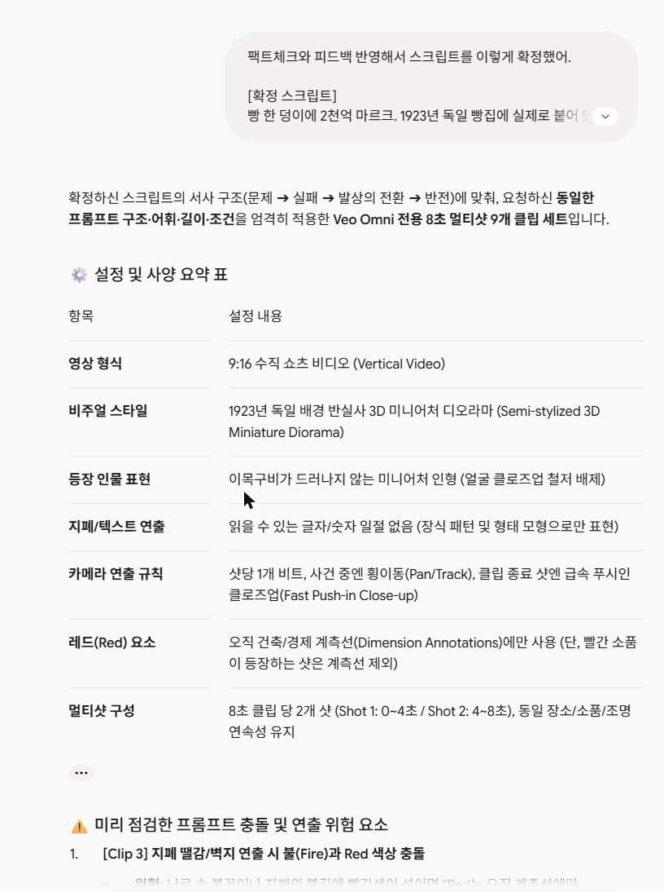
*설정 표 · 충돌 위험 점검 · 클립별 한국어 설명 + 영문 코드블록 + 글자 수*

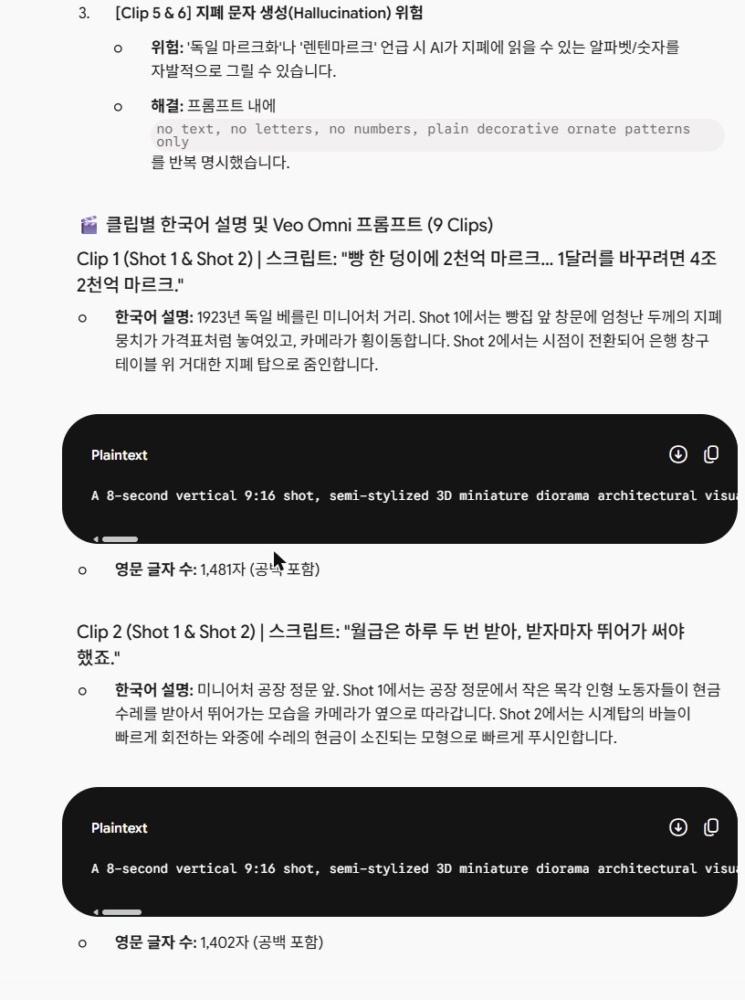
*클립별 한국어 설명 + 영문 프롬프트*

### 구조가 예시와 달라졌을 때 — 고쳐 달라고 보내기

첫 답에서 STYLE · COLOR · 소리 문장이 빠지고, 카메라 설명이 샷 밖으로 나와 있었어요. 빠진 부분을 짚어서 다시 요청했습니다.

**보낸 말**

```text
좋아, 그런데 원본 프롬프트와 구조가 달라져서 수정이 필요해.
1. 원본 순서를 그대로 지켜줘: 첫 문장(A 8-second vertical 9:16 shot, ...) → SUBJECT → STYLE → COLOR IS RICH AND CLEAN → SHOT 1 (0-4s) + CAMERA BEAT ONE → Cut to SHOT 2 (4-8s) + CAMERA BEAT TWO → RED → No text 문장 → No background music + 소리 문장. 지금은 STYLE, COLOR, 소리 문장이 빠졌어.
2. 샷과 카메라 비트를 한 덩어리로 묶어줘. Shot 1 (0-4s) 안에는 횡이동만, Shot 2 (4-8s) 안에는 급속 푸시인만. "from zero to four seconds" 같은 비트 설명을 샷 밖에 따로 쓰지 마.
3. RED 문장은 원본처럼 "They are the only saturated red in the frame and carry no numbers and no text"까지 넣고, 고정선인지 움직이는 선인지 매번 적어줘. 빨간 소품 컷(3번)은 RED 문장 대신 "No red annotations in this shot"만.
4. 소리는 "No background music, no voice, no dialogue. Only realistic location sound: ..."로 매 클립 넣어줘. 나레이션은 편집에서 따로 넣을 거야.
5. 장면 수정:
- 1번 Shot 2: 은행 창구 위에 작은 은화 1개와 그 옆에 천장까지 닿을 듯한 지폐 탑. 빨간 계측선은 지폐 탑 높이(고정선).
- 9번 Shot 2: 악수 아이콘 대신, 땅 모형이 옆으로 미끄러져 사라져도 새 지폐 1장은 그대로 똑바로 서 있는 장면. 따뜻한 빛, 지폐로 푸시인.
- 9번 Shot 1: 땅 모형과 지폐 사이 빈 간격을 재는 빨간 계측선(고정선).
나머지 장면 내용은 그대로 두고, 9개 전부 다시 영문 코드블록 + 글자수로 줘.
```

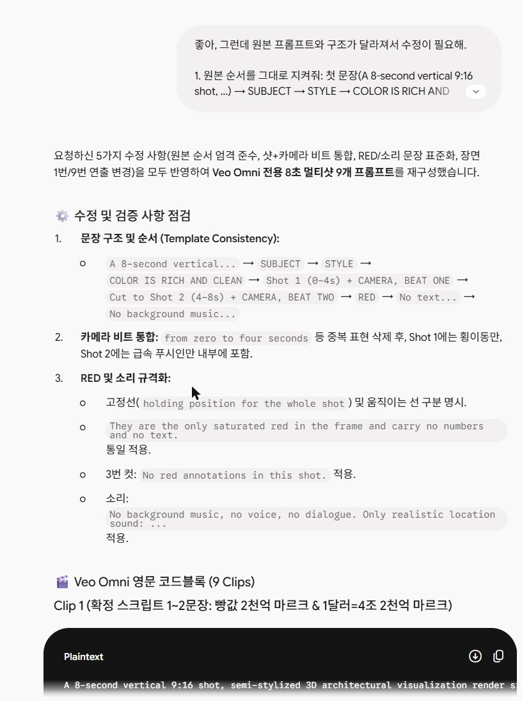
*수정 사항 점검 후 9개 다시 받음*

## 5. 최종 프롬프트 9개

Flow에 그대로 붙여 넣은 최종본입니다. 아래 줄을 펼쳐 복사하세요.

<details>
<summary>01 · 빵집 진열창에 빵 1개 옆 지폐 더미 → 은행 창구, 은화 1개 옆 거대한 지폐 탑 (지폐 탑 높이 = 빨간 고정선)</summary>

**나레이션**

빵 한 덩이에 2천억 마르크. 1923년 독일 빵집에 실제로 붙어 있던 가격입니다. / 1달러를 바꾸려면 4조 2천억 마르크.

**프롬프트**

```text
A 8-second vertical 9:16 shot, semi-stylized 3D architectural visualization render sitting halfway between clean low-poly and photoreal. SUBJECT: 1923 Weimar Berlin bakery and bank interior miniature scene on a flat neutral pale gray studio ground with soft contact shadows, seen from a low three-quarter angle. Left bakery window with bread, right bank counter with money. All paper money is pale beige and brown 1920s German-style banknotes with plain ornamental patterns, never green US dollars. STYLE: simplified readable geometry with real modeled detail, smooth shading with no visible polygon edges, matte materials with brushed metal and aged paper, soft studio daylight with mild ambient occlusion, no sun disc. COLOR IS RICH AND CLEAN: warm wooden tones, pale neutral gray ground, fully saturated, no gray wash and no desaturated grading. Shot 1 (0-4s): a tiny wooden shopkeeper figure places a massive stack of patterned money in a bakery window next to a single bread loaf while CAMERA, BEAT ONE, tracks fast sideways from left to right past the storefront at a constant height. Cut to Shot 2 (4-8s): in the same studio setup and lighting, showing a miniature bank counter with one tiny silver coin sitting beside an enormous paper money stack towering high above the counter while CAMERA, BEAT TWO, rushes in fast to a tight close-up on the tall money stack, arriving by seven seconds and holding locked off for the final second. RED: a pure red technical dimension annotation line measures the full static height of the paper money stack from the counter surface, drafting style with a fixed horizontal extension line at the base and top with a vertical dimension line between them and sharp arrowheads, holding position for the whole shot. They are the only saturated red in the frame and carry no numbers and no text. No text, no letters, no numbers, no labels, no signboard lettering, no logos, no watermark, no lens flare, no film grain, no vignette, no close-up faces. No background music, no voice, no dialogue. Only realistic location sound: quiet studio air, subtle paper rustle, a fast air rush on the push-in.
```

</details>

<details>
<summary>02 · 공장 정문에서 돈 수레를 받아 뛰어가는 인형들 → 바퀴 클로즈업 (이동 거리 = 빨간 이동선)</summary>

**나레이션**

월급은 하루 두 번 받아, 받자마자 뛰어가 써야 했죠.

**프롬프트**

```text
A 8-second vertical 9:16 shot, semi-stylized 3D architectural visualization render sitting halfway between clean low-poly and photoreal. SUBJECT: 1920s German-style factory gate and cobbled miniature street on a flat neutral pale gray studio ground with soft contact shadows, seen from a low three-quarter angle. Factory gate on the left, street clock tower with a plain face and only hands on the right. All paper money is pale beige and brown 1920s German-style banknotes with plain ornamental patterns, never green US dollars. STYLE: simplified readable geometry with real modeled detail, smooth shading with no visible polygon edges, matte materials with aged brick and wood, soft studio daylight with mild ambient occlusion, no sun disc. COLOR IS RICH AND CLEAN: warm brick browns, slate grays, pale neutral gray ground, fully saturated, no gray wash and no desaturated grading. Shot 1 (0-4s): tiny wooden worker figures receive miniature wooden wheelbarrows overflowing with paper money bundles and rush along the street while CAMERA, BEAT ONE, tracks fast sideways following the movement of the wheelbarrows at a constant height. Cut to Shot 2 (4-8s): in the same location and lighting, looking down towards a wheelbarrow wheel with spinning street clock hands above while CAMERA, BEAT TWO, rushes in fast to a tight close-up on the wooden wheel spinning rapidly against the cobblestones, arriving by seven seconds and holding locked off for the final second. RED: a pure red technical extension line and animated dimension line dynamically measure the increasing distance traveled by the moving wheelbarrow, drafting style with sharp arrowheads, lengthening as the wheelbarrow advances. They are the only saturated red in the frame and carry no numbers and no text. No text, no letters, no numbers, no labels, no signboard lettering, no logos, no watermark, no lens flare, no film grain, no vignette, no close-up faces. No background music, no voice, no dialogue. Only realistic location sound: wooden wheels rattling on cobblestones, footsteps, a fast air rush on the push-in.
```

</details>

<details>
<summary>03 · 거실 난로에 돈다발을 던져 넣는 인형 → 난로 속 불꽃 클로즈업 (불꽃 = 빨간 소품이라 계측선 없음)</summary>

**나레이션**

장작보다 지폐가 싸서, 돈다발을 난로에 태웠습니다.

**프롬프트**

```text
A 8-second vertical 9:16 shot, semi-stylized 3D architectural visualization render sitting halfway between clean low-poly and photoreal. SUBJECT: 1920s German-style living room interior miniature set on a flat neutral pale gray studio ground with soft contact shadows, seen from a low three-quarter angle. Living room rug on the left, cast-iron stove on the right. All paper money is pale beige and brown 1920s German-style banknotes with plain ornamental patterns, never green US dollars. STYLE: simplified readable geometry with real modeled detail, smooth shading with no visible polygon edges, matte materials with cast iron and woven fabric, warm soft studio daylight with mild ambient occlusion, no sun disc. COLOR IS RICH AND CLEAN: warm mahogany wood, deep stove iron, pale neutral gray ground, fully saturated, no gray wash and no desaturated grading. Shot 1 (0-4s): a tiny faceless wooden figure tosses thick tied stacks of paper money into an open cast-iron stove fire while CAMERA, BEAT ONE, tracks fast sideways smoothly past the living room furniture at a constant height. Cut to Shot 2 (4-8s): inside the same room with identical furniture and warm glow, focusing on the open stove door while CAMERA, BEAT TWO, rushes in fast to a tight close-up on the flames where money bundles burn with orange embers, arriving by seven seconds and holding locked off for the final second. No red annotations in this shot. No text, no letters, no numbers, no labels, no signboard lettering, no logos, no watermark, no lens flare, no film grain, no vignette, no close-up faces. No background music, no voice, no dialogue. Only realistic location sound: soft crackle of stove embers, gentle paper flutter, a fast air rush on the push-in.
```

</details>

<details>
<summary>04 · 쉬지 않고 지폐를 쏟아내는 인쇄기 → 바닥의 지폐 산 (높이 = 빨간 이동선, 점점 올라감)</summary>

**나레이션**

정부의 해결책은? 돈을 더 찍는 것. 밤낮없이 찍어낼수록, 돈의 가치는 더 빨리 무너졌습니다.

**프롬프트**

```text
A 8-second vertical 9:16 shot, semi-stylized 3D architectural visualization render sitting halfway between clean low-poly and photoreal. SUBJECT: 1920s printing press factory miniature set on a flat neutral pale gray studio ground with soft contact shadows, seen from a low three-quarter angle. Printing machinery on the left, money pile on the floor on the right. All paper money is pale beige and brown 1920s German-style banknotes with plain ornamental patterns, never green US dollars. STYLE: simplified readable geometry with real modeled detail, smooth shading with no visible polygon edges, matte materials with brushed steel and iron, soft studio daylight with mild ambient occlusion, no sun disc. COLOR IS RICH AND CLEAN: dark metallic steel, pale neutral gray ground, fully saturated, no gray wash and no desaturated grading. Shot 1 (0-4s): a heavy mechanical printing press machine model operates continuously, spilling endless streams of paper money onto the floor while CAMERA, BEAT ONE, tracks fast sideways parallel to the spinning metal rollers at a constant height. Cut to Shot 2 (4-8s): in the same factory room and lighting, showing a massive overflowing pile of paper money covering the floor while CAMERA, BEAT TWO, rushes in fast to a tight close-up on a single paper note fluttering onto the top of the pile, arriving by seven seconds and holding locked off for the final second. RED: a pure red technical dimension annotation line dynamically measures the growing height of the paper money pile from the floor line, drafting style with a fixed bottom extension line and an ascending top extension line with sharp arrowheads, extending upward as money falls. They are the only saturated red in the frame and carry no numbers and no text. No text, no letters, no numbers, no labels, no signboard lettering, no logos, no watermark, no lens flare, no film grain, no vignette, no close-up faces. No background music, no voice, no dialogue. Only realistic location sound: mechanical rhythm of printing press, paper sliding, a fast air rush on the push-in.
```

</details>

<details>
<summary>05 · 텅 빈 금고 → 미니어처 지도 위 초록 땅 한 필지 (땅 경계 = 빨간 고정선)</summary>

**나레이션**

그래서 독일은 발상을 뒤집습니다. 금이 없다면, 땅을 담보로 잡자.

**프롬프트**

```text
A 8-second vertical 9:16 shot, semi-stylized 3D architectural visualization render sitting halfway between clean low-poly and photoreal. SUBJECT: empty bank vault and 3D miniature map landscape on a flat neutral pale gray studio ground with soft contact shadows, seen from a low three-quarter angle. Open vault door on the left, map with green fields on the right. All paper money is pale beige and brown 1920s German-style banknotes with plain ornamental patterns, never green US dollars. STYLE: simplified readable geometry with real modeled detail, smooth shading with no visible polygon edges, matte materials with gold brass and miniature turf, soft studio daylight with mild ambient occlusion, no sun disc. COLOR IS RICH AND CLEAN: metallic brass, vibrant green fields, pale neutral gray ground, fully saturated, no gray wash and no desaturated grading. Shot 1 (0-4s): an open gold vault model stands completely empty without gold bars while CAMERA, BEAT ONE, tracks fast sideways from the empty vault toward the landscape map at a constant height. Cut to Shot 2 (4-8s): in the same lighting, shifting to a stylized 3D miniature map with green fields and tiny trees while CAMERA, BEAT TWO, rushes in fast to a tight close-up on a central green land plot on the miniature map, arriving by seven seconds and holding locked off for the final second. RED: pure red technical grid lines outline the fixed rectangular border of the central green land plot on the map, drafting style with small sharp arrowheads at each corner, holding position for the whole shot. They are the only saturated red in the frame and carry no numbers and no text. No text, no letters, no numbers, no labels, no signboard lettering, no logos, no watermark, no lens flare, no film grain, no vignette, no close-up faces. No background music, no voice, no dialogue. Only realistic location sound: subtle metallic hum of vault door, quiet studio air, a fast air rush on the push-in.
```

</details>

<details>
<summary>06 · 공장·농지 위에 구리 저당 봉인이 내려앉음 → 새 지폐 1장 (지폐 폭 = 빨간 고정선)</summary>

**나레이션**

전국의 농지와 공장에 저당을 걸고, 새 돈 렌텐마르크를 내놓습니다.

**프롬프트**

```text
A 8-second vertical 9:16 shot, semi-stylized 3D architectural visualization render sitting halfway between clean low-poly and photoreal. SUBJECT: 3D miniature farmland plots, factory models, and new banknote on a flat neutral pale gray studio ground with soft contact shadows, seen from a low three-quarter angle. Industrial farm buildings on the left, wooden banknote display block on the right. All paper money is pale beige and brown 1920s German-style banknotes with plain ornamental patterns, never green US dollars. STYLE: simplified readable geometry with real modeled detail, smooth shading with no visible polygon edges, matte materials with copper and crisp paper, soft studio daylight with mild ambient occlusion, no sun disc. COLOR IS RICH AND CLEAN: copper brown seals, fresh paper white, pale neutral gray ground, fully saturated, no gray wash and no desaturated grading. Shot 1 (0-4s): stylized copper mortgage lock seals lower down onto the roofs of miniature factory models and farm fields while CAMERA, BEAT ONE, tracks fast sideways past the row of factory models at a constant height. Cut to Shot 2 (4-8s): in the same studio setup and lighting, showing a single pristine newly designed banknote model resting neatly on a wooden block while CAMERA, BEAT TWO, rushes in fast to a tight close-up on the decorative border pattern of the new banknote, arriving by seven seconds and holding locked off for the final second. RED: a pure red technical dimension annotation line measures the fixed width of the new banknote against the display block, drafting style with horizontal extension lines and sharp arrowheads, holding position for the whole shot. They are the only saturated red in the frame and carry no numbers and no text. No text, no letters, no numbers, no labels, no signboard lettering, no logos, no watermark, no lens flare, no film grain, no vignette, no close-up faces. No background music, no voice, no dialogue. Only realistic location sound: heavy metallic clink of copper seals, quiet studio air, a fast air rush on the push-in.
```

</details>

<details>
<summary>07 · 지폐 산 vs 새 지폐 1장이 수평인 저울 → 인쇄기 레버에 채운 자물쇠 (저울 수평 = 빨간 고정선)</summary>

**나레이션**

옛 돈 1조 마르크가 새 돈 1렌텐마르크. / 그리고 단 하나를 약속했습니다. 정해진 양 이상은 절대 찍지 않는다.

**프롬프트**

```text
A 8-second vertical 9:16 shot, semi-stylized 3D architectural visualization render sitting halfway between clean low-poly and photoreal. SUBJECT: 3D mechanical balance scale and locked press machine valve on a flat neutral pale gray studio ground with soft contact shadows, seen from a low three-quarter angle. Scale pans on the left, padlock press valve on the right. All paper money is pale beige and brown 1920s German-style banknotes with plain ornamental patterns, never green US dollars. STYLE: simplified readable geometry with real modeled detail, smooth shading with no visible polygon edges, matte materials with polished brass and iron, soft studio daylight with mild ambient occlusion, no sun disc. COLOR IS RICH AND CLEAN: bright brass gold, deep iron gray, pale neutral gray ground, fully saturated, no gray wash and no desaturated grading. Shot 1 (0-4s): a large brass balance scale holding a massive mountain of old paper notes on the left pan and a single new note on the right pan remains perfectly balanced horizontally while CAMERA, BEAT ONE, tracks fast sideways past the scale pans at a constant height. Cut to Shot 2 (4-8s): in the same studio lighting, showing a heavy iron padlock clamped around the main lever of a miniature printing press while CAMERA, BEAT TWO, rushes in fast to a tight close-up on the solid iron padlock, arriving by seven seconds and holding locked off for the final second. RED: a pure red technical extension line and horizontal dimension line show the perfectly level horizontal alignment of the scale arms, drafting style with sharp arrowheads, holding position for the whole shot. They are the only saturated red in the frame and carry no numbers and no text. No text, no letters, no numbers, no labels, no signboard lettering, no logos, no watermark, no lens flare, no film grain, no vignette, no close-up faces. No background music, no voice, no dialogue. Only realistic location sound: mechanical click of scale balance, heavy iron padlock latching, a fast air rush on the push-in.
```

</details>

<details>
<summary>08 · 지폐 1장으로 빵을 사는 평온한 시장 → 치솟다 수평으로 꺾이는 그래프 모형 (수평선 = 빨간 고정선)</summary>

**나레이션**

몇 주 만에, 물가가 멈춰 섰습니다.

**프롬프트**

```text
A 8-second vertical 9:16 shot, semi-stylized 3D architectural visualization render sitting halfway between clean low-poly and photoreal. SUBJECT: peaceful 1920s German-style market street and 3D trend line model on a flat neutral pale gray studio ground with soft contact shadows, seen from a low three-quarter angle. Market stalls on the left, physical trend chart on the right. All paper money is pale beige and brown 1920s German-style banknotes with plain ornamental patterns, never green US dollars. STYLE: simplified readable geometry with real modeled detail, smooth shading with no visible polygon edges, matte materials with natural wood and white plastic, soft studio daylight with mild ambient occlusion, no sun disc. COLOR IS RICH AND CLEAN: warm canopy colors, clean chart line white, pale neutral gray ground, fully saturated, no gray wash and no desaturated grading. Shot 1 (0-4s): tiny wooden customer figures trade single paper notes for bread at neat market stalls without wheelbarrows while CAMERA, BEAT ONE, tracks fast sideways smoothly down the market street at a constant height. Cut to Shot 2 (4-8s): in the same studio lighting, showing a physical 3D trend line model where a steeply rising line suddenly flattens into a completely horizontal plane while CAMERA, BEAT TWO, rushes in fast to a tight close-up on the sharp elbow bend where the chart flattens out, arriving by seven seconds and holding locked off for the final second. RED: a pure red technical dimension line marks the fixed height of the flattened horizontal trend line, drafting style with thin extension lines and sharp arrowheads, holding position for the whole shot. They are the only saturated red in the frame and carry no numbers and no text. No text, no letters, no numbers, no labels, no signboard lettering, no logos, no watermark, no lens flare, no film grain, no vignette, no close-up faces. No background music, no voice, no dialogue. Only realistic location sound: gentle street bustle, quiet chatter, a fast air rush on the push-in.
```

</details>

<details>
<summary>09 · 땅 모형과 채권 서류 사이 빈 간격 → 땅이 밀려나도 똑바로 선 새 지폐 1장 (빈 간격 = 빨간 고정선)</summary>

**나레이션**

그런데 진짜 반전은 따로 있습니다. 렌텐마르크를 땅으로 바꿀 방법은 처음부터 없었습니다. / 돈을 살린 건 땅이 아니라, 더 찍지 않는다는 믿음이었던 겁니다.

**프롬프트**

```text
A 8-second vertical 9:16 shot, semi-stylized 3D architectural visualization render sitting halfway between clean low-poly and photoreal. SUBJECT: 3D land plot model, paper bond document, and single new banknote on a flat neutral pale gray studio ground with soft contact shadows, seen from a low three-quarter angle. Land model and document on the left, standalone upright banknote on the right. All paper money is pale beige and brown 1920s German-style banknotes with plain ornamental patterns, never green US dollars. STYLE: simplified readable geometry with real modeled detail, smooth shading with no visible polygon edges, matte materials with turf, paper, and gold leaf, warm soft studio daylight with mild ambient occlusion, no sun disc. COLOR IS RICH AND CLEAN: green land plot, glowing gold banknote, pale neutral gray ground, fully saturated, no gray wash and no desaturated grading. Shot 1 (0-4s): a miniature land plot model stands beside a paper bond document with a visible gap between them while CAMERA, BEAT ONE, tracks fast sideways across the setup at a constant height. Cut to Shot 2 (4-8s): in the same warm studio lighting, the land plot model smoothly slides sideways out of the frame while a single new banknote stays standing perfectly upright and stable on the ground while CAMERA, BEAT TWO, rushes in fast to a tight close-up on the upright glowing banknote, arriving by seven seconds and holding locked off for the final second. RED: a pure red technical dimension line measures the empty static gap distance between the land model and the paper bond document, drafting style with extension lines and sharp arrowheads, holding position for the whole shot. They are the only saturated red in the frame and carry no numbers and no text. No text, no letters, no numbers, no labels, no signboard lettering, no logos, no watermark, no lens flare, no film grain, no vignette, no close-up faces. No background music, no voice, no dialogue. Only realistic location sound: smooth sliding motion sound, quiet warm studio hum, a fast air rush on the push-in.
```

</details>

## 6. Flow — 이미지 없이 바로 영상 만들기

1. Flow → **새 프로젝트**
1. 입력창 왼쪽 아래 **에이전트** 버튼이 켜져 있으면 눌러서 끄기 (켜져 있으면 설정이 '에이전트 설정'으로 열려요)
1. 입력창 오른쪽 아래 설정 → **동영상 · 프레임 · 9:16 · Omni 1.1 Flash · 720p · 8초 · x1** (12크레딧)
1. 프롬프트 붙여 넣기 → **→** (시작 · 종료 칸은 비워 둠)
1. 생성 중에도 다음 프롬프트를 넣고 → 를 눌러 **여러 개 동시에** 만들 수 있어요

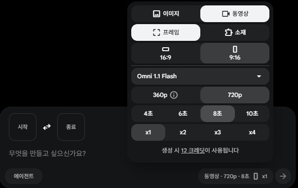
*동영상 · 프레임 · 9:16 · Omni 1.1 Flash · 720p · 8초 · x1 → 생성 시 12 크레딧*

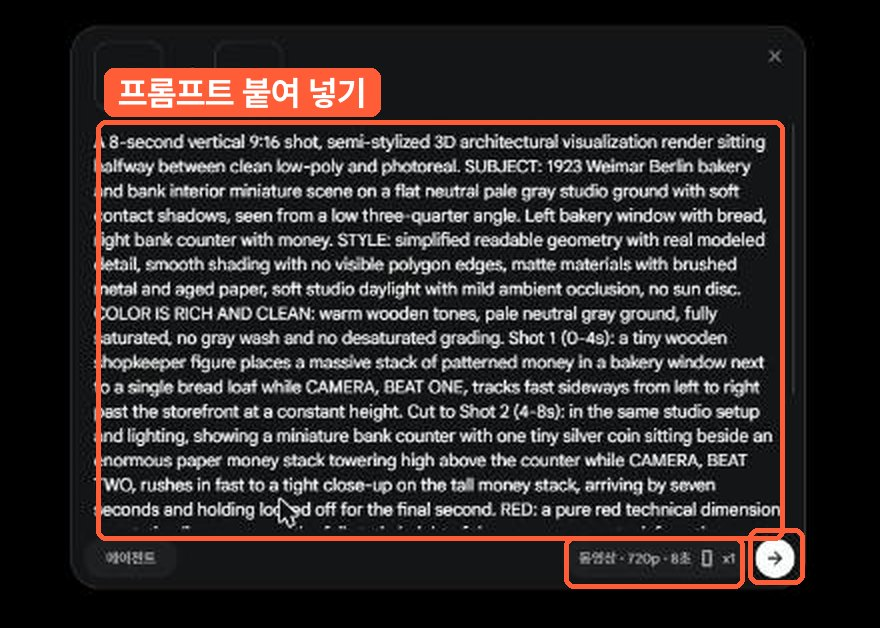
*프롬프트 붙여 넣기 → 설정 칩에서 8초 · 9:16 확인 → 오른쪽 → 로 생성*

### 내려받기

1. 만든 영상 클릭 → 오른쪽 위 **다운로드** 아이콘 → **720p (원본 크기)**
1. 파일 이름을 e01\~e09로 바꿔 05_영상에 저장

### 크레딧 · 계정

무료 계정은 하루 50크레딧 = 8초 클립 4개. 이번에는 dlwldkdl002 (1\~4번) → dlwldkdl001 (5\~8번) → dlwldkdl003 (9번 + 4번 다시 만들기) 순서로 계정을 바꿔 가며 만들었어요.

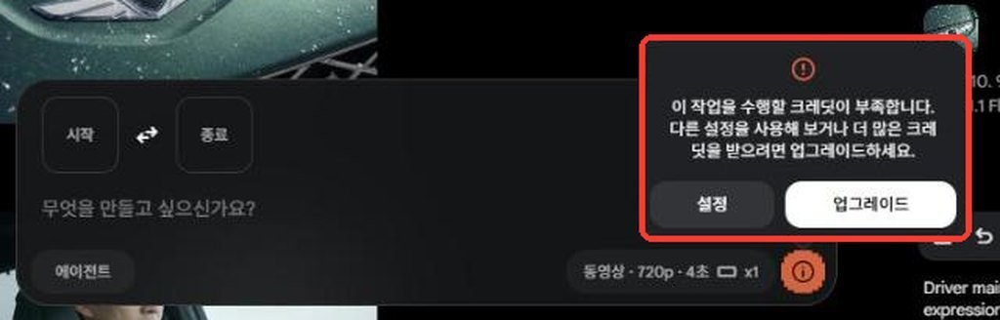
*이 창이 뜨면 이 계정 크레딧이 바닥. 프로필 → 계정 전환*

## 7. 검수 — 18장면 확인

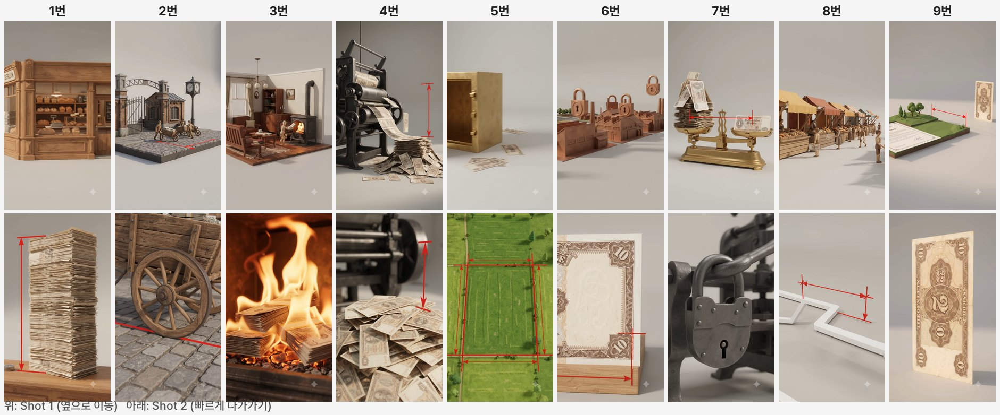
*클립마다 위가 Shot 1, 아래가 Shot 2. 8초 안에서 컷이 실제로 바뀌는지 확인*

### 다시 만든 장면

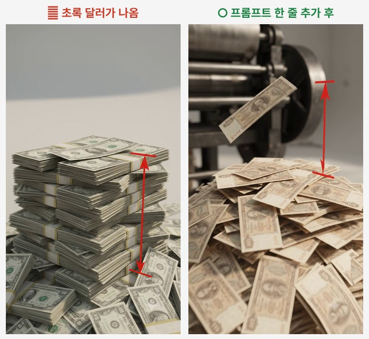
*4번: 독일 이야기인데 초록 달러가 나옴 → 지폐 설명 한 줄을 넣고 다시 생성*

```text
All paper money is pale beige and brown 1920s German-style banknotes with plain ornamental patterns, never green US dollars.
```

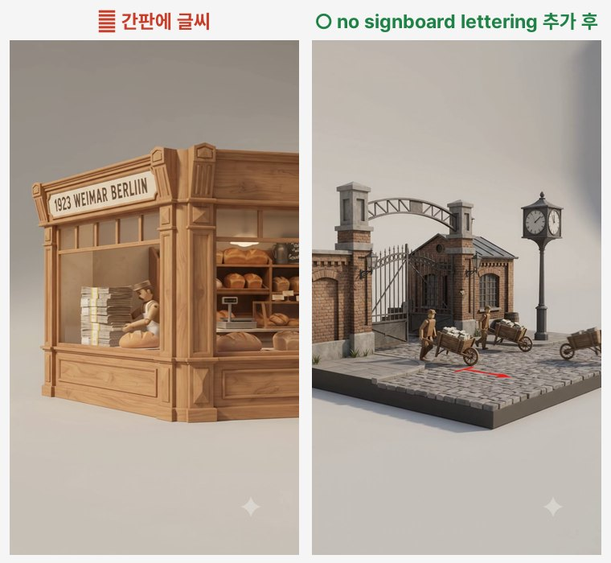
*1번: 간판에 '1923 WEIMAR BERLIN' 글씨가 생김 → 이후 프롬프트에 `no signboard lettering` 추가 (1번은 내용과 맞아서 그대로 사용)*

- [ ] 빨간색이 계측선에만 쓰였나
- [ ] 읽을 수 있는 글자 · 숫자가 크게 나오지 않았나
- [ ] 시대 · 나라가 내용과 맞나
- [ ] 얼굴 클로즈업이 없나

## 8. 나레이션 만들기

확정 스크립트를 문장 단위로 나눠 읽힙니다. **숫자는 한글로** 풀어 써야 TTS가 정확히 읽어요 (예: 2천억 → 이천억, 1923년 → 천구백이십삼 년).

- 원카AI 방식: **Typecast** 웹에 대본 붙여 넣기 → 목소리 고르기 → 오른쪽 위 다운로드
- 이번 예시: 무료 TTS **Supertonic**(PC에서 실행) · 남성 M3 · 속도 1.05 · 문장마다 wav 1개

**TTS에 넣은 문장**

```text
빵 한 덩이에 이천억 마르크.
천구백이십삼 년, 독일 빵집에 실제로 붙어 있던 가격입니다.
일 달러를 바꾸려면, 사조 이천억 마르크.
월급은 하루 두 번 받아, 받자마자 뛰어가 써야 했죠.
장작보다 지폐가 싸서, 돈다발을 난로에 태웠습니다.
정부의 해결책은? 돈을 더 찍는 것.
밤낮없이 찍어낼수록, 돈의 가치는 더 빨리 무너졌습니다.
그래서 독일은 발상을 뒤집습니다.
금이 없다면, 땅을 담보로 잡자.
전국의 농지와 공장에 저당을 걸고, 새 돈 렌텐마르크를 내놓습니다.
옛 돈 일조 마르크가, 새 돈 일 렌텐마르크.
그리고 단 하나를 약속했습니다.
정해진 양 이상은, 절대 찍지 않는다.
몇 주 만에, 물가가 멈춰 섰습니다.
그런데 진짜 반전은 따로 있습니다.
렌텐마르크를 땅으로 바꿀 방법은, 처음부터 없었습니다.
돈을 살린 건 땅이 아니라, 더 찍지 않는다는 믿음이었던 겁니다.
```

## 9. CapCut 편집

### 편집 원칙 2가지

1. **영상은 나레이션을 따라간다** — 나레이션 한 줄이 시작될 때 그 줄의 클립으로 컷. 클립 앞쪽(옆 이동)과 뒤쪽(다가가기)을 나눠 쓰면 8초 안의 두 샷이 다 살아요
1. **자막은 크게, 핵심어만 노랗게** — 나레이션 한 줄 = 자막 한 줄, 숫자는 아라비아 숫자로

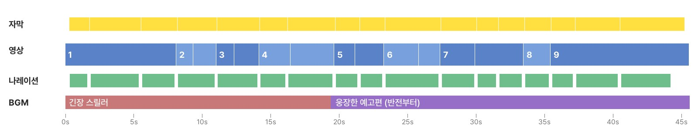
*완성 타임라인: 자막 · 영상(클립 번호) · 나레이션 · BGM (반전 줄에서 BGM 교체)*

### ① 가져와서 순서대로 올리기

1. CapCut → **프로젝트 만들기** → 비율 **9:16**
1. 미디어 → 가져오기 → e01\~09 · narr_01\~ · BGM 2곡
1. 나레이션 wav를 순서대로 오디오 줄에 붙이기 (줄 사이 0.3초)
1. 아래 표대로 클립을 올리고 `Ctrl`+`B`로 잘라 쓸 구간만 남기기

| 클립 | 타임라인 | 쓸 구간 (초) | 속도 | 자막 |
|---|---|---|---|---|
| 01 | 0.0초 | 0.1–7.9 | 0.96x | 빵 한 덩이에 2,000억 마르크 / 1923년 독일 빵집에 실제로 붙어 있던 가격 / 1달러 = 4조 2,000억 마르크 |
| 02 | 8.1초 | 0.4–1.6 + 6.2–7.9 |  | 월급은 하루 두 번, 받자마자 뛰어가 썼다 |
| 03 | 11.0초 | 0.4–1.7 + 6.1–7.9 |  | 장작보다 지폐가 더 쌌다 |
| 04 | 14.2초 | 0.4–2.7 + 4.7–7.9 |  | 정부의 해결책은? 돈을 더 찍는 것 / 찍을수록 돈의 가치는 더 빨리 무너졌다 |
| 05 | 19.7초 | 0.4–1.9 + 5.8–7.9 |  | 그래서 독일은 발상을 뒤집는다 / 금이 없다면, 땅을 담보로 |
| 06 | 23.3초 | 0.4–2.9 + 6.4–7.9 |  | 전국의 농지·공장에 저당 → 새 돈 렌텐마르크 |
| 07 | 27.4초 | 0.4–3.0 + 4.4–7.9 |  | 옛 돈 1조 마르크 = 새 돈 1렌텐마르크 / 그리고 단 하나의 약속 / 정해진 양 이상은 절대 찍지 않는다 |
| 08 | 33.5초 | 0.4–2.4 |  | 몇 주 만에 물가가 멈췄다 |
| 09 | 35.5초 | 0.1–7.9 | 0.77x | 그런데 진짜 반전은 따로 있다 / 렌텐마르크를 땅으로 바꿀 방법은 처음부터 없었다 / 돈을 살린 건 땅이 아니라 믿음 |

> 💡 마지막 클립처럼 나레이션이 8초보다 길면 클립을 선택 → **속도**를 낮춰 길이를 맞춰요.

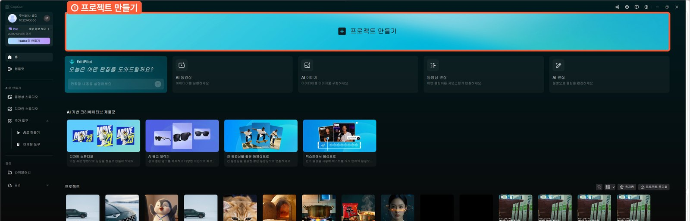
*CapCut → 프로젝트 만들기*

### ② 상단 제목 + 자막

- 상단 제목: 영상 처음부터 끝까지 고정, Pretendard ExtraBold, 흰색 + 검은 테두리, 핵심어 노란색
- 자막: 텍스트 → 기본 텍스트, Pretendard Black · 흰색 + 검은 테두리 · 화면 가운데 아래, 나레이션 줄마다 하나

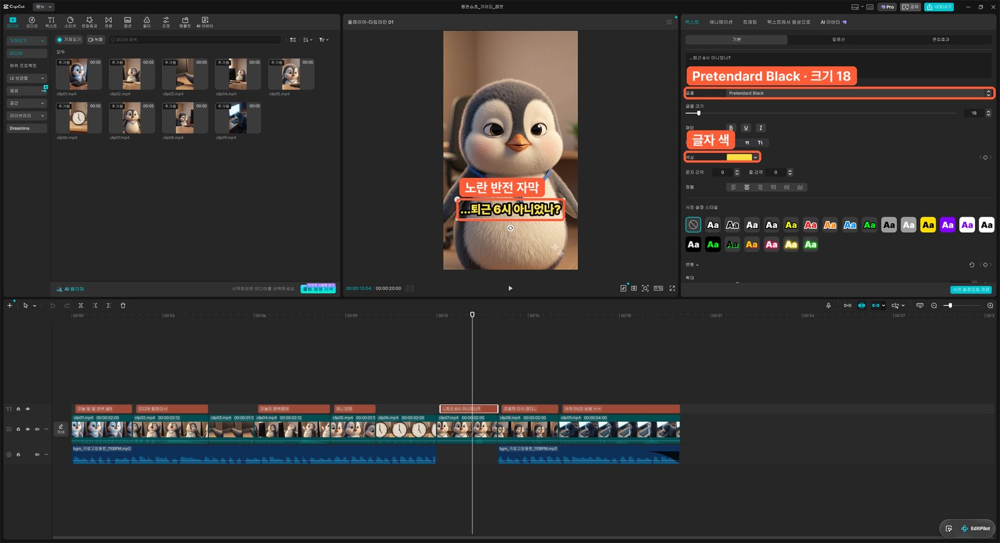
*자막 선택 → 텍스트 탭에서 글꼴 · 크기 · 색*

### ③ 소리

- 클립 원래 소리(Omni가 만든 현장음) 볼륨 20% 정도
- BGM ① **긴장 스릴러** (BGM 팩 09) — 처음부터 반전 직전까지, 볼륨 20%
- BGM ② **웅장한 예고편** (BGM 팩 04) — 반전 줄('그래서 독일은 발상을 뒤집습니다')부터, 끝 1.5초 페이드 아웃
- 나레이션은 100%, 전체 소리 크기는 쇼츠 기준 -14 LUFS 정도

### ④ 내보내기

오른쪽 위 **내보내기** → 해상도 **4K** · 프레임 **24fps**(Flow 원본과 같게) → 08_완성본

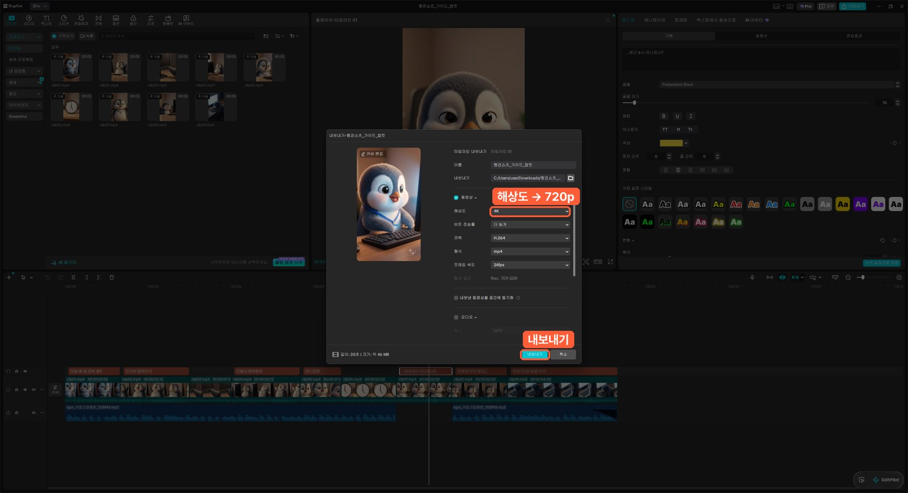
*① 해상도 4K ② 프레임 속도 24fps(원본과 같게)*

> 💡 **해상도 4K · 프레임은 원본과 같게(Flow 영상은 24fps)** 로 내보내요. 4K로 키운다고 그림이 더 선명해지진 않지만, 유튜브는 4K로 올린 영상에 더 좋은 압축(높은 비트레이트)을 써서 올린 뒤 화질이 덜 뭉개져요. 프레임을 30·60으로 바꾸면 없는 프레임을 복제해 끊겨 보이니 원본과 같게 두세요.

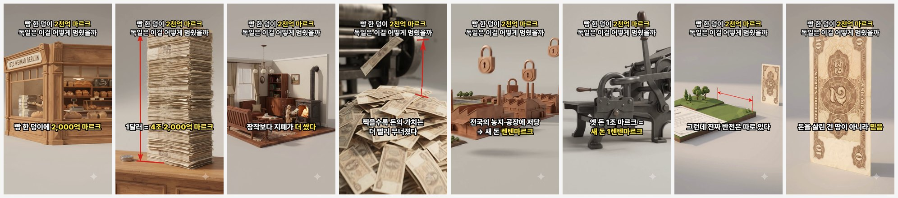
*완성본 장면 확인*

## 10. 체크리스트

- [ ] 레퍼런스 쇼츠 분석 받음
- [ ] 구조 5단계로 스크립트 초안
- [ ] 내 말로 고치고 팩트체크
- [ ] 멀티샷 프롬프트 9개 (구조 · RED · 소리 문장 확인)
- [ ] Flow 설정: 에이전트 끔 · 9:16 · Omni 1.1 Flash · 720p · 8초
- [ ] 클립 9개 검수, 문제 장면만 다시 생성
- [ ] 숫자를 한글로 풀어 나레이션
- [ ] 나레이션 따라 컷 · 자막 한 줄씩
- [ ] 반전 줄에서 BGM 교체
- [ ] 4K · 24fps로 내보냄
