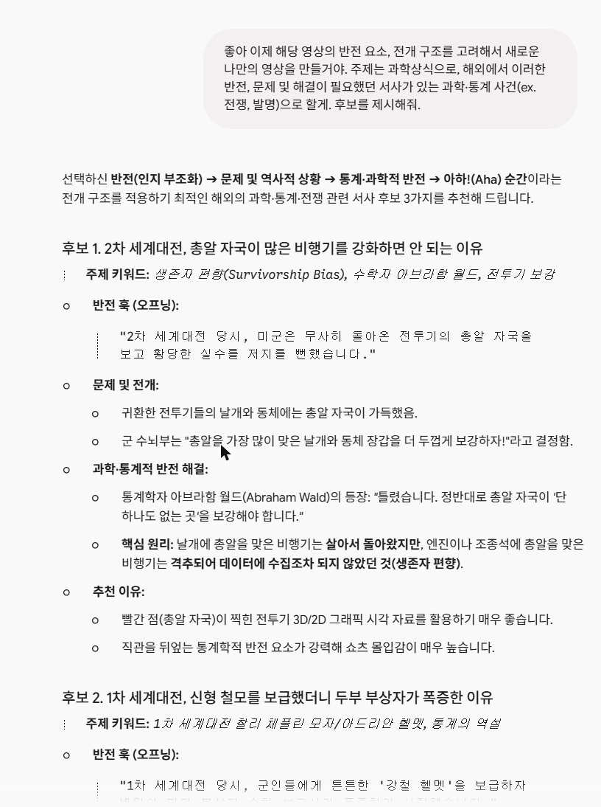
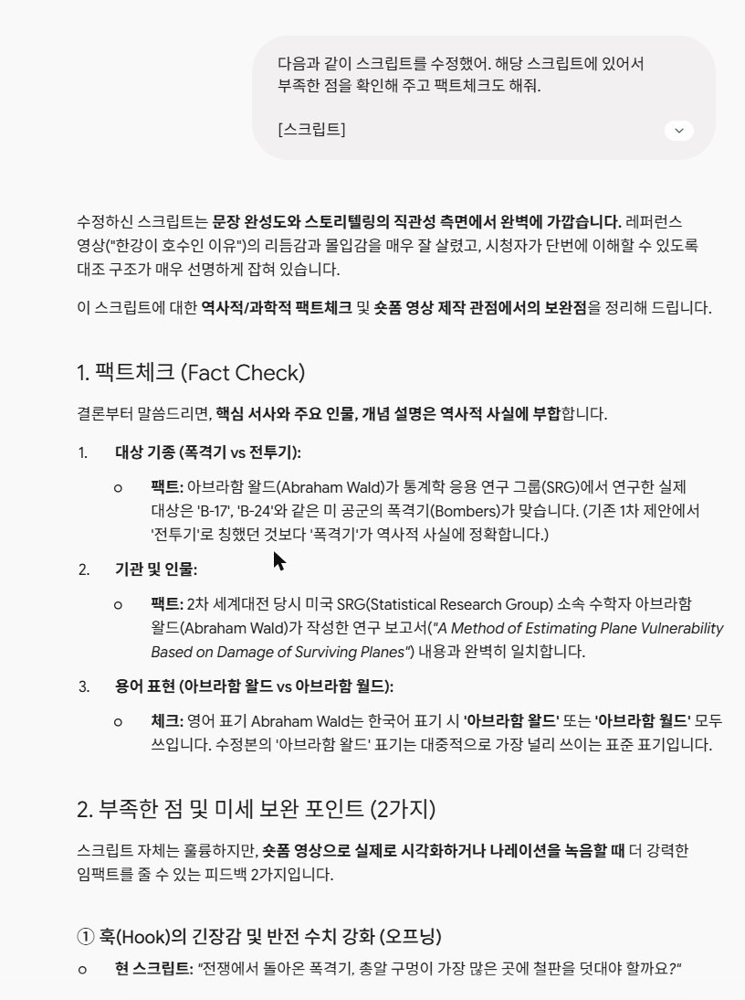
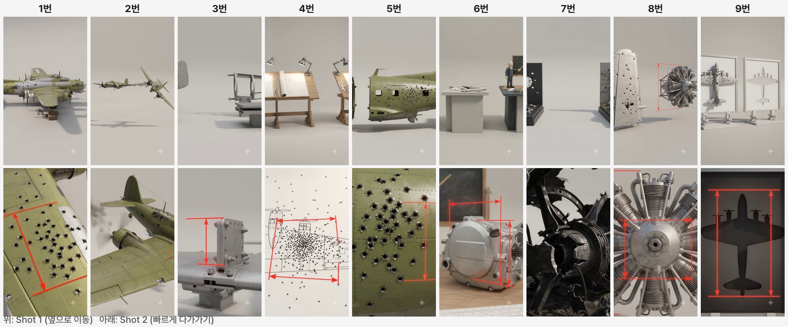
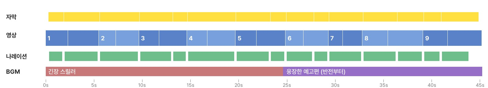
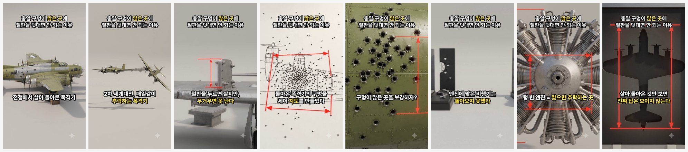

# ✈️ 지식 쇼츠 · 과학상식 「생존자 편향」

유튜브 원카AI의 「AI 건축 쇼츠 30분 만에 만드는 법」 방식 그대로, **제미나이로 기획 → Flow Omni Flash로 이미지 없이 바로 영상 → 나레이션 → CapCut 편집**까지 따라 하는 설명서입니다.

<video src="media/ks_s3_final.mp4" poster="media/ks_s3_final_poster.jpg" controls playsinline preload="metadata"></video>
<p class="cap">완성본 · 45초 · 9:16</p>

> 🎬 **결과물** 45초 · 9:16 · 8초 멀티샷 클립 9개 → 장면 18개<br>
> **도구** Gemini → Google Flow (Omni 1.1 Flash) → 나레이션 TTS → CapCut<br>
> **크레딧** 영상 108 (8초 클립 9개) · 이미지 없음<br>
> **구조** [당연하게 알던 대상] → [뜻밖의 충격적인 문제 발생] → [잘못된 1차 해결책/부작용] → [발상의 전환을 통한 반전의 해결책] → [거대한 스케일과 결론]

## 0. 시작 전 준비

- 참고 영상(원카AI): [www.youtube.com/watch?v=ObvCtB1ATnA](https://www.youtube.com/watch?v=ObvCtB1ATnA)
- 레퍼런스 쇼츠 — 신비한 건축사전 「한강이 강이 아니라 호수인 이유」: [www.youtube.com/shorts/uUN1Bw0elY8](https://www.youtube.com/shorts/uUN1Bw0elY8)
- Gemini: [gemini.google.com](https://gemini.google.com)
- Google Flow: [labs.google/fx/tools/flow](https://labs.google/fx/tools/flow)
- CapCut PC 버전

**폴더 만들어 두기**

```text
shorts_과학_생존자편향/
 ├ 01_대화캡처
 ├ 05_영상    s01~s09.mp4
 ├ 06_소리    narr_01~.wav
 ├ 07_편집
 └ 08_완성본
```

> 💡 핵심은 **구조만 빌리고 소재와 문장은 새로** 쓰는 것. 잘된 쇼츠 한 편을 분석해서 그 뼈대에 내 주제를 얹습니다.

## 1. 제미나이 — 잘된 쇼츠 분석

제미나이 새 채팅에 레퍼런스 쇼츠 주소와 함께 보냅니다.

**보낸 말**

```text
https://www.youtube.com/shorts/uUN1Bw0elY8
해당 영상처럼 제작하려고 해. 이때 해당 영상이 어떤 스타일과 시각자료를 바탕으로 구성되어있는지 확인해줘.
스크립트도 왜 조회수가 많이 나올 수 있었는지를 세부적으로 확인해줘.
```


*스타일(3D 단면 그래픽 · 전/후 비교) + 조회수 이유(상식을 깨는 훅 → 문제 → 반전) 분석*

## 2. 제미나이 — 주제 후보 → 스크립트 초안

### ① 주제 후보 받기

**보낸 말**

```text
좋아 이제 해당 영상의 반전 요소, 전개 구조를 고려해서 새로운 나만의 영상을 만들거야. 주제는 과학상식으로, 해외에서 이러한 반전, 문제 및 해결이 필요했던 서사가 있는 과학·통계 사건(ex. 전쟁, 발명)으로 할게. 후보를 제시해줘.
```


*후보마다 훅 · 문제 · 반전 해결 · 시각 자료 포인트를 정리해 줘요*

### ② 고른 주제로 스크립트 초안

**보낸 말**

```text
1번 생존자 편향으로 할게. 해당 사건의 서사를 담아서 레퍼런스 영상과 비슷한 구조의 스크립트를 만들어줘.
구조는 [당연하게 알던 대상] → [뜻밖의 충격적인 문제 발생] → [잘못된 1차 해결책/부작용] → [발상의 전환을 통한 반전의 해결책] → [거대한 스케일과 결론] 순서로 하고, 나레이션 기준 50초 내외로 시간대별 구간을 나눠줘.
```


*구간별 화면 연출 + 나레이션 초안*

> 💡 원카AI 영상과 달라진 점 두 가지: 구조 5단계를 프롬프트에 **직접 적었고**, 멀티샷 9개에 맞게 **50초 내외**로 길이를 정했어요.

## 3. 스크립트 고치기 + 팩트체크

초안은 '전투기'로 쓰고 '비행기가 전멸합니다' 같은 과장이 있었어요. 실제 연구 대상인 '폭격기'로 바꾸고, 철판이 무거워 다 두를 수 없다는 조건을 넣어 다시 썼습니다.

**보낸 말 (내가 고친 스크립트)**

```text
다음과 같이 스크립트를 수정했어. 해당 스크립트에 있어서 부족한 점을 확인해 주고 팩트체크도 해줘.

[스크립트]
전쟁에서 돌아온 폭격기, 총알 구멍이 가장 많은 곳에 철판을 덧대야 할까요?

2차 세계대전, 연합군 폭격기가 매일같이 하늘에서 떨어지고 있었습니다. 철판을 두르면 살 수 있지만, 전부 두르면 너무 무거워서 날지 못합니다. 어디에 덧댈지 골라야 했죠.

그래서 군은 살아 돌아온 폭격기의 총알 구멍을 하나하나 세어 지도를 만들었습니다. 구멍은 날개와 동체에 몰려 있었고, 결론은 간단해 보였습니다. 구멍이 많은 곳을 보강하자.

그때 수학자 아브라함 왈드가 정반대를 말합니다. 구멍이 없는 곳을 보강하라.

엔진에 총알을 맞은 비행기는, 애초에 돌아오지 못했던 겁니다. 돌아온 비행기의 구멍은 맞아도 버틸 수 있는 곳의 지도였고, 텅 빈 자리야말로 맞으면 추락하는 곳이었죠.

이게 바로 생존자 편향입니다. 살아 돌아온 것만 보면, 진짜 답은 보이지 않습니다.
```


*폭격기(B-17 · B-24) · 통계연구그룹(SRG) · 아브라함 왈드 보고서 모두 '사실에 부합'. 첫 문장을 질문으로 끝내지 말고 결과를 살짝 얹으라는 피드백*

**피드백 반영 후 확정한 스크립트 (9줄 = 클립 9개)**

```text
전쟁에서 살아 돌아온 폭격기, 총알 구멍이 가장 많은 곳에 철판을 덧대면, 틀린 답입니다.
2차 세계대전, 연합군 폭격기가 매일같이 하늘에서 떨어지고 있었습니다.
철판을 두르면 살 수 있지만, 너무 무거우면 날지 못합니다. 어디에 덧댈지 골라야 했죠.
그래서 군은 살아 돌아온 폭격기의 총알 구멍을 하나하나 세어 지도를 만들었습니다.
구멍은 날개와 동체에 몰려 있었고, 결론은 간단해 보였습니다. 구멍이 많은 곳을 보강하자.
그때 수학자 아브라함 왈드가 정반대를 말합니다. 구멍이 없는 곳을 보강하라.
엔진에 총알을 맞은 비행기는, 애초에 돌아오지 못했던 겁니다.
돌아온 비행기의 구멍은 맞아도 버틸 수 있는 곳의 지도였고, 텅 빈 엔진이야말로 맞으면 추락하는 곳이었죠.
이게 바로 생존자 편향입니다. 살아 돌아온 것만 보면, 진짜 답은 보이지 않습니다.
```

> ⚠️ 제미나이 팩트체크도 틀릴 수 있어요. 숫자 · 연도 · 인물 이름은 위키백과 같은 다른 자료로 한 번 더 확인하세요.

## 4. 제미나이 — 멀티샷 영상 프롬프트 18장면 → 9개

원카AI 카페 글의 영상 프롬프트를 **[프롬프트] 예시**로 붙이고, 구조 · 어휘 · 길이는 그대로 두고 내용만 바꾸게 합니다. 8초 클립 하나에 **샷 2개(0\~4초 · 4\~8초)** 를 넣는 멀티샷으로 해서 18장면을 클립 9개(크레딧 절반)로 만들어요.

**보낸 말**

```text
팩트체크 반영해서 스크립트를 이렇게 확정했어.

[확정 스크립트]
전쟁에서 살아 돌아온 폭격기, 총알 구멍이 가장 많은 곳에 철판을 덧대면, 틀린 답입니다.
2차 세계대전, 연합군 폭격기가 매일같이 하늘에서 떨어지고 있었습니다.
철판을 두르면 살 수 있지만, 너무 무거우면 날지 못합니다. 어디에 덧댈지 골라야 했죠.
그래서 군은 살아 돌아온 폭격기의 총알 구멍을 하나하나 세어 지도를 만들었습니다.
구멍은 날개와 동체에 몰려 있었고, 결론은 간단해 보였습니다. 구멍이 많은 곳을 보강하자.
그때 수학자 아브라함 왈드가 정반대를 말합니다. 구멍이 없는 곳을 보강하라.
엔진에 총알을 맞은 비행기는, 애초에 돌아오지 못했던 겁니다.
돌아온 비행기의 구멍은 맞아도 버틸 수 있는 곳의 지도였고, 텅 빈 엔진이야말로 맞으면 추락하는 곳이었죠.
이게 바로 생존자 편향입니다. 살아 돌아온 것만 보면, 진짜 답은 보이지 않습니다.

이제 스크립트의 내용을 기준으로 총 18개 장면으로 영상화하려고 해. 크레딧을 아끼기 위해 장면 2개를 8초 멀티샷 1개로 묶어서, 멀티샷 9개 클립으로 만들 거야(스크립트 1줄 = 클립 1개). veo omni 모델용 프롬프트로 제시해 주고 스크립트의 내용이 적절하게 들어갈 수 있도록 해줘.
하단의 프롬프트와 똑같은 구조·어휘·길이로 만들어주되 내용은 위 스크립트에 맞춰줘. 추가적으로 하단의 내용을 참조 해줘.

순서: 첫 문장 → SUBJECT → STYLE → COLOR IS RICH AND CLEAN → Shot 1 (0-4s) 안에 CAMERA, BEAT ONE(횡이동만) → Cut to Shot 2 (4-8s) 안에 CAMERA, BEAT TWO(급속 푸시인 클로즈업만, arriving by seven seconds) → RED → No text 문장 → 소리 문장.
두 샷은 같은 장소·같은 소품·같은 조명으로 이어지게.
빨강은 계측선으로만, 고정/이동 보조선을 매번 명시하고 "They are the only saturated red in the frame and carry no numbers and no text"로 끝내기. 빨간 소품(불꽃 등) 컷엔 계측선 대신 "No red annotations in this shot".
총알 구멍은 빨간 점이 아니라 작고 어두운 금속 구멍으로만. 비행기에는 국적 마크·글자·숫자 없음.
스타일은 2차 대전 비행장을 재현한 반실사 3D 미니어처 디오라마. 사람은 얼굴이 작게 보이는 미니어처 인형으로만, 얼굴 클로즈업 없음.
No text 문장에 no signboard lettering, no insignia 추가.
소리는 "No background music, no voice, no dialogue. Only realistic location sound: ..., a fast air rush on the push-in."
한국어 설명 + 영문 코드블록 + 글자수로 주고, 충돌은 미리 점검해서 위험도 같이 알려줘.

[프롬프트]
A 8-second vertical 9:16 shot, semi-stylized 3D architectural visualization render sitting halfway between clean low-poly and photoreal. SUBJECT: two bridge models standing side by side as technical models on a flat neutral pale gray studio ground with soft contact shadows, seen from a low three-quarter angle. The left one is the London Millennium Bridge, its suspension cables running almost flat and straight with only the shallowest sag between its Y-shaped piers. The right one is a conventional suspension bridge of the same length with deep swooping cables sagging far below tall towers. Everything else about them is identical, same white deck, same handrails, modeled anchor plates and turnbuckles at every cable end, clean empty studio space around them. STYLE: simplified readable geometry with real modeled detail, smooth shading with no visible polygon edges, matte materials with brushed steel, no mirror gloss, soft studio daylight with mild ambient occlusion, no sun disc. COLOR IS RICH AND CLEAN: bright white painted steel, pale neutral gray ground, fully saturated, no gray wash and no desaturated grading. CAMERA, BEAT ONE, the first two seconds: the camera tracks fast sideways from left to right past both models at a constant height. CAMERA, BEAT TWO, from two seconds to the end: the camera rushes in fast to a tight close-up on the almost flat cable of the left model, arriving by four seconds and holding locked off on it for the final second. RED: two pure red technical dimension annotations measure how far each cable sags below its anchor line, drafting style, on each model a thin horizontal extension line at the anchor height and another at the cable's lowest point with a vertical dimension line between them and a small sharp arrowhead at each end, glowing, the left one extremely short and the right one very tall, both holding their length for the whole shot. They are the only saturated red in the frame and carry no numbers and no text. No text, no letters, no numbers, no labels, no logos, no watermark, no lens flare, no film grain, no vignette, no close-up faces. No background music. Only realistic location sound: a thin metallic shimmer from the taut cables, quiet studio air, a fast air rush on the push-in.
```


*설정 표 · 충돌 위험 점검 · 클립별 한국어 설명 + 영문 코드블록 + 글자 수*

> 💡 렌텐마르크 때 구조가 흐트러진 경험을 살려, 이번에는 **순서 · RED · 소리 규칙을 처음부터** 적어 보냈어요. 그래도 'Shot 1 / Cut to Shot 2' 표기가 빠져 있어서, 컷이 확실히 바뀌도록 그 두 표현만 직접 넣었습니다.

## 5. 최종 프롬프트 9개

Flow에 그대로 붙여 넣은 최종본입니다. 아래 줄을 펼쳐 복사하세요.

<details>
<summary>01 · 구멍 난 폭격기 모형 옆을 횡이동 → 구멍이 빽빽한 날개로 푸시인 (구멍 밀집 구역 = 빨간 고정선)</summary>

**나레이션**

전쟁에서 살아 돌아온 폭격기. / 총알 구멍이 가장 많은 곳에 철판을 덧대면, 틀린 답입니다.

**프롬프트**

```text
A 8-second vertical 9:16 shot, semi-stylized 3D architectural visualization render sitting halfway between clean low-poly and photoreal. SUBJECT: a damaged four-engine bomber technical miniature model sitting on a flat neutral pale gray studio ground with soft contact shadows, seen from a low three-quarter angle. The bomber skin shows clean matte metal panels with no insignia and no markings. On its wings and rear fuselage, dozens of tiny dark jagged physical metal punctures are visibly scattered, while all four engine housings stay perfectly clean. Modeled wheel chocks and wooden tool crates sit beside the landing gear, clean empty studio space around it. STYLE: simplified readable geometry with real modeled detail, smooth shading with no visible polygon edges, matte materials with brushed aluminum, no mirror gloss, soft studio daylight with mild ambient occlusion, no sun disc. COLOR IS RICH AND CLEAN: bright painted olive metal, pale neutral gray ground, fully saturated, no gray wash and no desaturated grading. Shot 1 (0-4s): CAMERA, BEAT ONE, the camera tracks fast sideways from left to right past the entire bomber model at a constant height. Cut to Shot 2 (4-8s), same set and lighting: CAMERA, BEAT TWO, the camera rushes in fast to a tight close-up on the heavily punctured outer wing surface, arriving by seven seconds and holding locked off on it for the final second. RED: two pure red technical dimension annotations measure the dense cluster area of punctures on the wing, drafting style, a thin horizontal extension line at the top and another at the bottom with a vertical dimension line between them and a small sharp arrowhead at each end, glowing, holding its length for the whole shot. They are the only saturated red in the frame and carry no numbers and no text. No text, no letters, no numbers, no labels, no logos, no watermark, no lens flare, no film grain, no vignette, no close-up faces, no signboard lettering, no insignia. No background music, no voice, no dialogue. Only realistic location sound: quiet studio air, faint metallic hangar ambiance, a fast air rush on the push-in.
```

</details>

<details>
<summary>02 · 나란히 나는 폭격기 2대 → 엔진에서 연기를 끌며 떨어지는 오른쪽 기체로 푸시인 (연기 컷이라 계측선 없음)</summary>

**나레이션**

이차 세계대전, 연합군 폭격기가 매일같이 하늘에서 떨어지고 있었습니다.

**프롬프트**

```text
A 8-second vertical 9:16 shot, semi-stylized 3D architectural visualization render sitting halfway between clean low-poly and photoreal. SUBJECT: two bomber aircraft models flying side by side as technical models above a flat neutral pale gray studio ground with soft shadows below, seen from a low three-quarter angle. The left bomber flies steady with smooth propeller motion, clean matte metallic plating with no insignia. The right bomber trails a thin dark gray smoke plume from its inner engine housing, tilted at a steep downward angle. Same wing layout, modeled rivets and wing ribs, clean empty studio space around them. STYLE: simplified readable geometry with real modeled detail, smooth shading with no visible polygon edges, matte materials with brushed steel, no mirror gloss, soft studio daylight with mild ambient occlusion, no sun disc. COLOR IS RICH AND CLEAN: bright olive painted steel, pale neutral gray ground, fully saturated, no gray wash and no desaturated grading. Shot 1 (0-4s): CAMERA, BEAT ONE, the camera tracks fast sideways from left to right past both flying models at a constant height. Cut to Shot 2 (4-8s), same set and lighting: CAMERA, BEAT TWO, the camera rushes in fast to a tight close-up on the smoking engine of the falling right bomber, arriving by seven seconds and holding locked off on it for the final second. RED: No red annotations in this shot. No text, no letters, no numbers, no labels, no logos, no watermark, no lens flare, no film grain, no vignette, no close-up faces, no signboard lettering, no insignia. No background music, no voice, no dialogue. Only realistic location sound: a deep mechanical engine hum, wind whistling past miniature wings, a fast air rush on the push-in.
```

</details>

<details>
<summary>03 · 저울 위에서 무게로 기우는 날개 + 두꺼운 철판 → 날개 위 철판으로 푸시인 (철판 두께 = 빨간 고정선)</summary>

**나레이션**

철판을 두르면 살 수 있지만, 너무 무거우면 날지 못합니다. / 어디에 덧댈지, 골라야 했죠.

**프롬프트**

```text
A 8-second vertical 9:16 shot, semi-stylized 3D architectural visualization render sitting halfway between clean low-poly and photoreal. SUBJECT: a bomber wing section and heavy armor plate props standing side by side as technical models on a flat neutral pale gray studio ground with soft contact shadows, seen from a low three-quarter angle. The left prop is a detached wing section mounted on a miniature mechanical balance scale, tipping heavily downward under the weight of stacked steel plates. The right prop is a bare wing frame with thick gray steel slabs resting on a low pedestal nearby. Modeled bolts and mounting pins at every joint, clean empty studio space around them. STYLE: simplified readable geometry with real modeled detail, smooth shading with no visible polygon edges, matte materials with brushed steel, no mirror gloss, soft studio daylight with mild ambient occlusion, no sun disc. COLOR IS RICH AND CLEAN: bright gray painted steel, pale neutral gray ground, fully saturated, no gray wash and no desaturated grading. Shot 1 (0-4s): CAMERA, BEAT ONE, the camera tracks fast sideways from left to right past both technical props at a constant height. Cut to Shot 2 (4-8s), same set and lighting: CAMERA, BEAT TWO, the camera rushes in fast to a tight close-up on the heavy armor plate resting on the wing joint, arriving by seven seconds and holding locked off on it for the final second. RED: two pure red technical dimension annotations measure the thickness of the heavy armor plate, drafting style, a thin horizontal extension line at the top and another at the bottom with a vertical dimension line between them and a small sharp arrowhead at each end, glowing, holding its length for the whole shot. They are the only saturated red in the frame and carry no numbers and no text. No text, no letters, no numbers, no labels, no logos, no watermark, no lens flare, no film grain, no vignette, no close-up faces, no signboard lettering, no insignia. No background music, no voice, no dialogue. Only realistic location sound: a heavy metallic clinking noise, quiet studio air, a fast air rush on the push-in.
```

</details>

<details>
<summary>04 · 비어 있는 도면 탁자 vs 점이 찍힌 도면 탁자(인형 장교들) → 날개 쪽 점 무더기로 푸시인 (점 무더기 폭 = 빨간 고정선)</summary>

**나레이션**

그래서 군은 살아 돌아온 폭격기의 총알 구멍을, 하나하나 세어 지도를 만들었습니다.

**프롬프트**

```text
A 8-second vertical 9:16 shot, semi-stylized 3D architectural visualization render sitting halfway between clean low-poly and photoreal. SUBJECT: two drafting tables displaying aircraft damage charts side by side as technical models on a flat neutral pale gray studio ground with soft contact shadows, seen from a low three-quarter angle. The left table shows an empty bomber top-view outline with clean grid lines. The right table shows the same outline filled with tiny dark hand-drawn dots concentrated along the wings and the rear fuselage, with the engine areas left completely empty. Small faceless miniature officer figurines stand around the right table. Same wooden tables and desk lamps, modeled calipers and rulers on each desk edge, clean empty studio space around them. STYLE: simplified readable geometry with real modeled detail, smooth shading with no visible polygon edges, matte materials with brushed steel and paper, no mirror gloss, soft studio daylight with mild ambient occlusion, no sun disc. COLOR IS RICH AND CLEAN: bright white paper charts, pale neutral gray ground, fully saturated, no gray wash and no desaturated grading. Shot 1 (0-4s): CAMERA, BEAT ONE, the camera tracks fast sideways from left to right past both drafting tables at a constant height. Cut to Shot 2 (4-8s), same set and lighting: CAMERA, BEAT TWO, the camera rushes in fast to a tight close-up on the dense dot pattern on the wing section of the right chart, arriving by seven seconds and holding locked off on it for the final second. RED: two pure red technical dimension annotations measure the width of the main dot cluster on the chart, drafting style, a thin vertical extension line at the left boundary and another at the right boundary with a horizontal dimension line between them and a small sharp arrowhead at each end, glowing, holding its length for the whole shot. They are the only saturated red in the frame and carry no numbers and no text. No text, no letters, no numbers, no labels, no logos, no watermark, no lens flare, no film grain, no vignette, no close-up faces, no signboard lettering, no insignia. No background music, no voice, no dialogue. Only realistic location sound: crisp paper rustling, quiet studio air, a fast air rush on the push-in.
```

</details>

<details>
<summary>05 · 깨끗한 동체 vs 구멍 난 동체 → 구멍이 몰린 동체 중앙으로 푸시인 (구멍 퍼진 높이 = 빨간 고정선)</summary>

**나레이션**

구멍은 날개와 동체에 몰려 있었고, 결론은 간단해 보였습니다. / 구멍이 많은 곳을 보강하자.

**프롬프트**

```text
A 8-second vertical 9:16 shot, semi-stylized 3D architectural visualization render sitting halfway between clean low-poly and photoreal. SUBJECT: two bomber fuselage sections standing side by side as technical models on a flat neutral pale gray studio ground with soft contact shadows, seen from a low three-quarter angle. The left section is a plain unblemished metal body module. The right section is a heavily punctured fuselage module with dozens of tiny dark jagged physical metal punctures clustered on its mid-section and tail fin. Same gray metallic finish, modeled rivet lines and access doors, clean empty studio space around them. STYLE: simplified readable geometry with real modeled detail, smooth shading with no visible polygon edges, matte materials with brushed steel, no mirror gloss, soft studio daylight with mild ambient occlusion, no sun disc. COLOR IS RICH AND CLEAN: bright olive painted steel, pale neutral gray ground, fully saturated, no gray wash and no desaturated grading. Shot 1 (0-4s): CAMERA, BEAT ONE, the camera tracks fast sideways from left to right past both fuselage models at a constant height. Cut to Shot 2 (4-8s), same set and lighting: CAMERA, BEAT TWO, the camera rushes in fast to a tight close-up on the densely punctured mid-fuselage skin, arriving by seven seconds and holding locked off on it for the final second. RED: two pure red technical dimension annotations measure the vertical spread of the dark punctures on the right module, drafting style, a thin horizontal extension line at the top and another at the bottom with a vertical dimension line between them and a small sharp arrowhead at each end, glowing, holding its length for the whole shot. They are the only saturated red in the frame and carry no numbers and no text. No text, no letters, no numbers, no labels, no logos, no watermark, no lens flare, no film grain, no vignette, no close-up faces, no signboard lettering, no insignia. No background music, no voice, no dialogue. Only realistic location sound: dull metallic tapping, quiet studio air, a fast air rush on the push-in.
```

</details>

<details>
<summary>06 · 칠판 앞에서 지시봉으로 깨끗한 엔진을 가리키는 수학자 인형 → 깨끗한 엔진으로 푸시인 (엔진 높이 = 빨간 고정선)</summary>

**나레이션**

그때 수학자 아브라함 왈드가 정반대를 말합니다. / 구멍이 없는 곳을 보강하라.

**프롬프트**

```text
A 8-second vertical 9:16 shot, semi-stylized 3D architectural visualization render sitting halfway between clean low-poly and photoreal. SUBJECT: two analysis pedestals standing side by side as technical models on a flat neutral pale gray studio ground with soft contact shadows, seen from a low three-quarter angle. The left pedestal displays a small bomber layout model. The right pedestal features a small faceless mathematician figurine in a dark suit beside a miniature blank chalkboard, holding a wooden pointer aimed directly at a pristine engine casing prop. Modeled chalk pieces and slide rules on each pedestal top, clean empty studio space around them. STYLE: simplified readable geometry with real modeled detail, smooth shading with no visible polygon edges, matte materials with brushed wood and metal, no mirror gloss, soft studio daylight with mild ambient occlusion, no sun disc. COLOR IS RICH AND CLEAN: bright white chalk dust, dark slate, pale neutral gray ground, fully saturated, no gray wash and no desaturated grading. Shot 1 (0-4s): CAMERA, BEAT ONE, the camera tracks fast sideways from left to right past both pedestals at a constant height. Cut to Shot 2 (4-8s), same set and lighting: CAMERA, BEAT TWO, the camera rushes in fast to a tight close-up on the clean untouched surface of the engine casing, arriving by seven seconds and holding locked off on it for the final second. RED: two pure red technical dimension annotations measure the height of the untouched engine module, drafting style, a thin horizontal extension line at the top and another at the bottom with a vertical dimension line between them and a small sharp arrowhead at each end, glowing, holding its length for the whole shot. They are the only saturated red in the frame and carry no numbers and no text. No text, no letters, no numbers, no labels, no logos, no watermark, no lens flare, no film grain, no vignette, no close-up faces, no signboard lettering, no insignia. No background music, no voice, no dialogue. Only realistic location sound: a sharp wooden pointer tap, quiet studio air, a fast air rush on the push-in.
```

</details>

<details>
<summary>07 · 온전한 날개 vs 부서진 엔진 잔해 → 그을린 엔진 잔해로 푸시인 (계측선 없음)</summary>

**나레이션**

엔진에 총알을 맞은 비행기는, 애초에 돌아오지 못했던 겁니다.

**프롬프트**

```text
A 8-second vertical 9:16 shot, semi-stylized 3D architectural visualization render sitting halfway between clean low-poly and photoreal. SUBJECT: two crash site diorama modules standing side by side as technical models on a flat neutral pale gray studio ground with soft contact shadows, seen from a low three-quarter angle. The left module shows an intact unpainted aluminum wing section. The right module shows a destroyed engine cowling with twisted black metal wreckage and dark soot stains on miniature terrain. Modeled sheared bolts and torn framing along the break points, clean empty studio space around them. STYLE: simplified readable geometry with real modeled detail, smooth shading with no visible polygon edges, matte materials with brushed steel and dark carbon finish, no mirror gloss, soft studio daylight with mild ambient occlusion, no sun disc. COLOR IS RICH AND CLEAN: dark burnt soot finish, pale neutral gray ground, fully saturated, no gray wash and no desaturated grading. Shot 1 (0-4s): CAMERA, BEAT ONE, the camera tracks fast sideways from left to right past both crash modules at a constant height. Cut to Shot 2 (4-8s), same set and lighting: CAMERA, BEAT TWO, the camera rushes in fast to a tight close-up on the fractured core of the destroyed engine assembly, arriving by seven seconds and holding locked off on it for the final second. RED: No red annotations in this shot. No text, no letters, no numbers, no labels, no logos, no watermark, no lens flare, no film grain, no vignette, no close-up faces, no signboard lettering, no insignia. No background music, no voice, no dialogue. Only realistic location sound: low metal creaking, quiet wind over desolate metal, a fast air rush on the push-in.
```

</details>

<details>
<summary>08 · 구멍 난 날개(버틴 곳) vs 구멍 없는 엔진(추락하는 곳) → 깨끗한 엔진으로 푸시인 (엔진 높이 = 빨간 고정선)</summary>

**나레이션**

돌아온 비행기의 구멍은, 맞아도 버틸 수 있는 곳의 지도였고, / 텅 빈 엔진이야말로, 맞으면 추락하는 곳이었죠.

**프롬프트**

```text
A 8-second vertical 9:16 shot, semi-stylized 3D architectural visualization render sitting halfway between clean low-poly and photoreal. SUBJECT: a damaged outer wing model and a pristine radial engine model standing side by side as technical models on a flat neutral pale gray studio ground with soft contact shadows, seen from a low three-quarter angle. The left model is an outer wing panel covered in small dark physical punctures. The right model is a completely clean radial engine assembly with smooth metal cylinders and no bullet marks whatsoever. Same silver finish, modeled mounting struts and exhaust pipes, clean empty studio space around them. STYLE: simplified readable geometry with real modeled detail, smooth shading with no visible polygon edges, matte materials with brushed steel, no mirror gloss, soft studio daylight with mild ambient occlusion, no sun disc. COLOR IS RICH AND CLEAN: bright metallic steel, pale neutral gray ground, fully saturated, no gray wash and no desaturated grading. Shot 1 (0-4s): CAMERA, BEAT ONE, the camera tracks fast sideways from left to right past both models at a constant height. Cut to Shot 2 (4-8s), same set and lighting: CAMERA, BEAT TWO, the camera rushes in fast to a tight close-up on the completely untouched center of the clean radial engine, arriving by seven seconds and holding locked off on it for the final second. RED: two pure red technical dimension annotations measure the height of the clean engine unit, drafting style, a thin horizontal extension line at the top and another at the bottom with a vertical dimension line between them and a small sharp arrowhead at each end, glowing, holding its length for the whole shot. They are the only saturated red in the frame and carry no numbers and no text. No text, no letters, no numbers, no labels, no logos, no watermark, no lens flare, no film grain, no vignette, no close-up faces, no signboard lettering, no insignia. No background music, no voice, no dialogue. Only realistic location sound: a quiet mechanical hum, subtle metallic resonance, a fast air rush on the push-in.
```

</details>

<details>
<summary>09 · 구멍 난 폭격기 vs 비어 있는 실루엣 틀(돌아오지 못한 비행기) → 빈 실루엣 안으로 푸시인 (실루엣 높이 = 빨간 고정선)</summary>

**나레이션**

이게 바로, 생존자 편향입니다. / 살아 돌아온 것만 보면, 진짜 답은 보이지 않습니다.

**프롬프트**

```text
A 8-second vertical 9:16 shot, semi-stylized 3D architectural visualization render sitting halfway between clean low-poly and photoreal. SUBJECT: two display frames standing side by side as technical models on a flat neutral pale gray studio ground with soft contact shadows, seen from a low three-quarter angle. The left frame holds a complete miniature bomber model marked with scattered puncture holes. The right frame holds an empty cut-out bomber silhouette, a hollow outline representing the planes that never came back. Same white mounting stands, modeled base clamps, clean empty studio space around them. STYLE: simplified readable geometry with real modeled detail, smooth shading with no visible polygon edges, matte materials with brushed aluminum, no mirror gloss, soft studio daylight with mild ambient occlusion, no sun disc. COLOR IS RICH AND CLEAN: bright white display panels, pale neutral gray ground, fully saturated, no gray wash and no desaturated grading. Shot 1 (0-4s): CAMERA, BEAT ONE, the camera tracks fast sideways from left to right past both display frames at a constant height. Cut to Shot 2 (4-8s), same set and lighting: CAMERA, BEAT TWO, the camera rushes in fast to a tight close-up on the dark empty space inside the right silhouette frame, arriving by seven seconds and holding locked off on it for the final second. RED: two pure red technical dimension annotations measure the height of the empty silhouette frame, drafting style, a thin horizontal extension line at the top and another at the bottom with a vertical dimension line between them and a small sharp arrowhead at each end, glowing, holding its length for the whole shot. They are the only saturated red in the frame and carry no numbers and no text. No text, no letters, no numbers, no labels, no logos, no watermark, no lens flare, no film grain, no vignette, no close-up faces, no signboard lettering, no insignia. No background music, no voice, no dialogue. Only realistic location sound: quiet studio atmosphere, subtle ambient hum, a fast air rush on the push-in.
```

</details>

## 6. Flow — 이미지 없이 바로 영상 만들기

1. Flow → **새 프로젝트**
1. 입력창 왼쪽 아래 **에이전트** 버튼이 켜져 있으면 눌러서 끄기 (켜져 있으면 설정이 '에이전트 설정'으로 열려요)
1. 입력창 오른쪽 아래 설정 → **동영상 · 프레임 · 9:16 · Omni 1.1 Flash · 720p · 8초 · x1** (12크레딧)
1. 프롬프트 붙여 넣기 → **→** (시작 · 종료 칸은 비워 둠)
1. 생성 중에도 다음 프롬프트를 넣고 → 를 눌러 **여러 개 동시에** 만들 수 있어요


*동영상 · 프레임 · 9:16 · Omni 1.1 Flash · 720p · 8초 · x1 → 생성 시 12 크레딧*


*프롬프트 붙여 넣기 → 설정 칩에서 8초 · 9:16 확인 → 오른쪽 → 로 생성*

### 내려받기

1. 만든 영상 클릭 → 오른쪽 위 **다운로드** 아이콘 → **720p (원본 크기)**
1. 파일 이름을 s01\~s09로 바꿔 05_영상에 저장

### 크레딧 · 계정

무료 계정은 하루 50크레딧 = 8초 클립 4개. 이번에는 dlwldkdl003 (1\~2번) → utop402 (3\~6번) → k2309123 (7\~9번) 순서로 계정을 바꿔 가며 만들었어요.


*이 창이 뜨면 이 계정 크레딧이 바닥. 프로필 → 계정 전환*

## 7. 검수 — 18장면 확인


*클립마다 위가 Shot 1, 아래가 Shot 2. 8초 안에서 컷이 실제로 바뀌는지 확인*

> 💡 폭격기 날개의 흰 별 마크는 실제 미군 B-17 표식이라 그대로 썼어요. 국적 마크가 다른 나라 것으로 나오면 다시 만드세요.

- [ ] 빨간색이 계측선에만 쓰였나
- [ ] 읽을 수 있는 글자 · 숫자가 크게 나오지 않았나
- [ ] 시대 · 나라가 내용과 맞나
- [ ] 얼굴 클로즈업이 없나

## 8. 나레이션 만들기

확정 스크립트를 문장 단위로 나눠 읽힙니다. **숫자는 한글로** 풀어 써야 TTS가 정확히 읽어요 (예: 2천억 → 이천억, 1923년 → 천구백이십삼 년).

- 원카AI 방식: **Typecast** 웹에 대본 붙여 넣기 → 목소리 고르기 → 오른쪽 위 다운로드
- 이번 예시: 무료 TTS **Supertonic**(PC에서 실행) · 남성 M3 · 속도 1.05 · 문장마다 wav 1개

**TTS에 넣은 문장**

```text
전쟁에서 살아 돌아온 폭격기.
총알 구멍이 가장 많은 곳에 철판을 덧대면, 틀린 답입니다.
이차 세계대전, 연합군 폭격기가 매일같이 하늘에서 떨어지고 있었습니다.
철판을 두르면 살 수 있지만, 너무 무거우면 날지 못합니다.
어디에 덧댈지, 골라야 했죠.
그래서 군은 살아 돌아온 폭격기의 총알 구멍을, 하나하나 세어 지도를 만들었습니다.
구멍은 날개와 동체에 몰려 있었고, 결론은 간단해 보였습니다.
구멍이 많은 곳을 보강하자.
그때 수학자 아브라함 왈드가 정반대를 말합니다.
구멍이 없는 곳을 보강하라.
엔진에 총알을 맞은 비행기는, 애초에 돌아오지 못했던 겁니다.
돌아온 비행기의 구멍은, 맞아도 버틸 수 있는 곳의 지도였고,
텅 빈 엔진이야말로, 맞으면 추락하는 곳이었죠.
이게 바로, 생존자 편향입니다.
살아 돌아온 것만 보면, 진짜 답은 보이지 않습니다.
```

## 9. CapCut 편집

### 편집 원칙 2가지

1. **영상은 나레이션을 따라간다** — 나레이션 한 줄이 시작될 때 그 줄의 클립으로 컷. 클립 앞쪽(옆 이동)과 뒤쪽(다가가기)을 나눠 쓰면 8초 안의 두 샷이 다 살아요
1. **자막은 크게, 핵심어만 노랗게** — 나레이션 한 줄 = 자막 한 줄, 숫자는 아라비아 숫자로


*완성 타임라인: 자막 · 영상(클립 번호) · 나레이션 · BGM (반전 줄에서 BGM 교체)*

### ① 가져와서 순서대로 올리기

1. CapCut → **프로젝트 만들기** → 비율 **9:16**
1. 미디어 → 가져오기 → s01\~09 · narr_01\~ · BGM 2곡
1. 나레이션 wav를 순서대로 오디오 줄에 붙이기 (줄 사이 0.3초)
1. 아래 표대로 클립을 올리고 `Ctrl`+`B`로 잘라 쓸 구간만 남기기

| 클립 | 타임라인 | 쓸 구간 (초) | 속도 | 자막 |
|---|---|---|---|---|
| 01 | 0.0초 | 0.4–2.7 + 4.7–7.9 |  | 전쟁에서 살아 돌아온 폭격기 / 구멍이 가장 많은 곳에 철판을? 틀린 답 |
| 02 | 5.5초 | 0.4–2.1 + 5.5–7.9 |  | 2차 세계대전, 매일같이 추락하는 폭격기 |
| 03 | 9.7초 | 0.4–2.5 + 5.0–7.9 |  | 철판을 두르면 살지만, 무거우면 못 난다 / 어디에 덧댈지 골라야 했다 |
| 04 | 14.6초 | 0.4–2.5 + 5.0–7.9 |  | 돌아온 폭격기의 구멍을 세어 지도를 만들었다 |
| 05 | 19.7초 | 0.4–2.6 + 4.9–7.9 |  | 구멍은 날개와 동체에 몰려 있었다 / 구멍이 많은 곳을 보강하자? |
| 06 | 24.9초 | 0.4–2.3 + 5.4–8.0 |  | 그때 수학자 아브라함 왈드 / 구멍이 없는 곳을 보강하라 |
| 07 | 29.3초 | 0.4–1.9 + 5.9–7.9 |  | 엔진에 맞은 비행기는 돌아오지 못했다 |
| 08 | 32.8초 | 0.4–3.0 + 4.3–7.9 |  | 돌아온 구멍 = 맞아도 버틴 곳 / 텅 빈 엔진 = 맞으면 추락하는 곳 |
| 09 | 39.1초 | 0.4–2.9 + 4.4–7.9 |  | 이게 바로 생존자 편향 / 살아 돌아온 것만 보면 진짜 답은 보이지 않는다 |

> 💡 마지막 클립처럼 나레이션이 8초보다 길면 클립을 선택 → **속도**를 낮춰 길이를 맞춰요.


*CapCut → 프로젝트 만들기*

### ② 상단 제목 + 자막

- 상단 제목: 영상 처음부터 끝까지 고정, Pretendard ExtraBold, 흰색 + 검은 테두리, 핵심어 노란색
- 자막: 텍스트 → 기본 텍스트, Pretendard Black · 흰색 + 검은 테두리 · 화면 가운데 아래, 나레이션 줄마다 하나


*자막 선택 → 텍스트 탭에서 글꼴 · 크기 · 색*

### ③ 소리

- 클립 원래 소리(Omni가 만든 현장음) 볼륨 20% 정도
- BGM ① **긴장 스릴러** (BGM 팩 09) — 처음부터 반전 직전까지, 볼륨 20%
- BGM ② **웅장한 예고편** (BGM 팩 04) — 반전 줄('그때 수학자 아브라함 왈드가')부터, 끝 1.5초 페이드 아웃
- 나레이션은 100%, 전체 소리 크기는 쇼츠 기준 -14 LUFS 정도

### ④ 내보내기

오른쪽 위 **내보내기** → 해상도 **4K** · 프레임 **24fps**(Flow 원본과 같게) → 08_완성본


*① 해상도 4K ② 프레임 속도 24fps(원본과 같게)*

> 💡 **해상도 4K · 프레임은 원본과 같게(Flow 영상은 24fps)** 로 내보내요. 4K로 키운다고 그림이 더 선명해지진 않지만, 유튜브는 4K로 올린 영상에 더 좋은 압축(높은 비트레이트)을 써서 올린 뒤 화질이 덜 뭉개져요. 프레임을 30·60으로 바꾸면 없는 프레임을 복제해 끊겨 보이니 원본과 같게 두세요.


*완성본 장면 확인*

## 10. 체크리스트

- [ ] 레퍼런스 쇼츠 분석 받음
- [ ] 구조 5단계로 스크립트 초안
- [ ] 내 말로 고치고 팩트체크
- [ ] 멀티샷 프롬프트 9개 (구조 · RED · 소리 문장 확인)
- [ ] Flow 설정: 에이전트 끔 · 9:16 · Omni 1.1 Flash · 720p · 8초
- [ ] 클립 9개 검수, 문제 장면만 다시 생성
- [ ] 숫자를 한글로 풀어 나레이션
- [ ] 나레이션 따라 컷 · 자막 한 줄씩
- [ ] 반전 줄에서 BGM 교체
- [ ] 4K · 24fps로 내보냄
