# 💰 돈의 현장 EP.01 · 만사 무사 「금 뿌리다가 대출받은 왕」

AI로 **지식 쇼츠 한 편**을 처음부터 끝까지 만드는 설명서입니다. 처음 해 보는 분도 위에서부터 한 단계씩 따라 하면 됩니다.
같은 주제를 **기획 AI 두 가지**(Claude 혼자 / 제미나이+ChatGPT)와 **영상 AI 두 가지**(Google Flow / MiniMax H3)로 각각 만들어 비교했어요.

> 🎬 **결과물** 9:16 세로 · 약 1분 · 실제 장소가 나오는 다큐 스타일<br>
> **도구** Claude · 제미나이 · ChatGPT(기획) → 매그니픽 Nano Banana Pro(이미지, 무료) → Google Flow / MiniMax H3(영상) → 무료 TTS(나레이션) → 편집<br>
> **비용** 이미지 0원 · Flow 무료 계정 크레딧(4초 클립당 7) · H3는 내 PC에서 무료

## 완성본 비교

<video src="media/mm_A_flow.mp4" poster="media/mm_A_flow_poster.jpg" controls playsinline preload="metadata"></video>
<p class="cap">A안(Claude 기획) · Flow 영상</p>

<video src="media/mm_A_h3.mp4" poster="media/mm_A_h3_poster.jpg" controls playsinline preload="metadata"></video>
<p class="cap">A안(Claude 기획) · H3 영상</p>

<video src="media/mm_B_flow.mp4" poster="media/mm_B_flow_poster.jpg" controls playsinline preload="metadata"></video>
<p class="cap">B안(제미나이+ChatGPT 기획) · Flow 영상</p>

<video src="media/mm_B_h3.mp4" poster="media/mm_B_h3_poster.jpg" controls playsinline preload="metadata"></video>
<p class="cap">B안(제미나이+ChatGPT 기획) · H3 영상</p>

## 0. 시작 전 준비

- 계정: [Claude](https://claude.ai) · [Gemini](https://gemini.google.com) · [ChatGPT](https://chatgpt.com) · [Magnific](https://www.magnific.com) · [Google Flow](https://labs.google/fx/tools/flow)
- 폴더 만들어 두기

```text
돈의현장_만사무사/
 ├ 01_기획캡처
 ├ 02_이미지     A01~A12.png / B01~B17.png
 ├ 03_영상_Flow  A01.mp4 ...
 ├ 03_영상_H3
 ├ 04_소리       나레이션
 └ 06_완성본
```

> 💡 이번 주제를 고른 이유: 유튜브·인스타에서 **"돈 + 역사 + 반전"** 이 잘 먹혀요. 만사 무사는 "역사상 최고 부자"라는 강한 훅이 있고, **금을 너무 뿌려서 금값이 떨어졌는데 정작 본인은 돈을 빌렸다**는 웃긴 반전이 있어요.

## 1. 잘된 쇼츠 찾기 (레퍼런스)

1. 유튜브에서 비슷한 채널을 찾아요. 이번엔 **신비한 건축사전**(구독자 80만)을 참고했어요.
2. 채널 → **Shorts** 탭 → **인기순**으로 정렬해서 조회수 높은 영상 5개의 주소를 복사해요.

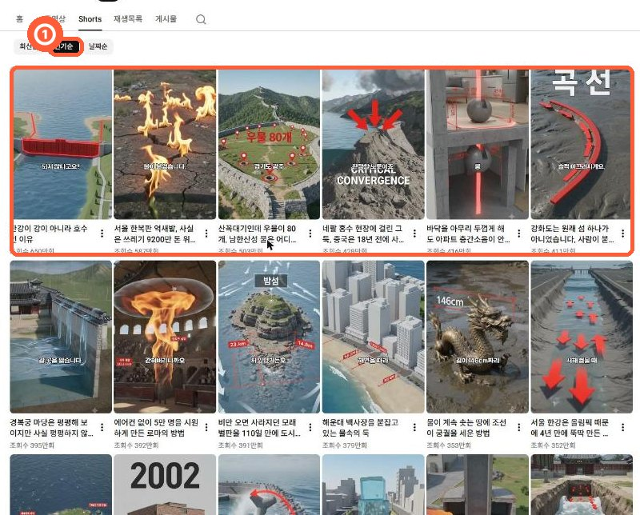
*① 인기순 정렬 → 조회수 400만\~650만 쇼츠 5개*

> 💡 인기 영상의 공통점: **실제 장소**가 나오고, 2\~4초마다 화면이 바뀌고, 화면 위에 **큰 숫자·라벨**이 떠요. 회색 배경 모형만 나오면 밋밋해 보여요.

## 2. 기획 — 두 가지 방법으로 해 보기

### A안 · Claude 하나로 끝내기

Claude 새 대화에 레퍼런스 분석 → 주제 · 재미 · 팩트체크 · 대본 · 장면표를 **한 번에** 요청했어요.

**① 레퍼런스 분석**
```text
[인기 쇼츠 주소 5개]
위 영상들은 '신비한 건축사전' 채널에서 조회수가 가장 높은 쇼츠 5개야. 이 영상들처럼 실제 장소가 나오면서 설명되는 지식 쇼츠를 만들려고 해.
5개에 공통된 ①전체 흐름 구조 ②장면 구성(화면 종류, 컷 길이) ③이미지 스타일과 시각자료(화면 속 숫자·라벨) ④조회수가 많이 나온 이유를 표로 정리해줘.
```
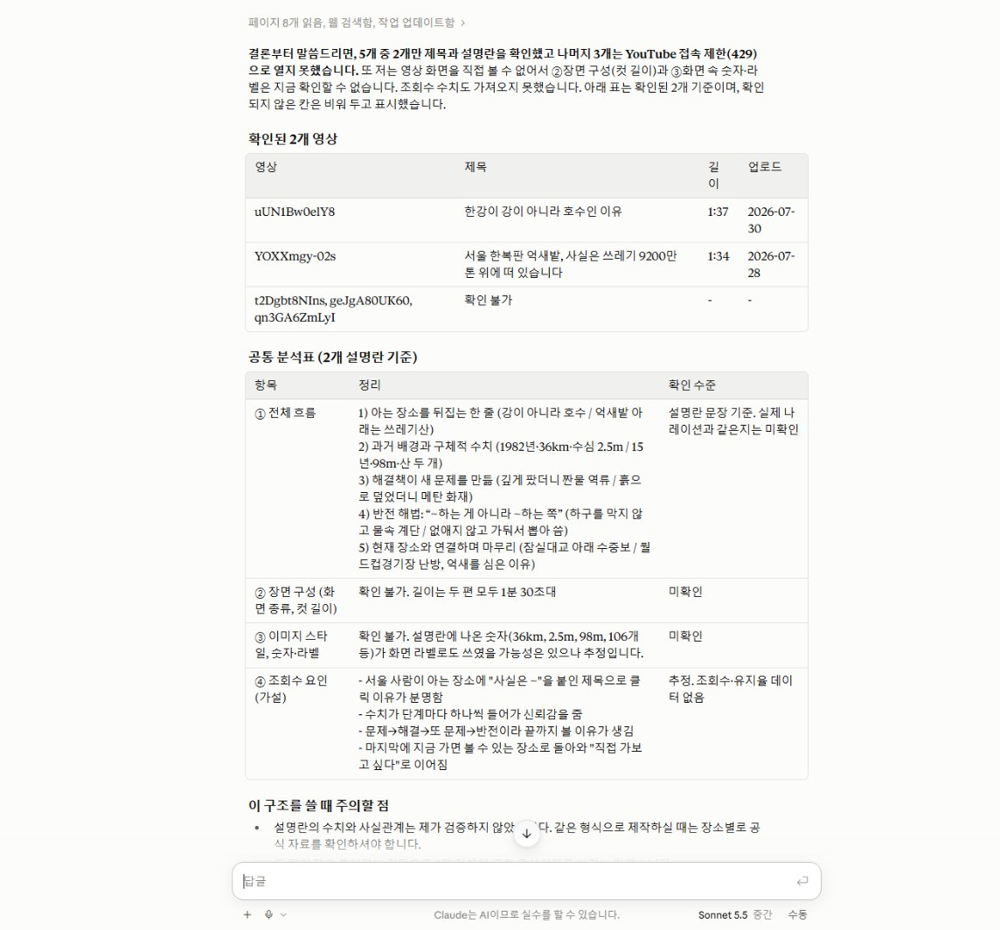
*Claude는 유튜브 5개 중 2개만 열 수 있었고, '화면은 직접 못 본다'고 솔직하게 알려줘요*

**② 기획 한 번에 받기**
```text
이 구조로 경제 역사 채널 '돈의 현장' 첫 영상을 만들 거야.
주제: 역사상 가장 부자로 불리는 말리 제국의 왕 만사 무사가 1324년 메카 순례 길에 카이로에서 금을 너무 많이 쓰고 나눠 줘서 카이로의 금값이 떨어진 이야기. 돌아오는 길에는 오히려 카이로 상인들에게 돈을 빌렸다는 반전까지.

조건:
1. 구조: [당연하게 아는 것(부자는 돈이 많을수록 좋다)] → [뜻밖의 문제(금을 뿌렸더니 금값이 떨어짐)] → [더 꼬이는 상황] → [반전] → [지금 우리 삶과 연결]
2. 재미가 제일 중요해. 첫 2초 훅 문장 5개, 웃음 포인트, 끝 문장이 첫 문장으로 이어지는 루프 엔딩, 쇼츠 제목 후보 10개. 새로운 사실이나 숫자를 지어내서 웃기면 안 되고, 표현과 연출로만 재미를 만들어줘.
3. 팩트체크: 웹 검색으로 확인하고, 확인된 것과 확실하지 않은 것을 표로 나눠줘. 출처 링크도 같이.
4. 최종 대본: 나레이션 70초 내외. 첫 문장은 가장 좋은 훅, 그다음 "여기 ○○"처럼 실제 장소가 나오게. 확실하지 않은 내용은 "전해진다"로.
5. 장면표: 문장마다 [화면 종류] + [이미지 설명] + [화면 글자].
6. 최종 제목 1개.
```
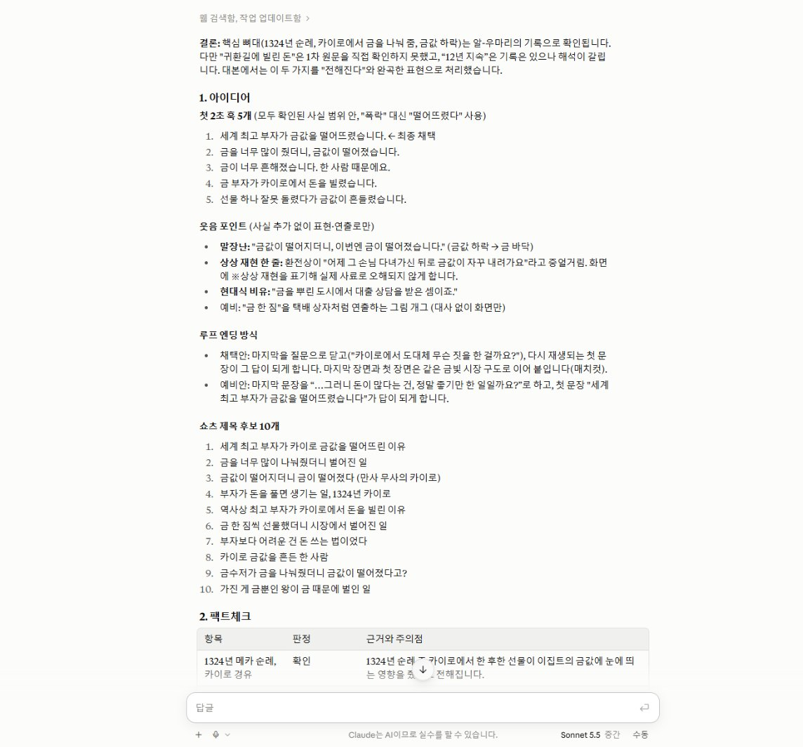
*훅 5개 · 웃음 포인트 · 루프 엔딩 · 제목 10개*
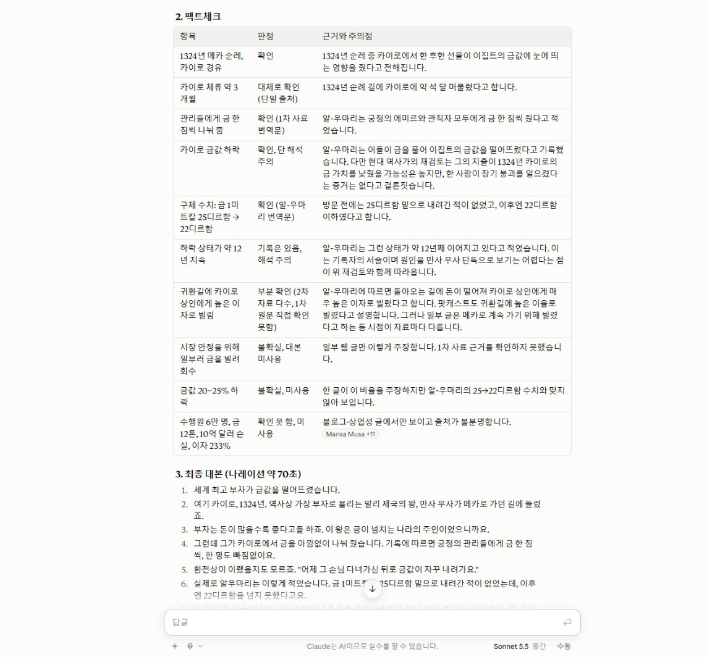
*팩트체크: 확인됨 / 해석 주의 / 미사용으로 나눠 줌*
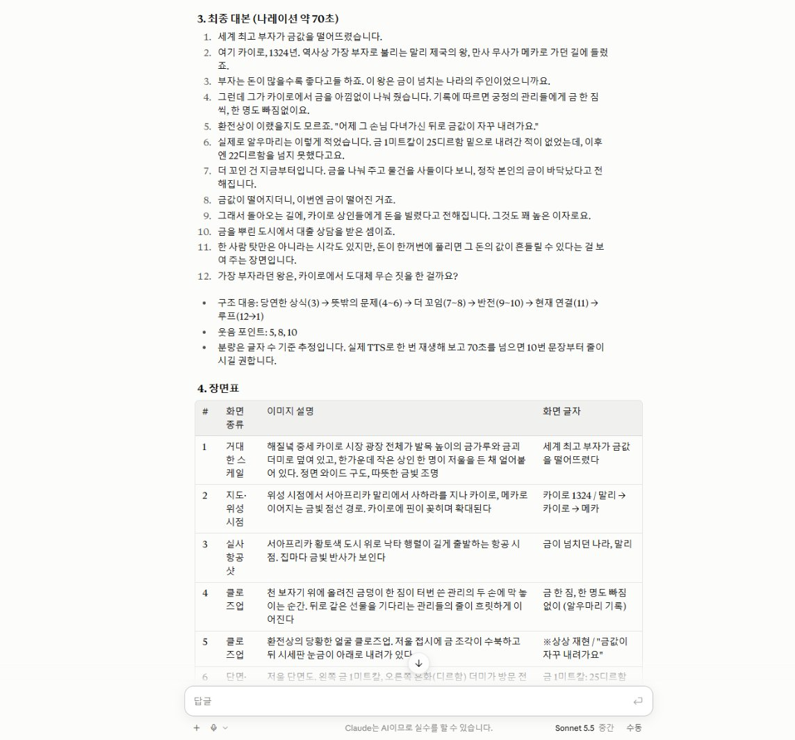
*최종 대본 12문장 + 장면표*

### B안 · 제미나이(초안) + ChatGPT(재미·팩트체크)

1. **제미나이**에 같은 레퍼런스 분석 질문 → 같은 조건으로 대본 초안
2. 초안을 **ChatGPT**에 붙여 넣고 "재미만 맡아줘" → 훅·웃음 포인트·루프·제목
3. ChatGPT에 "웹 검색으로 팩트체크 + 최종 대본 + 장면표"

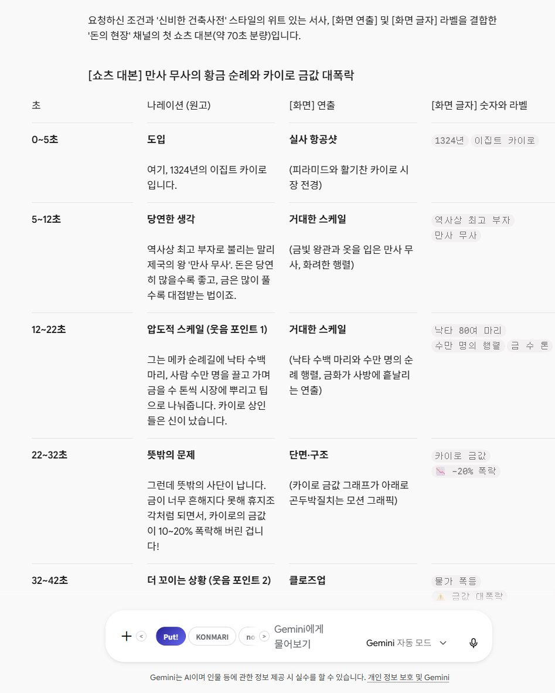
*제미나이 초안: 낙타 80여 마리, 금값 10\~20% 폭락 같은 확인 안 된 숫자가 들어 있었어요*
```text
유튜브 쇼츠 경제 역사 채널 '돈의 현장' 첫 영상 대본이야. 제미나이가 쓴 초안인데, 사실은 나중에 따로 검증할 거니까 너는 "재미"만 맡아줘.
[초안 붙여 넣기]
요청:
1. 첫 2초 안에 스크롤을 멈추게 할 훅 문장 5개 (지금 사람들이 아는 것과 비교하면 좋아. 예: 일론 머스크)
2. 대본 중간중간 넣을 웃음 포인트 5개 (과장된 비유, 상황극 한 줄, 숫자 비교 등)
3. 끝 문장이 다시 첫 문장으로 이어지는 '루프 엔딩' 문장 2개
4. 쇼츠 제목 후보 10개 (궁금해서 누르게, 30자 이내)
5. 새로운 사실이나 숫자는 지어내지 말고, 표현과 연출로만 재미를 만들어줘.
```
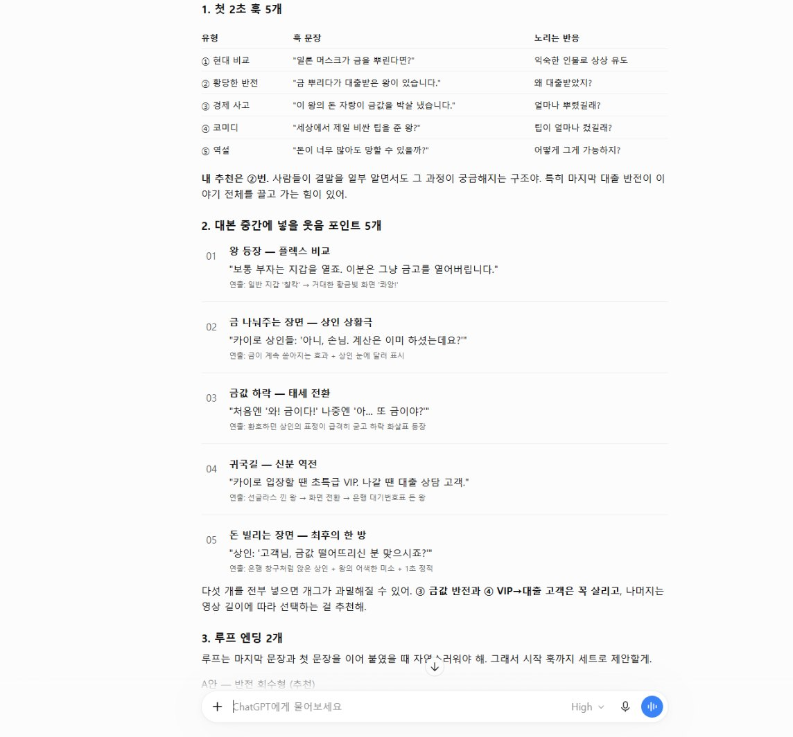
*ChatGPT 재미 아이디어: '들어올 땐 초특급 VIP, 나갈 땐 대출 상담 고객'*
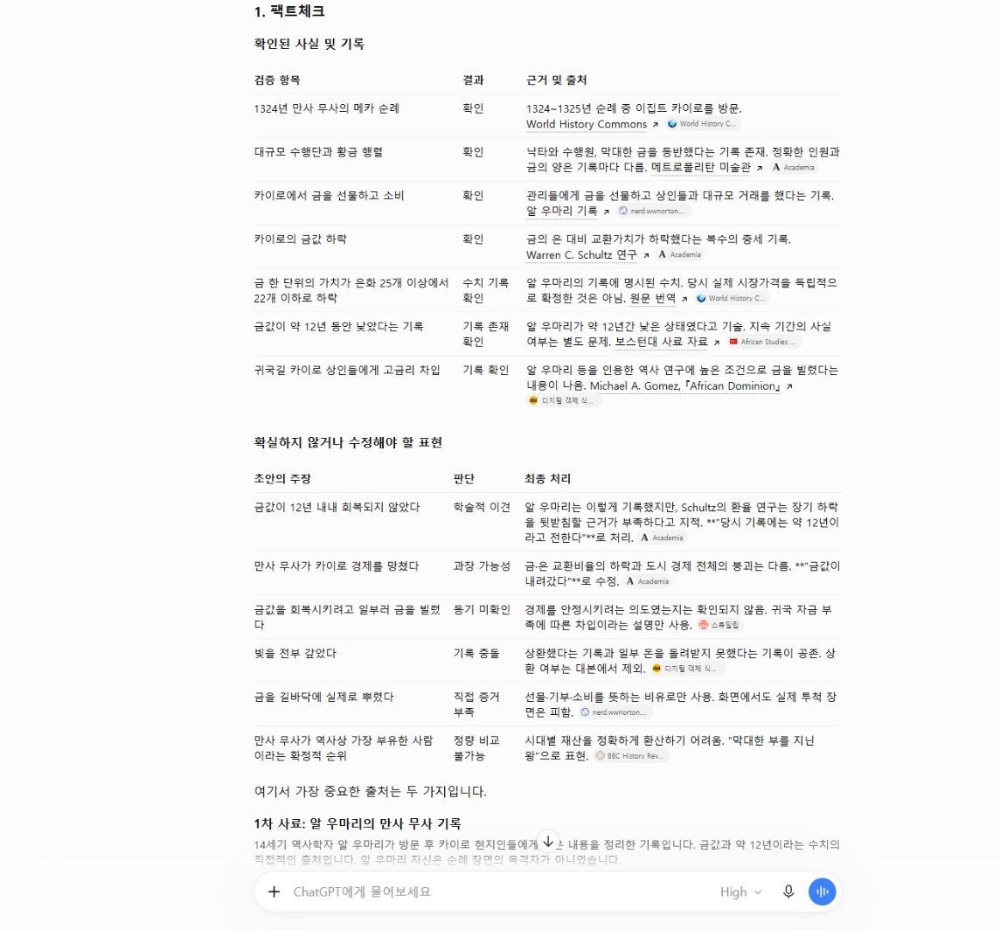
*ChatGPT 팩트체크: 제미나이의 불확실한 숫자를 빼고 출처를 붙임*
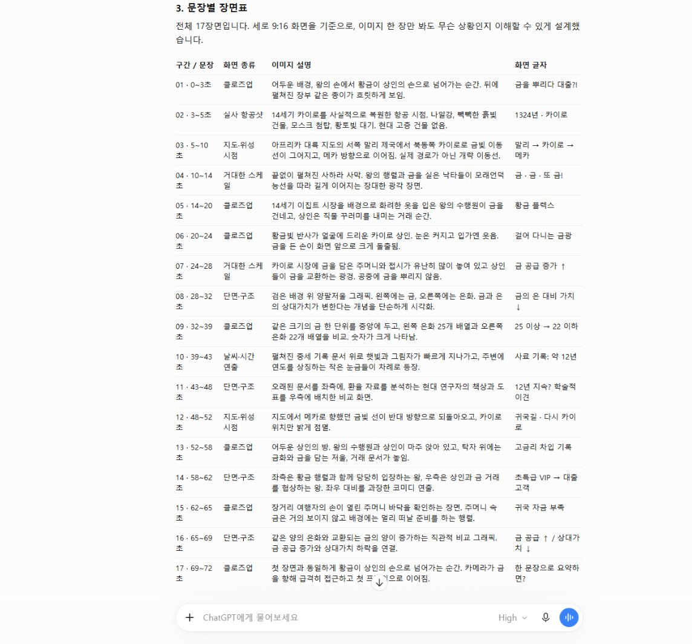
*17장면 장면표*

### 기획 비교

| | A안 · Claude | B안 · 제미나이 + ChatGPT |
|---|---|---|
| 대화 수 | 2번 | 4번 (두 서비스) |
| 레퍼런스 분석 | 5개 중 2개만 열람, 못 본 건 솔직히 표시 | 5개 다 본 것처럼 답했지만 채널에 없는 멘트를 지어냄 |
| 팩트체크 | 1차 사료(알우마리)와 현대 연구로 나눠 정리 | 출처 링크가 많고 꼼꼼, 단 제미나이 초안 숫자는 버려야 했음 |
| 재미 | 말장난 "금값이 떨어지더니 금이 떨어졌다" | 상황극 "들어올 땐 VIP, 나갈 땐 대출 고객" — 더 웃김 |
| 대본 | 12문장 · 약 54초 | 17문장 · 약 53초, 장면이 더 잘게 나뉨 |
| 제목 | 세계 최고 부자가 카이로 금값을 떨어뜨린 이유 | 금 뿌리다가 대출받은 왕 |

> ⚠️ 어떤 AI든 **팩트체크도 틀릴 수 있어요.** 금 1미트칼 25→22디르함, 약 12년 같은 숫자는 원문(알우마리 기록)과 연구(Schultz 2006)를 한 번 더 확인하세요. 확실하지 않은 부분은 "전해진다"로 말해요.

## 3. 이미지 만들기 — 매그니픽 Nano Banana Pro (무료)

### ① 이미지 프롬프트 받기
기획한 AI에 이어서 보내요.
```text
좋아, 이 대본과 장면표로 확정할게. 이제 장면표의 장면마다 이미지 생성 AI 'Nano Banana Pro'에 넣을 이미지 프롬프트를 영어로 써줘.
조건:
1. 세로 9:16, 2K. 신비한 건축사전처럼 실제 장소가 보이는 사실적인 시네마틱 스타일 (14세기 카이로, 사하라, 말리). 회색 스튜디오 배경 금지.
2. 모든 장면에서 왕과 행렬의 의상·색을 똑같이 맞추고, 왕은 얼굴이 크게 나오지 않게 옆모습·뒷모습·멀리서.
3. 이미지 안에 글자·숫자·로고 없음 (자막은 편집에서 넣음). 지도도 글자 없이.
4. 장면 번호마다 코드블록 하나씩, 한 장면 60~90단어.
5. 메카 성지(카바)는 직접 그리지 않음.
```
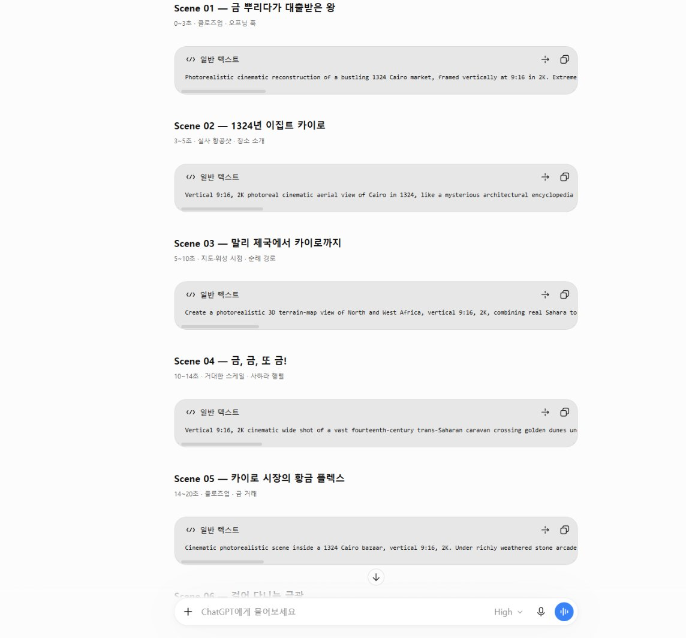
*장면마다 영어 프롬프트가 코드블록으로 나와요 — 오른쪽 위 복사 버튼*

### ② 매그니픽에서 생성
1. [magnific.com](https://www.magnific.com) → 왼쪽 메뉴 **Image Generator**
2. 모델 **Google Nano Banana Pro**, 아래 설정 **9:16 · 2K**, 버튼에 **Unlimited generations**가 보이면 무료
3. 프롬프트 붙여 넣기 → **Generate** → 장면 수만큼 반복 (앞 이미지가 끝나기 전에 다음 걸 넣어도 돼요)


*모델 Nano Banana Pro · 버튼 아래 'Unlimited generations' = 크레딧 0*
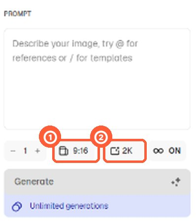
*① 9:16 ② 2K*
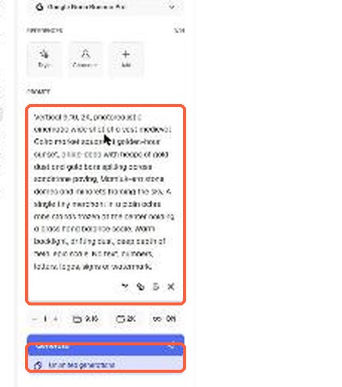
*프롬프트 붙여 넣고 Generate*

> 💡 다 만들어지면 결과 이미지 클릭 → 다운로드 → **A01.png**처럼 장면 번호로 이름을 바꿔 02_이미지에 저장하세요.

### ③ 결과 확인
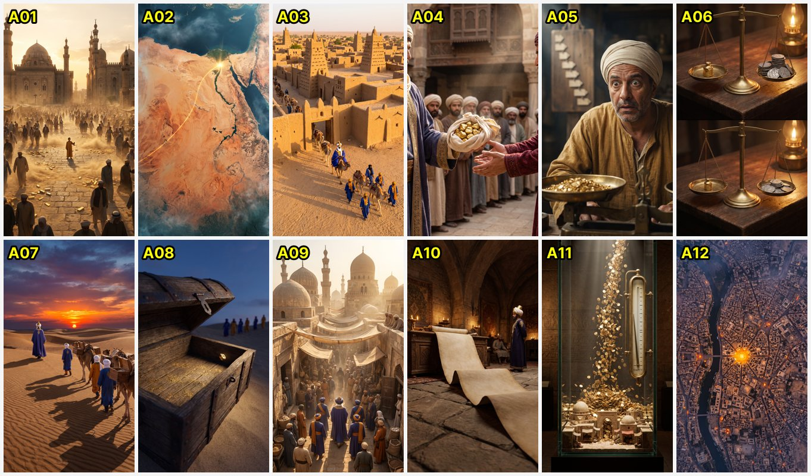
*A안 12장*
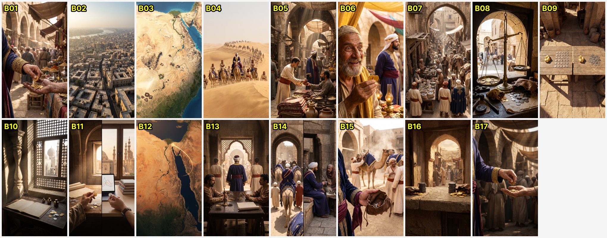
*B안 17장*

**자주 생기는 문제 — 이미지가 옆으로 누워 나옴**
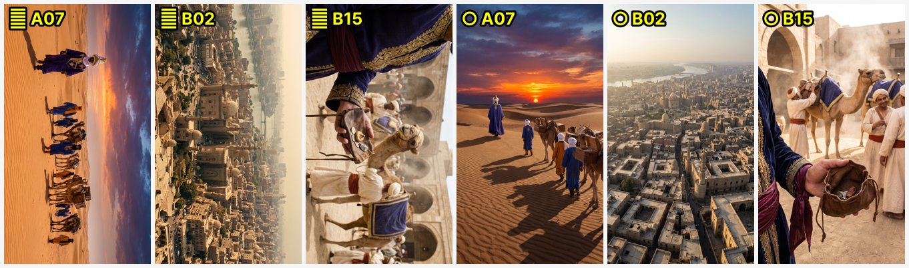
*왼쪽 3장 ✕ 옆으로 누움 → 오른쪽 ○ 문장 한 줄 추가 후 다시 생성*
```text
Upright vertical portrait composition: the horizon is horizontal across the frame, the ground is at the bottom and the sky at the top, nothing rotated or sideways.
```

<details>
<summary>A안 이미지 프롬프트 12개 펼치기</summary>

**A01**

```text
Vertical 9:16, 2K, photorealistic cinematic wide shot of a vast medieval Cairo market square at golden-hour sunset, ankle-deep with heaps of gold dust and gold bars spilling across sandstone paving, Mamluk-era stone domes and minarets framing the sky. A single tiny merchant in a plain ochre robe stands frozen at the center holding a brass hand balance scale. Warm backlight, drifting dust, deep depth of field, epic scale. No text, numbers, letters, logos, signs or watermark.
```

**A02**

```text
Vertical 9:16, 2K, photorealistic top-down satellite view of North Africa and the Nile, the Sahara's rust-orange dunes and dark green Nile delta clearly visible, with a glowing golden dotted route crossing the desert from the southwest toward a bright golden glow over Cairo at the Nile's edge, subtle cloud wisps, soft atmospheric haze at the edges. Cinematic color grading, razor-sharp terrain detail, a map-like composition with absolutely no labels. No text, numbers, letters, borders, logos or watermark.
```

**A03**

```text
Vertical 9:16, 2K, photorealistic cinematic aerial drone shot above a 14th-century West African Sahel city of ochre mud-brick buildings with earthen mosque towers studded with wooden beams, at dawn. A long camel caravan departs through the gate across the sand: at its head the king in a long indigo robe with gold trim and a tall white-and-gold turban, seen only from far above and behind, followed by attendants in matching indigo and saffron robes with white turbans. No text, numbers, letters, logos or watermark.
```

**A04**

```text
Vertical 9:16, 2K, photorealistic cinematic close-up of a heavy bundle of raw gold nuggets wrapped in cream cloth, being passed from the king's indigo gold-trimmed sleeve into the outstretched hands of a Mamluk court official in a deep crimson sleeve, inside a shaded stone courtyard in 14th-century Cairo. Behind, a line of other turbaned officials waits, softly out of focus, with carved wooden lattice windows and a sunbeam falling across the gold. Shallow depth of field, warm tones. No text, numbers, letters, logos or watermark.
```

**A05**

```text
Vertical 9:16, 2K, photorealistic cinematic close-up of a startled middle-aged Cairo money-changer in a faded ochre robe and plain cotton turban, eyes wide, leaning over a brass balance whose pans overflow with gold flakes. Behind him a wooden board hangs blurred, carved only with a descending row of blank notches, in a dim vaulted bazaar stall of 14th-century Cairo lit by a shaft of dusty light. Intimate, slightly comedic expression, shallow depth of field. No text, numbers, letters, logos or watermark.
```

**A06**

```text
Vertical 9:16, 2K, photorealistic cinematic macro scene split into two matching halves, top and bottom, on a dark worn wooden money-changer's counter in 14th-century Cairo. In each half a brass balance holds one small gold weight on the left pan and silver coins on the right pan. In the top half the silver stack is tall; in the bottom half the silver stack is clearly shorter. Warm lamplight, fine brushed metal textures, crisp cross-section clarity. No text, numbers, letters, symbols, logos or watermark.
```

**A07**

```text
Vertical 9:16, 2K, photorealistic cinematic wide shot of a pilgrim caravan crossing a vast desert of rippled dunes as the sun sinks into a blazing orange-purple horizon, long shadows stretching across the sand. At the front the king walks, seen only from behind and far away, in a long indigo robe with gold trim and a tall white-and-gold turban, followed by attendants in matching indigo and saffron robes with white turbans, leading camels carrying visibly light, half-empty wooden chests. No text, numbers, letters, logos or watermark.
```

**A08**

```text
Vertical 9:16, 2K, photorealistic cinematic close-up of an open, nearly empty wooden treasure chest bound with dark iron, resting on desert sand at twilight, its floor holding only a thin dusting of gold flakes. A single gold nugget is caught mid-air, tumbling off the chest's edge toward the sand. Soft blue-hour sky behind, a faint line of travelers in indigo and saffron robes blurred in the far distance. Macro texture detail, dramatic side light, shallow depth of field. No text, numbers, letters, logos or watermark.
```

**A09**

```text
Vertical 9:16, 2K, photorealistic cinematic aerial view looking down into a crowded narrow bazaar street of 14th-century Cairo at late afternoon, with Mamluk stone domes, minarets and awnings of faded cloth. A returning procession halts before a row of money-changers' shops: the king in a long indigo robe with gold trim and a tall white-and-gold turban, seen only from above and behind, with attendants in matching indigo and saffron robes with white turbans. Merchants watch from doorways. Warm dusty light, rich detail. No text, numbers, letters, logos or watermark.
```

**A10**

```text
Vertical 9:16, 2K, photorealistic cinematic wide low-angle shot inside a lamplit stone merchant's office in 14th-century Cairo. An enormous parchment scroll unrolls from a heavy carved desk, spilling across the floor in long curling waves, its surface blank and unmarked. Far across the room the king stands small, in profile, in a long indigo robe with gold trim and a tall white-and-gold turban, dwarfed by it, while a seated merchant waits calmly. Warm amber light, dramatic scale. No text, numbers, letters, logos or watermark.
```

**A11**

```text
Vertical 9:16, 2K, photorealistic cinematic cross-section of a giant glass tank built like a museum cutaway model of a medieval Cairo market, tiny sandstone stalls and domes at the bottom, while a torrent of gold coins cascades in from above and piles up around them. On the tank's side stands a tall brass gauge with blank tick marks and its needle dropping toward the low end. Dark warm-stone background, dramatic volumetric light, crisp glass reflections. No text, numbers, letters, symbols, logos or watermark.
```

**A12**

```text
Vertical 9:16, 2K, photorealistic satellite-style top-down view of a reimagined 14th-century Cairo and the Nile at dusk, the river a dark ribbon through a dense sprawl of sandstone rooftops and domes, with one open plaza at the exact center glowing intensely gold as if filled with molten light. Slight slow-zoom feel, soft haze, warm city lights beginning to appear. Cinematic color grading, razor-sharp detail, map-like composition with absolutely no labels. No text, numbers, letters, borders, logos or watermark.
```

</details>

<details>
<summary>B안 이미지 프롬프트 17개 펼치기</summary>

**B01**

```text
Photorealistic cinematic reconstruction of a bustling 1324 Cairo market, framed vertically at 9:16 in 2K. Extreme close-up of gold pieces passing from a royal hand to a merchant's open palm, against recognizable medieval sandstone arches and crowded stalls, never a studio backdrop. The king's visible sleeve is deep indigo with broad gold embroidery and a burgundy sash edge; his face stays entirely outside frame. Warm dusty sunlight, intricate metal textures, dramatic shallow focus. No writing, numbers, logos, or watermarks.
```

**B02**

```text
Vertical 9:16, 2K photoreal cinematic aerial view of Cairo in 1324, like a mysterious architectural encyclopedia brought to life. The Nile winds beyond dense medieval quarters, sandstone and mudbrick rooftops, courtyards, domes, slender minarets, and busy winding streets. Golden morning haze and atmospheric depth make the real city feel immense, not fantastical. Emphasize historically plausible Mamluk-era architecture; exclude modern towers, roads, and electrical wires. No people in close-up, no text, numbers, labels, logos, or watermarks.
```

**B03**

```text
Create a photorealistic 3D terrain-map view of North and West Africa, vertical 9:16, 2K, combining real Sahara topography, the Sahel, the Nile, and the Red Sea. A thin glowing gold route travels from medieval Mali across desert landscapes toward Cairo, then continues discreetly east, without showing any holy sanctuary. Embed tiny architectural miniatures and camel silhouettes in the terrain. Entire map must be completely unlabeled: no letters, numbers, borders with captions, symbols resembling logos, or watermarks. Cinematic sunlight, architectural-documentary realism.
```

**B04**

```text
Vertical 9:16, 2K cinematic wide shot of a vast fourteenth-century trans-Saharan caravan crossing golden dunes under a pale sky. Hundreds of small figures and tan camels recede along a ridge, emphasizing breathtaking scale without implying a precise count. The distant king wears a deep indigo robe with broad gold trim, burgundy sash, and white turban with thin gold band. His entourage wears cream tunics with rust-red sashes; camels carry indigo saddlecloths edged gold. Warm windblown sand, believable realism. No text, numbers, logos, or watermarks.
```

**B05**

```text
Cinematic photorealistic scene inside a 1324 Cairo bazaar, vertical 9:16, 2K. Under richly weathered stone arcades, a royal attendant offers gold to a merchant beside folded textiles, brass scales, and ceramic vessels. The king stands farther back in side profile, face small, wearing a deep indigo gold-trimmed robe, burgundy sash, and white turban with thin gold band. Attendants wear cream tunics and rust-red sashes. Late-afternoon shafts of light, tactile historical detail, no modern objects. No letters, numbers, logos, or watermarks.
```

**B06**

```text
Vertical 9:16, 2K cinematic close-up of a Cairo merchant's astonished, delighted expression in a crowded fourteenth-century market. Warm reflected gold illuminates his face as his hand lifts several gold pieces; behind him, a distant royal figure is seen only from the side, face indistinct, in a deep indigo robe with gold trim, burgundy sash, and white turban with thin gold band. Real sandstone arches and fabric stalls fill the background. Playful human emotion without cartoon effects. No writing, numbers, logos, or watermarks.
```

**B07**

```text
Photorealistic 1324 Cairo gold market, vertical 9:16 in 2K, viewed from a slightly elevated cinematic angle. Numerous merchants openly weigh, exchange, and display small gold pieces on wooden counters beneath historic stone arches; do not show gold being thrown through the air. At the edge of the crowd, royal attendants wear cream tunics with rust-red sashes, with indigo-and-gold camel cloth visible outside. Dusty sunlight reveals the busy architecture and crowded streets. Economically suggest abundance without literal charts. No text, numbers, logos, or watermarks.
```

**B08**

```text
Vertical 9:16, 2K photorealistic cinematic macro composition inside an authentic medieval Cairo moneychanger's shop. A weathered brass balance scale holds gold on one side and silver coins on the other, suggesting their changing exchange relationship through carefully staged objects, not graphic arrows. Through an open arch behind the counter, sunlit fourteenth-century Cairo streets and masonry remain clearly visible. Sandstone, dark wood, warm gold, cool silver, and deep shadow create an architectural-documentary mood. No inscriptions, writing, numbers, logos, or watermarks.
```

**B09**

```text
In a medieval Cairo moneychanger's courtyard, create a photorealistic overhead comparison on two adjacent wooden tables, vertical 9:16, 2K. Each table features one identical piece of gold; beside the left gold piece, silver coins form a tidy five-by-five grid, while the right side shows a smaller group of twenty-two silver coins. Keep every coin individually visible, unmarked, and realistic, without typographic numerals. Weathered sandstone flooring, an arched market entrance, angled sunlight, and cinematic shadows. No captions, symbols, lettering, logos, or watermarks.
```

**B10**

```text
Vertical 9:16, 2K cinematic passage-of-time still life in a sunlit medieval Cairo scholar's room overlooking mosque domes and narrow streets. An open blank parchment lies on a dark wooden table beside an hourglass-like shadow, simple brass weights, and gold and silver pieces. Layered sunlight and long shadows imply years passing without a calendar or visual text. Architecture must feel geographically specific, richly textured, and historically plausible. No marks on the parchment, no letters, numbers, logos, watermarks, or invented historical inscriptions.
```

**B11**

```text
Create a photorealistic cinematic diptych in vertical 9:16, 2K: left, a fourteenth-century Cairo scholar's room with blank parchment, gold, silver, and sunlit historic arches; right, a present-day academic research desk beside a window overlooking preserved medieval Cairo architecture. Hands compare physical coins and anonymous unmarked charts made only from colored lines, without written data. Convey scholarly debate through contrasting evidence, not speech bubbles. Sophisticated mysterious architectural-encyclopedia atmosphere, matching warm sandstone palette. No visible writing, numbers, logos, or watermarks anywhere.
```

**B12**

```text
Vertical 9:16, 2K photorealistic satellite-like terrain visualization of North Africa and the Arabian Peninsula, with the Sahara, Nile valley, Red Sea, and Cairo recognizable from geography alone. A subtle luminous gold line traces an eastward journey and curves back toward Cairo, ending in a gentle glow. Tiny camels returning west near the Nile provide visual context; no shrine or sacred building is depicted. Realistic relief, warm dusk illumination, cinematic aerial depth. Completely blank geography: no place names, letters, numbers, icons, logos, or watermarks.
```

**B13**

```text
Inside a historically plausible fourteenth-century Cairo merchant's chamber, vertical 9:16, 2K cinematic realism. A merchant and royal representative negotiate a loan across a heavy wooden table bearing measured gold, brass scales, and a blank parchment. The king is visible only from behind at a respectful distance, wearing deep indigo with wide gold trim, burgundy sash, and a white turban with thin gold band. Attendants wear cream with rust-red sashes. Intricate arches and a sunlit street beyond. No writing, numbers, logos, or watermarks.
```

**B14**

```text
Vertical 9:16, 2K photoreal cinematic split-screen within the same medieval Cairo gateway. On the left, a dignified royal caravan enters: distant king seen from behind in a deep indigo robe with gold trim, burgundy sash, white turban with thin gold band; attendants in cream and rust-red, tan camels with indigo gold-edged cloths. On the right, the same king sits side-on with a merchant discussing borrowed gold. Match costumes and architecture precisely; contrast grandeur with quiet awkwardness. No lettering, numbers, logos, or watermarks.
```

**B15**

```text
Vertical 9:16, 2K cinematic close-up in a medieval Cairo caravan courtyard at departure time. The king's hand opens a nearly empty leather travel pouch, with deep indigo sleeve, broad gold embroidery, and burgundy sash visible; keep his face fully out of frame. In the sunlit background, cream-robed attendants with rust-red sashes prepare tan camels wearing indigo saddlecloths bordered in gold. Show practical travel expenses through gesture rather than modern banking symbolism. Sandstone arcades, realistic dust, subdued humor. No letters, numbers, logos, or watermarks.
```

**B16**

```text
Photorealistic educational still life at a fourteenth-century Cairo moneychanger's stone counter, vertical 9:16, 2K. Arrange two side-by-side transactions, each exchanging visually identical stacks of silver coins for different amounts of gold, so the gold's relative purchasing value feels changed without charts. Behind the scene, an authentic Cairo archway opens to a busy historic market, lit by late-afternoon sunlight. Natural textures, solemn cinematic focus, warm sandstone, gold and silver gleam. Absolutely no text, numerals, symbols, logos, or watermarks.
```

**B17**

```text
Create a seamless visual match to the opening image: vertical 9:16, 2K photoreal cinematic close-up in a bustling 1324 Cairo marketplace. A royal hand in a deep indigo sleeve with broad gold embroidery passes gold into a merchant's open palm. The burgundy sash edge is barely visible; the king's face remains outside frame. Match the first shot's hand positions, stone arches, dusty sunlight, dark-gold palette, and shallow depth of field exactly, enabling a perfect video loop. No writing, numbers, logos, or watermarks.
```

</details>

## 4. 영상 프롬프트 받기 (Flow용 · H3용 두 가지)

영상 AI마다 잘 알아듣는 문장 방식이 달라요. 같은 기획 AI에 두 버전을 같이 달라고 해요.
```text
이미지가 다 나왔어. 이제 장면마다 이 이미지를 '시작 프레임'으로 넣어서 4초짜리 영상을 만들 거야. 영상 AI 두 가지로 똑같이 만들어서 비교할 거라, 각 AI의 프롬프트 작성법에 맞게 두 버전을 써줘.

[공통 조건]
- 시작 프레임 이미지가 이미 있으니, 장면을 다시 설명하기보다 "무엇이 어떻게 움직이는지 + 카메라 움직임 + 소리"를 중심으로.
- 4초, 세로 9:16, 사람·의상·건물·지도가 처음 이미지와 똑같이 유지되게. 새 사람·글자·로고가 생기지 않게.
- 카메라 움직임은 장면당 1개만 (천천히 앞으로 / 옆으로 / 위로 올라가기 등). 신비한 건축사전처럼 다큐 느낌.
- 소리: 배경음악·말소리 없음, 현장음만 (나레이션은 편집에서 넣음).
- 웃음 포인트 장면은 표정·동작을 살짝 과장해도 됨.

[버전 1] Google Flow · Omni Flash용: 영어 2~3문장, 짧고 명확하게. 마지막에 "No music, no voice. No text."
[버전 2] MiniMax H3(로컬)용: 아래 형식 그대로.
  첫 줄: 스타일·조명 한 문장
  Timeline:
  [0s-2s] ...
  [2s-4s] ...
  Audio: ... No music, no voice.
  No text, no new people, no faces changing.

장면 번호마다 버전 1, 버전 2를 코드블록으로 줘.
```
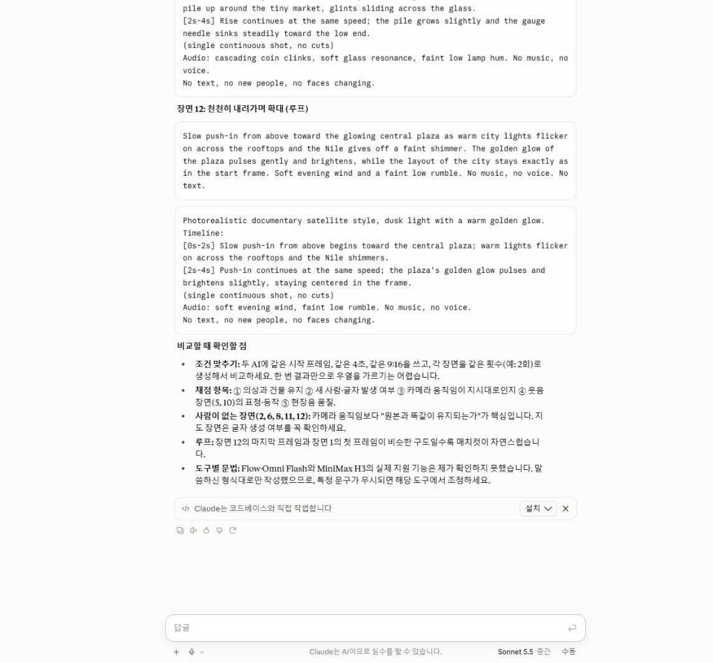
*Claude: Flow용(문장) · H3용(Timeline) 두 버전*

| | Flow · Omni Flash | MiniMax H3 |
|---|---|---|
| 쓰는 곳 | 구글 Flow 웹 (무료 계정 하루 50크레딧) | 내 PC (ComfyUI, 무료) |
| 프롬프트 | 짧은 영어 2\~3문장 | 스타일 한 줄 + `[0s-2s]` 타임라인 + Audio |
| 4초 클립 | 7크레딧 · 약 2\~3분 | 0원 · RTX 3070 Ti 기준 약 8\~9분 |
| 해상도 | 720p 세로 | 768×1344 세로 |

<details>
<summary>A안 영상 프롬프트 (Flow · H3) 펼치기</summary>

**A01 · Flow**

```text
Slow forward push-in across the golden market square as dust drifts through the warm backlight and loose gold dust slides softly down the heaps. The lone merchant slowly lowers his scale and looks down at the gold in stunned disbelief, while everything else stays exactly as in the start frame. Soft desert wind and faint metallic clinks of shifting gold. No music, no voice. No text.
```

**A01 · H3**

```text
Photorealistic documentary cinematic style, warm golden-hour backlight with drifting dust.
Timeline:
[0s-2s] Camera begins a slow, steady push-in toward the merchant; dust motes drift through the backlight and a little gold dust slides down the nearest heap.
[2s-4s] Push-in continues at the same speed; the merchant slowly lowers the hand scale and tilts his head down at the gold, frozen in disbelief.
(single continuous shot, no cuts)
Audio: soft desert wind, faint metallic clinks of shifting gold, light cloth flutter. No music, no voice.
No text, no new people, no faces changing.
```

**A02 · Flow**

```text
Slow camera descent toward the glowing Cairo as a soft pulse of golden light travels along the dotted route across the desert. Thin clouds drift over the dunes and the delta, while terrain, colors and the city glow stay exactly as in the start frame. Low airy wind ambience. No music, no voice. No text.
```

**A02 · H3**

```text
Photorealistic satellite documentary style, soft cool daylight with a warm golden glow over the city.
Timeline:
[0s-2s] Camera begins a slow descent toward Cairo; a soft pulse of golden light travels along the dotted route from the southwest.
[2s-4s] Descent continues at the same speed as the pulse reaches the glowing city and brightens it slightly; thin clouds drift over the dunes.
(single continuous shot, no cuts)
Audio: low airy wind ambience, faint deep atmospheric hum. No music, no voice.
No text, no new people, no faces changing.
```

**A03 · Flow**

```text
Slow forward aerial glide along the departing caravan as camels walk steadily through the city gate onto the sand, kicking up light dust. The king, seen from above and behind, walks at the front while attendants follow in matching robes; all costumes and buildings stay identical to the start frame. Wind over sand, soft camel footfalls and a faint harness creak. No music, no voice. No text.
```

**A03 · H3**

```text
Photorealistic documentary drone style, soft dawn light with long gentle shadows.
Timeline:
[0s-2s] Slow forward glide begins above the caravan; the camels pass through the gate and step onto the sand, raising small clouds of dust.
[2s-4s] Glide continues at the same speed; the king at the head keeps walking steadily with the attendants following in line, dust drifting behind them.
(single continuous shot, no cuts)
Audio: wind over sand, soft camel footfalls, faint harness creak. No music, no voice.
No text, no new people, no faces changing.
```

**A04 · Flow**

```text
Slow push-in on the exchange as the king's indigo sleeve lowers the gold bundle into the official's hands and the fingers close around it. Dust motes float in the sunbeam while the blurred line of officials behind shifts slightly; sleeves, cloth and courtyard stay as in the start frame. Soft cloth rustle, a quiet metallic clink and gentle courtyard echo. No music, no voice. No text.
```

**A04 · H3**

```text
Photorealistic documentary cinematic style, warm shaft of sunlight in a shaded stone courtyard.
Timeline:
[0s-2s] Slow push-in begins; the gold bundle descends from the king's sleeve toward the official's open hands, dust motes floating in the sunbeam.
[2s-4s] Push-in continues at the same speed; the official's fingers close around the bundle and his hands dip slightly under its weight, as the officials in the blurred background shift a little.
(single continuous shot, no cuts)
Audio: soft cloth rustle, one quiet metallic clink, gentle stone-courtyard echo. No music, no voice.
No text, no new people, no faces changing.
```

**A05 · Flow**

```text
Slow push-in on the money-changer's face as his eyes widen and his eyebrows shoot up in an exaggerated double take at the overflowing scale. A few gold flakes slide off the pan and the balance wobbles gently, while his face, robe and the stall stay the same as in the start frame. Soft patter of gold flakes and a small brass clink. No music, no voice. No text.
```

**A05 · H3**

```text
Photorealistic documentary cinematic style, dim vaulted stall lit by a dusty shaft of light.
Timeline:
[0s-2s] Slow push-in begins; the money-changer's eyes widen and his brows rise as he stares down at the overflowing scale, gold flakes sliding off the pan.
[2s-4s] Push-in continues at the same speed; his gaze snaps back to the scale in a comically exaggerated double take, mouth slightly open, the balance swaying and settling.
(single continuous shot, no cuts)
Audio: soft patter of gold flakes, a small brass clink of the balance, one short breath. No music, no voice.
No text, no new people, no faces changing.
```

**A06 · Flow**

```text
Slow sideways slide along the counter as both balances sway gently and settle, the tall silver stack on top and the shorter stack below staying clearly different. Lamplight flickers softly across the brass, and objects and the split composition stay exactly as in the start frame. Soft brass creak, tiny coin clinks and a faint lamp flicker. No music, no voice. No text.
```

**A06 · H3**

```text
Photorealistic documentary macro style, warm flickering lamplight on dark worn wood.
Timeline:
[0s-2s] Slow sideways slide begins to the right; both balances sway slightly as if just placed, lamplight flickering on the brass.
[2s-4s] Slide continues at the same speed; the balances slowly settle, the top silver stack still tall and the bottom one clearly shorter, a coin or two shifting.
(single continuous shot, no cuts)
Audio: soft brass creak, tiny coin clinks, faint flicker of an oil lamp. No music, no voice.
No text, no new people, no faces changing.
```

**A07 · Flow**

```text
Slow rise of the camera as the pilgrim caravan walks steadily across the dunes into the sunset, long shadows stretching and the light, half-empty chests swaying on the camels. The king at the front, seen from behind, and the attendants keep identical robes and turbans to the start frame. Wind over sand, soft footfalls and rope creaks. No music, no voice. No text.
```

**A07 · H3**

```text
Photorealistic documentary cinematic style, blazing orange-purple sunset with long shadows.
Timeline:
[0s-2s] Camera begins to rise slowly; the caravan walks steadily across the dunes, the chests swaying lightly on the camels.
[2s-4s] Rise continues at the same speed, revealing more of the dunes as the long shadows stretch and sand blows lightly off the ridges.
(single continuous shot, no cuts)
Audio: wind over sand, soft footfalls, rope and wood creaks. No music, no voice.
No text, no new people, no faces changing.
```

**A08 · Flow**

```text
Slow downward camera move following the single gold nugget as it tumbles off the edge of the empty chest and drops onto the sand with a soft puff. The thin gold dusting on the chest floor trembles slightly, while the chest, sand and distant blurred travelers stay exactly as in the start frame. Soft wind, a gentle thud and a light hiss of sand. No music, no voice. No text.
```

**A08 · H3**

```text
Photorealistic documentary macro style, cool blue-hour twilight with soft side light.
Timeline:
[0s-2s] Camera begins a slow downward move; the gold nugget rolls over the chest's edge and starts to fall, the gold dust on the chest floor trembling.
[2s-4s] Move continues at the same speed as the nugget lands in the sand with a small puff, the blurred distant travelers walking slowly in the background.
(single continuous shot, no cuts)
Audio: soft wind, one gentle thud, light hiss of sand. No music, no voice.
No text, no new people, no faces changing.
```

**A09 · Flow**

```text
Slow camera descent into the bazaar street as the returning procession comes to a halt before the money-changers' shops, dust settling around the king and attendants. Merchants lean slightly in the doorways and awnings flutter, while the king's robes, the attendants and the buildings stay identical to the start frame. Footsteps on stone, fluttering cloth and a camel's soft snort. No music, no voice. No text.
```

**A09 · H3**

```text
Photorealistic documentary drone style, warm dusty late-afternoon light.
Timeline:
[0s-2s] Slow descent begins; the procession slows and halts before the shops, dust swirling around their feet.
[2s-4s] Descent continues at the same speed; the dust settles as the merchants in the doorways lean forward slightly and the awnings flutter.
(single continuous shot, no cuts)
Audio: footsteps on stone, fluttering cloth, a camel's soft snort, a wooden shutter creak. No music, no voice.
No text, no new people, no faces changing.
```

**A10 · Flow**

```text
Slow sideways track along the giant scroll as it keeps unrolling and curling across the floor toward the tiny king. The king, in profile, lets his shoulders sag in a slightly exaggerated sigh while the seated merchant waits calmly; robes, scroll and the lamplit room stay exactly as in the start frame. Parchment rustle, oil-lamp crackle and a faint stone-hall echo. No music, no voice. No text.
```

**A10 · H3**

```text
Photorealistic documentary cinematic style, warm amber lamplight in a stone office.
Timeline:
[0s-2s] Slow sideways track begins; the blank scroll unrolls further across the floor in long curling waves toward the king.
[2s-4s] Track continues at the same speed; the king, in profile, lowers his head and lets his shoulders sag in a slightly exaggerated sigh while the merchant waits calmly.
(single continuous shot, no cuts)
Audio: parchment rustle, oil-lamp crackle, faint stone-hall echo. No music, no voice.
No text, no new people, no faces changing.
```

**A11 · Flow**

```text
Slow rise along the glass tank as the gold coins keep cascading in and piling around the tiny market, while the brass gauge's needle sinks steadily toward the low end. Light glints on the glass, and the tank, market and gauge stay exactly as in the start frame. Clinking coins, soft glass resonance and a low lamp hum. No music, no voice. No text.
```

**A11 · H3**

```text
Photorealistic documentary cutaway style, dramatic volumetric light on dark warm stone.
Timeline:
[0s-2s] Camera begins a slow rise along the tank; gold coins cascade from above and pile up around the tiny market, glints sliding across the glass.
[2s-4s] Rise continues at the same speed; the pile grows slightly and the gauge needle sinks steadily toward the low end.
(single continuous shot, no cuts)
Audio: cascading coin clinks, soft glass resonance, faint low lamp hum. No music, no voice.
No text, no new people, no faces changing.
```

**A12 · Flow**

```text
Slow push-in from above toward the glowing central plaza as warm city lights flicker on across the rooftops and the Nile gives off a faint shimmer. The golden glow of the plaza pulses gently and brightens, while the layout of the city stays exactly as in the start frame. Soft evening wind and a faint low rumble. No music, no voice. No text.
```

**A12 · H3**

```text
Photorealistic documentary satellite style, dusk light with a warm golden glow.
Timeline:
[0s-2s] Slow push-in from above begins toward the central plaza; warm lights flicker on across the rooftops and the Nile shimmers.
[2s-4s] Push-in continues at the same speed; the plaza's golden glow pulses and brightens slightly, staying centered in the frame.
(single continuous shot, no cuts)
Audio: soft evening wind, faint low rumble. No music, no voice.
No text, no new people, no faces changing.
```

</details>

<details>
<summary>B안 영상 프롬프트 (Flow · H3) 펼치기</summary>

**B01 · Flow**

```text
Animate the supplied start frame as one continuous 4-second vertical 9:16, 2K shot: the royal hand slowly passes gold into the merchant's palm while the camera gently pushes forward. Preserve all original hands, clothing, faces, objects, and architecture, with no cuts, new people, or logos; use only soft metallic clinks, fabric rustling, and indistinct market ambience. No music, no voice. No text.
```

**B01 · H3**

```text
Photorealistic medieval architectural documentary, warm dusty sunlight, cinematic shallow depth of field, vertical 9:16, 2K, four seconds, using the supplied image as the exact first frame.

Timeline:
[0s-2s] The royal hand begins transferring the gold toward the merchant's open palm. The camera starts a very slow forward push, maintaining the original composition.
[2s-4s] The gold settles into the merchant's hand with subtle natural finger movements. The same forward camera push continues without a cut. Preserve every original costume, person, and architectural detail; introduce no new objects or logos.

Audio: Gentle gold clinks, soft cloth friction, distant indistinct market ambience. No music, no voice.
No text, no new people, no faces changing.
```

**B02 · Flow**

```text
Animate the supplied medieval Cairo aerial image into a continuous 4-second vertical 9:16, 2K documentary shot with a slow forward aerial glide over the rooftops. Let distant dust drift and tiny existing street activity move naturally while preserving the exact buildings, skyline, and city layout, with no cuts, new structures, people, or logos; use gentle wind and faint indistinct city ambience. No music, no voice. No text.
```

**B02 · H3**

```text
Photorealistic historical architectural documentary, golden morning haze, soft atmospheric sunlight, vertical 9:16, 2K, four seconds, anchored to the supplied first frame.

Timeline:
[0s-2s] The camera begins a slow forward aerial glide above the existing medieval rooftops. Thin layers of atmospheric dust drift gently between the buildings.
[2s-4s] The same forward glide continues, revealing subtle architectural depth and natural parallax. Existing distant street activity moves minimally. All buildings, minarets, rooftops, and their positions remain unchanged; no new structures or logos appear.

Audio: Soft elevated wind, faint distant market bustle, subtle natural city ambience without intelligible speech. No music, no voice.
No text, no new people, no faces changing.
```

**B03 · Flow**

```text
Animate the supplied 3D terrain map as one continuous 4-second vertical 9:16, 2K shot, with the camera slowly pushing toward the existing golden travel route. A gentle highlight travels along that route toward Cairo while terrain, coastlines, rivers, and geographic proportions remain completely unchanged, with no cuts, new markers, people, or logos; use only quiet desert wind. No music, no voice. No text.
```

**B03 · H3**

```text
Photorealistic cinematic terrain-map documentary, warm desert sunlight, subtle atmospheric depth, vertical 9:16, 2K, four seconds, using the supplied map as the exact first frame.

Timeline:
[0s-2s] The camera slowly pushes forward toward the existing golden route. A soft illuminated highlight begins moving along the route through the Sahara.
[2s-4s] The highlight continues along the existing route toward Cairo. The camera maintains the same slow forward movement. All terrain, rivers, coastlines, miniature structures, and geographic relationships remain perfectly stable. No new map elements or logos appear.

Audio: Gentle dry desert wind, subtle atmospheric air movement, no artificial transition effects. No music, no voice.
No text, no new people, no faces changing.
```

**B04 · Flow**

```text
Animate the supplied Sahara caravan image into a continuous 4-second vertical 9:16, 2K cinematic documentary shot, slowly raising the camera as the existing camels and attendants advance along the dunes. Sand blows lightly across the ground while every costume, saddlecloth, person, and caravan position remains visually consistent, with no cuts, new travelers, or logos; use camel footsteps, harness creaks, and desert wind. No music, no voice. No text.
```

**B04 · H3**

```text
Photorealistic historical desert documentary, vast golden dunes, natural afternoon sunlight, cinematic atmospheric haze, vertical 9:16, 2K, four seconds, anchored to the supplied first frame.

Timeline:
[0s-2s] The existing camel caravan advances slowly along the ridge. Camels walk with natural weight and rhythm as loose fabric shifts gently. The camera begins a gradual vertical rise.
[2s-4s] The caravan continues its steady progress while the same upward camera movement reveals more of its existing length. Sand drifts near the ground. The king remains distant, with original clothing, colors, faces, and caravan composition unchanged. No extra figures or logos.

Audio: Rhythmic camel footsteps in sand, leather harness creaks, soft desert wind. No music, no voice.
No text, no new people, no faces changing.
```

**B05 · Flow**

```text
Animate the supplied Cairo market image as a continuous 4-second vertical 9:16, 2K shot, with the camera slowly pushing toward the existing transaction. The royal attendant gently offers the gold as the merchant moves the folded textile forward, while the king remains distant and side-facing; preserve all clothing, faces, market architecture, and objects, with no cuts or new elements; use soft metal clinks, fabric sounds, and faint market ambience. No music, no voice. No text.
```

**B05 · H3**

```text
Photorealistic medieval market documentary, warm sunlight through sandstone arches, realistic material textures, vertical 9:16, 2K, four seconds, using the supplied image as frame zero.

Timeline:
[0s-2s] The royal attendant slowly extends the gold toward the merchant. The merchant shifts the folded textile slightly forward. The camera begins a gentle forward push.
[2s-4s] The exchange completes through small natural hand movements. The camera continues the same forward push without cutting. The king remains distant and side-facing. All original costumes, architectural elements, faces, and market objects remain stable, with no additions or logos.

Audio: Soft gold clinks, folded fabric brushing wood, quiet footsteps, distant indistinct market ambience. No music, no voice.
No text, no new people, no faces changing.
```

**B06 · Flow**

```text
Animate the supplied merchant close-up for 4 seconds, vertical 9:16, 2K, with a gentle camera push-in as his eyes widen slightly and a delighted smile gradually grows. His hand lifts the existing gold just a little, catching natural reflected sunlight; preserve his facial identity, the distant king, costumes, and architecture without adding people, objects, cuts, or logos; use soft gold clinks, cloth rustling, and market footsteps. No music, no voice. No text.
```

**B06 · H3**

```text
Photorealistic cinematic character documentary, warm reflected golden sunlight, subtle natural expressions, vertical 9:16, 2K, four seconds, using the supplied image as the exact first frame.

Timeline:
[0s-2s] The merchant looks down at the gold, then raises his eyebrows slightly. His existing hand lifts the gold a small distance. The camera begins a slow forward push.
[2s-4s] His delighted smile broadens with a restrained comedic expression. Gold catches a brief sunlight reflection as the same camera push continues. Maintain the merchant's exact facial identity and all existing background figures, costumes, buildings, and objects. No new elements or logos.

Audio: Gentle metallic clinks, soft fabric movement, distant footsteps and quiet market activity. No music, no voice.
No text, no new people, no faces changing.
```

**B07 · Flow**

```text
Animate the supplied crowded Cairo gold market as a single continuous 4-second vertical 9:16, 2K shot, with a slow camera slide to the right. Existing merchants gently weigh and exchange their existing gold while sunlight glints across the counters; maintain the exact number of people, coins, stalls, costumes, and buildings, with no cuts, additions, or logos; use brass scale creaks, light coin clinks, and footsteps. No music, no voice. No text.
```

**B07 · H3**

```text
Photorealistic medieval Cairo market documentary, warm dusty sunlight, richly textured sandstone, vertical 9:16, 2K, four seconds, anchored to the supplied first frame.

Timeline:
[0s-2s] The camera begins a slow lateral slide to the right. Existing merchants carefully adjust their brass scales and handle gold already visible on their counters.
[2s-4s] The same rightward camera slide continues. Gold catches small reflections as the merchants complete their weighing gestures. Keep the exact original people, coin quantities, merchant stalls, architectural structures, and clothing unchanged. No gold falls from the sky, and no new objects or logos appear.

Audio: Gentle metallic clinks, faint scale creaks, footsteps, and soft fabric movement. No music, no voice.
No text, no new people, no faces changing.
```

**B08 · Flow**

```text
Animate the supplied medieval moneychanger's balance scale as a continuous 4-second vertical 9:16, 2K shot, with one slow camera push-in toward the scale. The balance beam makes a tiny natural oscillation and gradually settles while gold and silver remain securely in place; preserve all weights, objects, proportions, architecture, and visible people without cuts or additions; use subtle brass creaking, a faint metal tap, and soft air movement. No music, no voice. No text.
```

**B08 · H3**

```text
Photorealistic cinematic historical documentary, warm directional sunlight, deep architectural shadows, vertical 9:16, 2K, four seconds, using the supplied image as frame zero.

Timeline:
[0s-2s] The camera starts a slow forward push toward the existing brass balance scale. The balance beam makes a very slight physical oscillation without disturbing its contents.
[2s-4s] The oscillation gradually settles as the same camera push continues. Reflections shift naturally across the gold and silver surfaces. Preserve the exact amount and position of every object, the original scale structure, and background architecture. Add no people, markings, or logos.

Audio: A faint brass hinge creak, subtle metallic contact, soft air movement from the nearby market. No music, no voice.
No text, no new people, no faces changing.
```

**B09 · Flow**

```text
Animate the supplied two-table coin comparison as a continuous 4-second vertical 9:16, 2K shot, with the camera slowly sliding from left to right. Natural sunlight produces subtle moving reflections across the existing silver coins and gold pieces, but every coin remains perfectly stationary and the original quantities stay unchanged; preserve the tables, courtyard, and architecture, with no cuts, additions, or logos; use quiet courtyard wind and distant footsteps. No music, no voice. No text.
```

**B09 · H3**

```text
Photorealistic medieval financial documentary, precise metallic textures, warm courtyard sunlight, vertical 9:16, 2K, four seconds, anchored to the supplied first frame.

Timeline:
[0s-2s] The camera begins a slow horizontal slide from left to right across the existing coin comparison. Subtle reflected sunlight reveals individual silver coin surfaces.
[2s-4s] The same lateral movement continues toward the right-hand arrangement. All coins and gold pieces stay stationary, retaining their exact original count, size, spacing, and placement. No objects appear, disappear, multiply, or transform. The courtyard architecture remains identical without cuts or logos.

Audio: Soft ambient courtyard wind, distant footsteps, very faint market activity without human voices. No music, no voice.
No text, no new people, no faces changing.
```

**B10 · Flow**

```text
Animate the supplied medieval scholar's room for 4 seconds, vertical 9:16, 2K, with a slow camera push toward the blank parchment. Sunlight and window shadows gradually sweep across the desk in a restrained time-lapse effect while dust floats gently in the air; preserve the parchment, objects, furniture, exterior architecture, and original arrangement without cuts, new markings, or logos; use soft wind through the window and faint parchment rustling. No music, no voice. No text.
```

**B10 · H3**

```text
Photorealistic medieval architectural documentary, warm cinematic sunlight with subtle time-lapse shadows, vertical 9:16, 2K, four seconds, using the supplied image as the exact first frame.

Timeline:
[0s-2s] The camera begins a gentle forward push toward the blank parchment. Sunlight slowly shifts across the wooden desk, casting an elongated architectural shadow.
[2s-4s] The same forward movement continues as the shadow moves farther across the parchment, suggesting the passage of years. Tiny dust particles float in the sunlight. All objects, parchment surfaces, and background buildings remain unchanged. No writing, new symbols, objects, or logos appear.

Audio: Gentle wind passing the window, a light parchment rustle, quiet interior room ambience. No music, no voice.
No text, no new people, no faces changing.
```

**B11 · Flow**

```text
Animate the supplied historical-versus-modern research diptych as one continuous 4-second vertical 9:16, 2K shot, with a subtle camera push-in across the entire split composition. Existing hands make small examination gestures near the coins and blank research materials, while both panels and their architectural backgrounds remain fixed and consistent; add no new people, documents, charts, writing, cuts, or logos; use gentle paper friction and faint metallic contact. No music, no voice. No text.
```

**B11 · H3**

```text
Photorealistic cinematic research documentary, balanced warm historical light and soft modern daylight, vertical 9:16, 2K, four seconds, anchored to the supplied diptych image.

Timeline:
[0s-2s] The camera begins a very slow push toward the center of the existing split composition. The visible hands make subtle examining movements near the existing coins and blank materials.
[2s-4s] The same forward push continues. One hand pauses near a coin while the other gently adjusts its position beside the original research objects. Keep both halves stable, with no panel transformation, facial changes, new markings, people, or logos.

Audio: Quiet paper friction, subtle coin contact, gentle natural room ambience. No music, no voice.
No text, no new people, no faces changing.
```

**B12 · Flow**

```text
Animate the supplied return-journey terrain map as one continuous 4-second vertical 9:16, 2K shot, with a slow camera pullback. A soft golden highlight travels backward along the existing route toward Cairo and settles there, while all terrain, rivers, coastlines, routes, and miniature elements remain geographically unchanged, with no cuts, new markers, structures, or logos; use only quiet atmospheric desert wind. No music, no voice. No text.
```

**B12 · H3**

```text
Photorealistic cinematic terrain-map documentary, warm dusk illumination, realistic Sahara topography, vertical 9:16, 2K, four seconds, using the supplied map as the exact first frame.

Timeline:
[0s-2s] The camera begins a gentle backward pull, gradually revealing more of the existing terrain. A luminous highlight starts traveling along the original route back toward Cairo.
[2s-4s] The same slow pullback continues as the highlight reaches Cairo and settles into a soft glow. Preserve the exact original geography, miniature caravan elements, coastlines, and route geometry. Do not generate any new markers, structures, labels, people, or logos.

Audio: Soft desert wind with subtle natural atmospheric movement, no artificial whooshes. No music, no voice.
No text, no new people, no faces changing.
```

**B13 · Flow**

```text
Animate the supplied medieval loan negotiation image into a continuous 4-second vertical 9:16, 2K documentary shot, with the camera slowly sliding right. The merchant carefully slides the existing gold toward the royal representative, who reaches forward to accept it, while the distant king remains back-facing; preserve original faces, hands, gold quantity, clothing, and architecture without cuts, new objects, or logos; use soft gold clinks, fingers brushing wood, and fabric rustling. No music, no voice. No text.
```

**B13 · H3**

```text
Photorealistic medieval financial documentary, warm directional interior sunlight, cinematic architectural depth, vertical 9:16, 2K, four seconds, anchored to the supplied first frame.

Timeline:
[0s-2s] The merchant slowly slides the existing gold across the wooden table. The royal representative makes a small reaching gesture. The camera begins a slow lateral slide to the right.
[2s-4s] The representative gently receives the gold as the merchant withdraws his hand. The same rightward camera movement continues without cutting. Keep the king distant and back-facing. Preserve the exact original people, faces, costumes, objects, and architecture. No new items or logos.

Audio: Small gold clinks against wood, subtle hand contact with the table, light fabric movement, quiet interior ambience. No music, no voice.
No text, no new people, no faces changing.
```

**B14 · Flow**

```text
Animate the supplied split-screen royal arrival and loan negotiation for 4 seconds, vertical 9:16, 2K, with one slow camera push-in across both panels. The existing caravan advances slightly on the left while the seated king on the right makes a restrained, awkward shoulder movement; keep his face distant, both panels fixed, and all costumes, people, buildings, and objects identical, with no cuts or additions; use footsteps, camel harness creaks, and soft coin contact. No music, no voice. No text.
```

**B14 · H3**

```text
Photorealistic medieval cinematic documentary with restrained visual comedy, warm natural Cairo sunlight, vertical 9:16, 2K, four seconds, anchored to the supplied split-screen image.

Timeline:
[0s-2s] The camera begins a slow forward push across the entire split composition. On the left, the existing royal caravan advances confidently with gentle fabric movement. On the right, the seated king remains still.
[2s-4s] The same forward push continues. On the right, the king makes a small awkward shoulder shift toward the merchant while his face stays turned away. Both panels retain their exact division, original identities, clothing, architecture, and objects. No new figures or logos.

Audio: Soft camel footsteps and harness creaks on the left, quiet fabric movement and a light coin tap on the right. No music, no voice.
No text, no new people, no faces changing.
```

**B15 · Flow**

```text
Animate the supplied close-up of the nearly empty travel pouch as a continuous 4-second vertical 9:16, 2K shot, with a slow camera push toward its opening. The king's fingers gently widen the pouch and tilt it slightly, revealing only its original contents, while the distant caravan prepares to depart; preserve costumes, people, faces, architecture, and objects, with no cuts or additions; use leather creaking, cloth rustling, and faint camel harness sounds. No music, no voice. No text.
```

**B15 · H3**

```text
Photorealistic medieval travel documentary, warm late-afternoon courtyard sunlight, cinematic shallow depth of field, vertical 9:16, 2K, four seconds, using the supplied image as frame zero.

Timeline:
[0s-2s] The king's fingers gently widen the opening of the nearly empty leather pouch. The camera begins a slow forward push toward the pouch.
[2s-4s] The pouch tilts slightly, making its original sparse contents easier to see. The same forward camera push continues. Existing attendants and camels in the background make minimal natural preparation movements. Preserve all original people, costumes, architecture, and object quantities. The king's face remains outside the frame. No additions or logos.

Audio: Soft leather creaking, fingers brushing fabric, distant camel harness sounds, gentle courtyard wind. No music, no voice.
No text, no new people, no faces changing.
```

**B16 · Flow**

```text
Animate the supplied medieval gold-and-silver comparison as a continuous 4-second vertical 9:16, 2K documentary shot, with a slow camera slide to the right across both arrangements. Subtle natural light reflections move over the existing metal surfaces, while every coin and gold piece remains stationary with its original count and position preserved; keep the architecture and background unchanged, with no cuts, new elements, or logos; use gentle courtyard wind and faint footsteps. No music, no voice. No text.
```

**B16 · H3**

```text
Photorealistic historical financial documentary, warm late-afternoon sunlight, precise gold and silver textures, vertical 9:16, 2K, four seconds, anchored to the supplied first frame.

Timeline:
[0s-2s] The camera begins a slow lateral slide to the right across the existing gold and silver arrangements. Natural specular highlights reveal fine metallic surface details.
[2s-4s] The same rightward slide continues, allowing the second arrangement to become more prominent. All gold pieces and silver coins remain completely stationary. Preserve exact quantities, spacing, scale, physical proportions, and background architecture. No object duplication, transformation, cuts, or logos.

Audio: Gentle courtyard wind, distant footsteps, subtle natural market ambience without voices. No music, no voice.
No text, no new people, no faces changing.
```

**B17 · Flow**

```text
Animate the supplied final gold-transfer image into a continuous 4-second vertical 9:16, 2K shot, with an extremely slow camera pullback toward the opening shot's original framing. The royal hand gently holds the existing gold just above the merchant's palm, settling into a natural poised position for a seamless loop; preserve exact hands, costumes, architecture, lighting, and objects, with no cuts, new people, or logos; use soft metal contact and fabric rustling. No music, no voice. No text.
```

**B17 · H3**

```text
Photorealistic medieval Cairo documentary, warm dusty sunlight, cinematic shallow depth of field matching the opening shot, vertical 9:16, 2K, four seconds, using the supplied image as the exact first frame.

Timeline:
[0s-2s] The royal hand gently steadies the existing gold above the merchant's open palm. The camera begins an extremely slow backward pull, maintaining the original lighting and composition.
[2s-4s] The same subtle pullback continues as both hands settle into a natural gold-transfer position. End with framing as close as possible to the opening shot's first frame, ready for a match cut. Preserve all original clothing, hand shapes, objects, architecture, and colors. No added figures or logos.

Audio: A faint gold contact sound, gentle fabric rustling, quiet market footsteps, without any dramatic ending effect. No music, no voice.
No text, no new people, no faces changing.
두 AI 비교 시 권장 설정

항목
```

</details>

## 4-1. 컷 늘리기 — 두 번째 앵글

정지된 그림 한 장으로 4초 넘게 버티면 지루하고, 그림을 확대해 늘리면 화면이 떨려 보여요. 레퍼런스 채널은 **2\~3초마다 각도가 바뀌어요.**
그래서 나레이션이 **3.2초보다 긴 장면**은 반으로 나눠서, 뒷부분을 **같은 장소 · 같은 인물을 다른 카메라 위치에서 본 두 번째 이미지**로 바꿨어요.

```text
나레이션 길이를 재 보니 아래 장면들은 3.2초가 넘어서 한 컷으로는 지루해. 이 장면들에 '두 번째 앵글'을 하나씩 추가하고 싶어.
[긴 장면 번호와 그 장면의 이미지 프롬프트 붙여 넣기]
조건:
1. 같은 장소 · 같은 시간대 · 같은 인물과 의상 · 같은 색감. 바뀌는 건 카메라 위치뿐 (예: 멀리서 → 가까이, 정면 → 옆, 위에서 → 땅 높이).
2. 첫 번째 이미지와 한눈에 다른 구도여야 해. 비슷하면 컷이 바뀐 줄 몰라.
3. 장면마다 ① Nano Banana Pro 이미지 프롬프트 ② Flow용 영상 프롬프트 ③ H3용 영상 프롬프트를 코드블록으로 줘. 이름은 A04b처럼 원래 번호 뒤에 b.
```
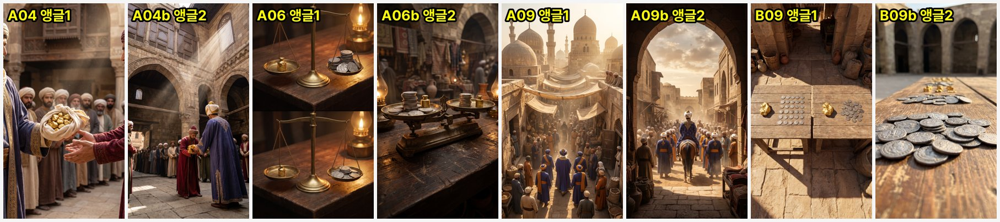
*같은 장면, 카메라만 바꾼 두 번째 앵글 (A04 · A06 · A09 · B09)*

- 두 번째 앵글 이미지와 영상은 3·5·6단계와 똑같이 만들고, 파일 이름만 **A04b.png / A04b.mp4**로 저장해요.
- 이번 예시: A안 8개 · B안 3개 = 11개 추가 → 영상은 Flow · H3 각각 **40개**(29 + 11).
- 두 번째 앵글이 없는 긴 장면은, 같은 클립의 **뒷부분을 1.35배 확대**해서 이어 붙이면 '다른 카메라'처럼 보여요.

<details>
<summary>두 번째 앵글 프롬프트 11개 펼치기 (이미지 · Flow · H3)</summary>

**A02b · 이미지**

```text
Vertical 9:16, 2K, photorealistic cinematic oblique high-altitude view looking north along the Nile from the Sahara, rust-orange dunes in the foreground crossed by a glowing golden dotted route leading to the green delta and a warmly glowing Cairo on the horizon under a thin blue atmosphere, map-like with absolutely no labels. No text, numbers, letters, logos or watermark. Upright vertical portrait composition: the horizon is horizontal across the frame, the ground is at the bottom and the sky at the top, nothing rotated or sideways.
```

**A02b · Flow**

```text
Smooth sideways slide along the horizon as a soft pulse of golden light travels along the dotted route toward the glowing Cairo. Thin clouds drift low over the dunes while the terrain, colors and city glow stay exactly as in the start frame. Low airy wind ambience. No music, no voice. No text.
```

**A02b · H3**

```text
Photorealistic documentary satellite style, soft cool daylight with a warm golden glow on the horizon.
Timeline:
[0s-2s] Camera begins a smooth sideways slide to the right along the horizon; a soft pulse of golden light starts along the dotted route in the foreground.
[2s-4s] Slide continues at the same speed as the pulse travels toward the glowing Cairo and brightens it slightly, thin clouds drifting low over the dunes.
(single continuous shot, no cuts)
Audio: low airy wind ambience, faint deep atmospheric hum. No music, no voice.
No text, no new people, no faces changing.
```

**A03b · 이미지**

```text
Vertical 9:16, 2K, photorealistic cinematic ground-level shot of the caravan passing through a mud-brick gate at dawn, camels' legs raising dust in the foreground, the king in a long indigo robe with gold trim and tall white-and-gold turban ahead seen from behind, attendants in matching indigo and saffron robes with white turbans following. No text, numbers, letters, logos or watermark. Upright vertical portrait composition: the horizon is horizontal across the frame, the ground is at the bottom and the sky at the top, nothing rotated or sideways.
```

**A03b · Flow**

```text
Camera rises smoothly from sand level, past the camels' legs and swaying cloth, to reveal the caravan and the gate behind it. The camels keep walking steadily while light dust drifts, and the king and attendants wear exactly the same robes and turbans as in the start frame. Soft camel footfalls, wind over sand and a faint harness creak. No music, no voice. No text.
```

**A03b · H3**

```text
Photorealistic documentary cinematic style, soft dawn light with long gentle shadows.
Timeline:
[0s-2s] Camera begins a smooth rise from sand level; the camels walk on steadily, raising dust around their legs.
[2s-4s] Rise continues at the same speed, lifting past the camels' backs to reveal the caravan and the gate behind, dust drifting in the low light.
(single continuous shot, no cuts)
Audio: soft camel footfalls, wind over sand, faint harness creak. No music, no voice.
No text, no new people, no faces changing.
```

**A04b · 이미지**

```text
Vertical 9:16, 2K, photorealistic cinematic low-angle wide shot inside a 14th-century Cairo stone courtyard, the king in a long indigo robe with gold trim and tall white-and-gold turban seen from behind handing a gold bundle to a crimson-robed official, a long line of officials waiting beneath carved arches, sunbeam through lattice windows. No text, numbers, letters, logos or watermark. Upright vertical portrait composition: the horizon is horizontal across the frame, the ground is at the bottom and the sky at the top, nothing rotated or sideways.
```

**A04b · Flow**

```text
Slow orbit around the exchange, arcing a short way to the side so the line of waiting officials sweeps across the background. The gold bundle passes from the king's sleeve into the official's hands while dust motes float in the sunbeam; robes, arches and light stay exactly as in the start frame. Soft cloth rustle, one quiet metallic clink and gentle courtyard echo. No music, no voice. No text.
```

**A04b · H3**

```text
Photorealistic documentary cinematic style, warm shaft of sunlight through lattice windows in a shaded stone courtyard.
Timeline:
[0s-2s] Camera begins a slow orbit to the left around the exchange; the king lowers the gold bundle toward the official's open hands, dust motes floating in the sunbeam.
[2s-4s] Orbit continues at the same speed as the official's fingers close around the bundle and the line of officials sweeps past in the background.
(single continuous shot, no cuts)
Audio: soft cloth rustle, one quiet metallic clink, gentle courtyard echo. No music, no voice.
No text, no new people, no faces changing.
```

**A05b · 이미지**

```text
Vertical 9:16, 2K, photorealistic cinematic medium-wide shot through the arched doorway of a dim vaulted Cairo bazaar stall: the money-changer in a faded ochre robe and plain cotton turban, seen from the side, behind a counter heaped with gold flakes, hands clutching his head in disbelief, brass balance overflowing. No text, numbers, letters, logos or watermark. Upright vertical portrait composition: the horizon is horizontal across the frame, the ground is at the bottom and the sky at the top, nothing rotated or sideways.
```

**A05b · Flow**

```text
Smooth sideways slide along the counter as the money-changer clutches his head with both hands, then slowly leans over to stare at the overflowing balance in exaggerated shock. Gold flakes slide off the pans and the scale wobbles; the stall, his robe and the dusty light stay exactly as in the start frame. Soft patter of gold flakes, a small brass clink and a creak of the wooden counter. No music, no voice. No text.
```

**A05b · H3**

```text
Photorealistic documentary cinematic style, dim vaulted stall lit by a dusty shaft of light.
Timeline:
[0s-2s] Camera begins a smooth sideways slide to the right along the counter; the money-changer clutches his head with both hands, eyes fixed on the overflowing scale.
[2s-4s] Slide continues at the same speed; he leans over the balance in comically exaggerated shock as gold flakes slide off the pans and the scale wobbles.
(single continuous shot, no cuts)
Audio: soft patter of gold flakes, small brass clink of the balance, creak of the wooden counter. No music, no voice.
No text, no new people, no faces changing.
```

**A06b · 이미지**

```text
Vertical 9:16, 2K, photorealistic cinematic low-angle macro at counter level on a dark worn wooden money-changer's counter in 14th-century Cairo, two brass balances side by side seen edge-on, the left holding a tall stack of silver coins, the right a clearly shorter stack, a gold weight opposite each stack, warm lamplight. No text, numbers, letters, logos or watermark. Upright vertical portrait composition: the horizon is horizontal across the frame, the ground is at the bottom and the sky at the top, nothing rotated or sideways.
```

**A06b · Flow**

```text
Quick push-in along the counter toward the shorter silver stack as both balances sway gently and settle. Lamplight flickers across the brass while the coins, balances and counter stay exactly as in the start frame. Soft brass creak, tiny coin clinks and a faint lamp flicker. No music, no voice. No text.
```

**A06b · H3**

```text
Photorealistic documentary macro style, warm flickering lamplight on dark worn wood.
Timeline:
[0s-2s] Camera begins a quick push-in at counter level toward the shorter silver stack; both balances sway slightly as if just placed.
[2s-4s] Push-in continues, slowing slightly, as the balances settle with the tall stack still tall and the short stack clearly shorter, a coin shifting at the top.
(single continuous shot, no cuts)
Audio: soft brass creak, tiny coin clinks, faint flicker of an oil lamp. No music, no voice.
No text, no new people, no faces changing.
```

**A07b · 이미지**

```text
Vertical 9:16, 2K, photorealistic cinematic sand-level side-on shot at sunset: a camel's legs and half-empty wooden chest swaying in the foreground, the king in a long indigo robe with gold trim and tall white-and-gold turban far ahead seen from behind, attendants in matching indigo and saffron robes with white turbans, orange-purple horizon. No text, numbers, letters, logos or watermark. Upright vertical portrait composition: the horizon is horizontal across the frame, the ground is at the bottom and the sky at the top, nothing rotated or sideways.
```

**A07b · Flow**

```text
Smooth sideways track at sand level, moving alongside the walking camels as the half-empty chest sways with each step. Light sand blows off the ridges while the king, attendants and robes stay exactly the same as in the start frame. Wind over sand, soft footfalls and rope and wood creaks. No music, no voice. No text.
```

**A07b · H3**

```text
Photorealistic documentary cinematic style, blazing orange-purple sunset with long shadows.
Timeline:
[0s-2s] Camera begins a smooth sideways track at sand level alongside the camels; the half-empty chest sways with each step and light sand blows off the ridges.
[2s-4s] Track continues at the same speed as the caravan keeps walking toward the sunset, the king far ahead seen only from behind.
(single continuous shot, no cuts)
Audio: wind over sand, soft footfalls, rope and wood creaks. No music, no voice.
No text, no new people, no faces changing.
```

**A09b · 이미지**

```text
Vertical 9:16, 2K, photorealistic cinematic eye-level shot from a shop doorway onto a 14th-century Cairo bazaar street, the halted procession outside, the king in a long indigo robe with gold trim and tall white-and-gold turban seen from behind, attendants in matching indigo and saffron robes with white turbans, dust settling in warm light. No text, numbers, letters, logos or watermark. Upright vertical portrait composition: the horizon is horizontal across the frame, the ground is at the bottom and the sky at the top, nothing rotated or sideways.
```

**A09b · Flow**

```text
Quick push-in from the shop doorway toward the halted procession as dust settles around the king and attendants. A cloth awning flutters overhead while the robes, turbans and street stay exactly as in the start frame. Footsteps on stone, fluttering cloth and a camel's soft snort. No music, no voice. No text.
```

**A09b · H3**

```text
Photorealistic documentary cinematic style, warm dusty late-afternoon light.
Timeline:
[0s-2s] Camera begins a quick push-in from the shop doorway toward the halted procession; dust swirls around the feet of the king and attendants.
[2s-4s] Push-in continues at the same speed as the dust settles and a cloth awning flutters overhead.
(single continuous shot, no cuts)
Audio: footsteps on stone, fluttering cloth, camel's soft snort, wooden shutter creak. No music, no voice.
No text, no new people, no faces changing.
```

**A11b · 이미지**

```text
Vertical 9:16, 2K, photorealistic cinematic close-up of a tall brass gauge on a giant glass tank holding a tiny medieval Cairo market, blank tick marks, the needle dropping toward the low end, gold coins cascading and piling up behind the glass around sandstone stalls, dark warm-stone background, volumetric light. No text, numbers, letters, logos or watermark. Upright vertical portrait composition: the horizon is horizontal across the frame, the ground is at the bottom and the sky at the top, nothing rotated or sideways.
```

**A11b · Flow**

```text
Slow orbit around the brass gauge as its needle sinks steadily toward the low end. Gold coins keep cascading and piling up behind the glass while light glints across it; the tank, stalls and gauge stay exactly as in the start frame. Clinking coins, soft glass resonance and a low lamp hum. No music, no voice. No text.
```

**A11b · H3**

```text
Photorealistic documentary cutaway style, dramatic volumetric light on dark warm stone.
Timeline:
[0s-2s] Camera begins a slow orbit to the right around the brass gauge; the needle starts sinking and gold coins cascade behind the glass.
[2s-4s] Orbit continues at the same speed as the coin pile grows around the tiny stalls and the needle sinks further toward the low end.
(single continuous shot, no cuts)
Audio: cascading coin clinks, soft glass resonance, faint low lamp hum. No music, no voice.
No text, no new people, no faces changing.
```

**B03b · 이미지**

```text
Using the route-map reference, show its same caravan near medieval Cairo from ground level, vertical 9:16, 2K, photorealistic architectural documentary. Foreground dunes reveal distant sandstone buildings and tan camels with indigo-gold saddlecloths. The distant king wears a gold-trimmed deep-indigo robe, burgundy sash, and white gold-banded turban; attendants wear cream and rust-red. Maintain identities and colors. No writing, numerals, logos, or sacred sites. Upright vertical portrait composition: the horizon is horizontal across the frame, the ground is at the bottom and the sky at the top, nothing rotated or sideways.
```

**B03b · Flow**

```text
Animate the supplied first frame into a continuous 4-second vertical 9:16, 2K shot with a slow lateral camera slide to the right, revealing natural parallax between foreground sand and the existing caravan. Camels walk steadily, dust drifts around their feet, and robes sway gently; preserve every person, costume, building, and camel without cuts or new elements, using only desert wind, footsteps, and leather harness creaks. No music, no voice. No text.
```

**B03b · H3**

```text
Photorealistic historical architectural documentary with warm desert sunlight and subtle atmospheric dust, vertical 9:16, 2K, four seconds, using the supplied image as the exact first frame.

Timeline:
[0s-2s] The camera begins a smooth lateral slide to the right at ground level. Existing camels walk slowly across the desert, creating subtle dust around their feet. Foreground sand produces natural parallax against the distant sandstone buildings.
[2s-4s] The same rightward camera slide continues without a cut. Camel footsteps remain steady and existing robes sway gently in the wind. The king remains distant, seen from the side or behind. Preserve all original people, costume colors, camel equipment, buildings, and positions. No new people, animals, structures, or logos.

Audio: Natural desert wind, muffled camel footsteps on sand, subtle leather harness creaks and soft fabric movement. No music, no voice.
No text, no new people, no faces changing.
```

**B09b · 이미지**

```text
From the same coin-comparison moment, switch overhead view to low tabletop macro, vertical 9:16, 2K, photorealistic cinematic Cairo documentary. Right-hand silver coins fill the foreground; the left group recedes behind, each beside its original gold piece. Preserve exact coin counts, positions, wooden tables, and stone courtyard arches. Slanting sunlight; no writing, numerals, logos, or added objects. Upright vertical portrait composition: the horizon is horizontal across the frame, the ground is at the bottom and the sky at the top, nothing rotated or sideways.
```

**B09b · Flow**

```text
Animate the supplied first frame into a continuous 4-second vertical 9:16, 2K cinematic macro shot with a controlled fast push-in toward the foreground silver coins. Natural metallic reflections shift with the camera while every coin and gold piece remains perfectly stationary, preserving exact quantities, arrangement, and courtyard architecture without cuts, duplication, or new elements; use only faint courtyard wind and distant footsteps. No music, no voice. No text.
```

**B09b · H3**

```text
Photorealistic medieval financial documentary with warm angled sunlight, sharp metallic textures, and cinematic macro depth of field, vertical 9:16, 2K, four seconds, anchored to the supplied first frame.

Timeline:
[0s-2s] The camera begins a controlled fast forward push toward the foreground silver coins at tabletop height. Natural reflections move across the silver surfaces as the perspective changes. All coins remain completely stationary.
[2s-4s] The same forward movement continues briefly, then smoothly decelerates into a tight macro composition. The nearest original silver coins dominate the frame while the distant arrangement falls softly out of focus. Preserve every coin's exact quantity, size, position, and shape. Keep the gold pieces, wooden tables, and original courtyard architecture unchanged. No added or duplicated objects, people, or logos.

Audio: Subtle courtyard wind, faint distant footsteps, quiet natural market ambience without intelligible speech. No music, no voice.
No text, no new people, no faces changing.
```

**B13b · 이미지**

```text
Same loan-exchange moment in the medieval Cairo merchant chamber, now an overhead tabletop close-up, vertical 9:16, 2K, photorealistic cinematic documentary. Existing merchant and royal-representative hands approach the original gold and brass scales. The king remains distant, with deep-indigo gold-trimmed robe, burgundy sash, and white gold-banded turban; attendants retain cream and rust-red. Sandstone arches stay visible. No writing, numerals, logos, or extra people. Upright vertical portrait composition: the horizon is horizontal across the frame, the ground is at the bottom and the sky at the top, nothing rotated or sideways.
```

**B13b · Flow**

```text
Animate the supplied first frame into a continuous 4-second vertical 9:16, 2K overhead documentary shot, with the camera slowly rising vertically above the existing merchant's table. The merchant carefully slides the original gold toward the royal representative, whose hand hesitates briefly before accepting it; preserve all hands, identities, costumes, gold quantities, furniture, and architecture without cuts, new people, or logos, using only subtle metal clinks, wooden friction, and fabric rustling. No music, no voice. No text.
```

**B13b · H3**

```text
Photorealistic fourteenth-century Cairo architectural documentary with warm directional sunlight, rich sandstone textures, and restrained cinematic tension, vertical 9:16, 2K, four seconds, using the supplied image as the exact first frame.

Timeline:
[0s-2s] The camera begins a smooth vertical rise directly above the original transaction table, maintaining its downward-looking orientation. The merchant gently slides the existing gold across the wooden surface toward the royal representative.
[2s-4s] The same upward camera movement continues without cutting. The royal representative's hand pauses briefly, then carefully accepts the gold. The slightly wider overhead view reveals more of the existing table and its original arrangement. Preserve every person's identity, hand anatomy, costume colors, gold quantity, brass scales, furniture, and architecture. The king remains distant, without a facial close-up. No new people, objects, or logos.

Audio: Soft gold clinks against the wooden table, gentle hand friction on wood, subtle fabric rustling, quiet chamber ambience. No music, no voice.
No text, no new people, no faces changing.
```

</details>

## 5. Google Flow로 영상 만들기

1. [flow.google.com](https://flow.google.com) → **새 프로젝트**
2. 입력창 왼쪽 아래 **에이전트(Agent)** 버튼이 하얗게 켜져 있으면 눌러서 끄기 → 입력창 위에 **시작 · 종료** 칸이 보이면 OK
3. 입력창 오른쪽 아래 설정 → **동영상 · 프레임 · 9:16 · Omni 1.1 Flash · 720p · 4초 · x1** → "생성 시 7크레딧"
4. **시작** 칸 → **미디어 업로드**로 이미지 올리기 (여러 장 한 번에 가능, 처음이면 '이미지 사용 권리' 확인 창에서 동의)
5. **시작** 칸 → 파일 이름 검색 → 결과 클릭 → **프롬프트에 추가**
6. 그 장면의 Flow용 프롬프트 붙여 넣기 → **→**
7. 생성 중에도 5\~6번을 반복해 다음 장면을 넣을 수 있어요 (7개를 연달아 넣어도 2\~3분이면 다 나와요)

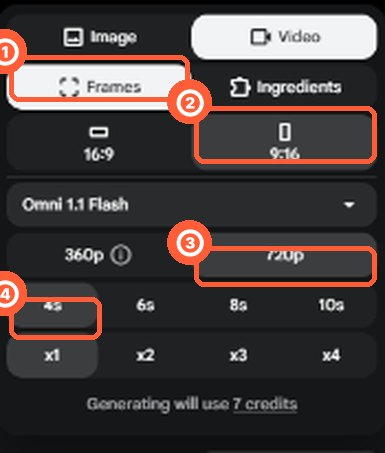
*① 프레임 ② 9:16 ③ 720p ④ 4초 → 7크레딧*
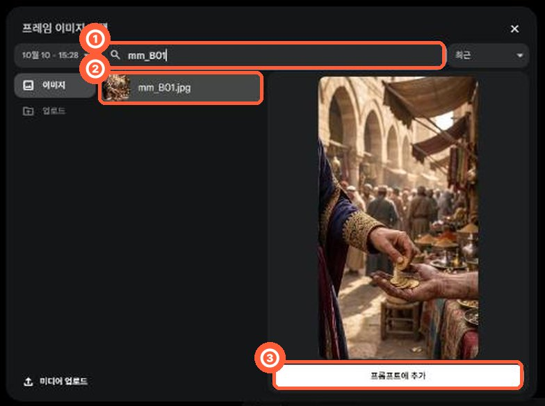
*① 파일 이름 검색 ② 결과 클릭 ③ 프롬프트에 추가*
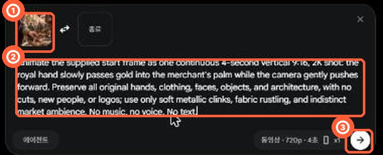
*① 시작 프레임 ② 영상 프롬프트 ③ 생성*

**내려받기**: 영상 클릭 → 오른쪽 위 ① 다운로드 아이콘 → ② **720p** → 파일 이름을 A01.mp4처럼 바꿔 03_영상_Flow에 저장
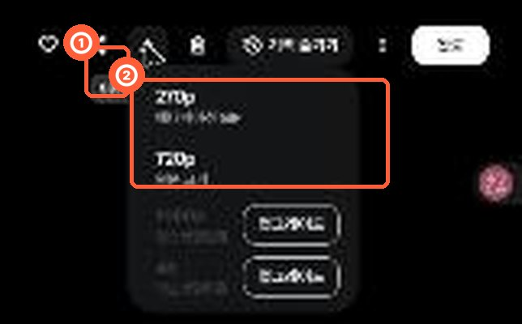
*① 다운로드 ② 720p*

> 💡 무료 계정은 하루 50크레딧 = 4초 영상 7개. 영상이 40개라 계정 여러 개를 바꿔 가며 만들었어요(오른쪽 위 프로필 → 계정 전환). 크레딧은 계정마다 마지막으로 쓴 시각 기준으로 다시 채워져요.
> 💡 **실패**가 뜨면 크레딧은 돌려받아요. 실패 카드의 ↻(다시 시도)를 누르면 같은 설정으로 다시 만들어요.

## 6. MiniMax H3로 영상 만들기 (내 PC, 무료)

- ComfyUI에 MiniMax H3 모델을 설치해 두고, 이미지 1장 + H3용 프롬프트를 넣어 4초(97프레임) 세로 영상을 만들어요.
- 터보 LoRA 8스텝 기준 클립 하나에 약 8\~9분이라, 밤새 돌려 두면 편해요.

## 7. 두 영상 AI 비교

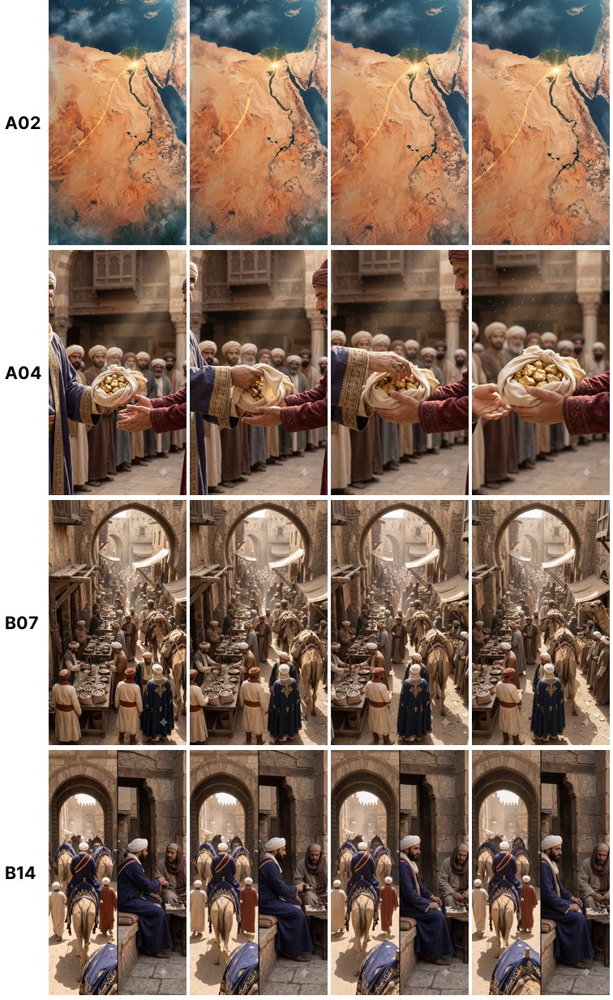
*Flow — 같은 시작 이미지, 0.3 / 1.5 / 2.7 / 3.8초*
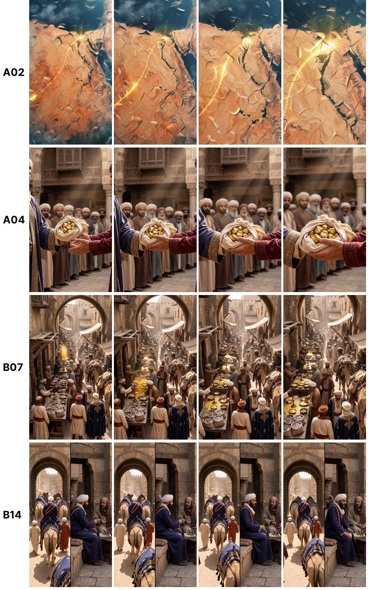
*H3 — 같은 시작 이미지, 같은 시각*

| | Flow · Omni Flash | MiniMax H3 |
|---|---|---|
| 원본 유지 | 처음 이미지 그대로, 움직임은 작고 안정적 | 카메라가 더 크게 움직이고 사람이 앞으로 걸어 나오기도 함 |
| 지도·그래픽 장면 | 금빛 경로가 자연스럽게 반짝임 | 지도 위에 금 간 무늬가 생기는 등 깨지기 쉬움 |
| 속도 · 비용 | 2\~3분 · 클립당 7크레딧 | 8\~9분 · 0원 |
| 이번 결과 | Flow 40개 · H3 40개 생성 | |

> 💡 **지도·그래픽 장면은 Flow**, 사람·풍경 장면은 둘 다 괜찮아요. 크레딧이 모자라면 H3로 채우세요.

## 8. 나레이션

- 대본 문장을 한 줄씩 TTS에 넣어요. **숫자는 한글로** 풀어 써야 정확히 읽어요 (1324년 → 천삼백이십사 년, 25디르함 → 이십오 디르함).
- 이번 예시: 무료 TTS **Supertonic**(PC 실행) · 남성 M3 · 속도 1.1 · 문장마다 wav 1개 (Typecast 같은 웹 TTS도 같은 방법)

<details>
<summary>A안 나레이션 문장</summary>

```text
세계 최고 부자가 금값을 떨어뜨렸습니다.
여기 카이로, 천삼백이십사 년.
역사상 가장 부자로 불리는 말리 제국의 왕, 만사 무사가 메카로 가던 길에 들렀죠.
부자는 돈이 많을수록 좋다고들 하죠. 이 왕은 금이 넘치는 나라의 주인이었으니까요.
그런데 그가 카이로에서 금을 아낌없이 나눠 줬습니다.
기록에 따르면 궁정의 관리들에게 금 한 짐씩, 한 명도 빠짐없이요.
환전상이 이랬을지도 모르죠. 어제 그 손님 다녀가신 뒤로, 금값이 자꾸 내려가요.
실제로 알우마리는 이렇게 적었습니다.
금 일 미트칼이 이십오 디르함 밑으로 내려간 적이 없었는데, 이후엔 이십이 디르함을 넘지 못했다고요.
더 꼬인 건 지금부터입니다.
금을 나눠 주고 물건을 사들이다 보니, 정작 본인의 금이 바닥났다고 전해집니다.
금값이 떨어지더니, 이번엔 금이 떨어진 거죠.
그래서 돌아오는 길에, 카이로 상인들에게 돈을 빌렸다고 전해집니다. 그것도 꽤 높은 이자로요.
금을 뿌린 도시에서, 대출 상담을 받은 셈이죠.
한 사람 탓만은 아니라는 시각도 있지만, 돈이 한꺼번에 풀리면 그 돈의 값이 흔들릴 수 있다는 걸 보여 주는 장면입니다.
가장 부자라던 왕은, 카이로에서 도대체 무슨 짓을 한 걸까요?
```
</details>

<details>
<summary>B안 나레이션 문장</summary>

```text
금 뿌리다가 대출받은 왕이 있습니다.
여기, 천삼백이십사 년 이집트 카이로.
서아프리카 말리 제국의 왕 만사 무사가, 메카 순례길에 이곳을 찾습니다.
뒤엔 엄청난 수행단과 낙타 행렬, 그리고 금, 금, 또 금!
왕은 관리들에게 금을 선물하고, 시장에서도 금을 아낌없이 썼다고 전해집니다.
상인들 눈엔 왕이 아니라, 걸어 다니는 금광이었겠죠.
그런데 금이 너무 많이 풀리자, 금값이 내려가기 시작합니다.
정확히는 금을 은으로 바꿀 때 받는 값이 떨어진 거죠.
당시 기록엔 금 한 단위가 은화 스물다섯 개 이상에서, 스물두 개 이하로 떨어졌다고 나옵니다.
심지어 그 기록은 낮은 금값이 약 십이 년 이어졌다고 전합니다.
다만 십이 년 내내 그랬는지는, 지금도 역사학자들 사이에 이견이 있습니다.
그리고 진짜 반전은 메카를 다녀온 뒤, 귀국길 카이로에서 벌어집니다.
금을 너무 많이 쓴 왕이, 카이로 상인들에게 비싼 이자로 금을 빌렸다고 전해집니다.
들어올 땐 초특급 브이아이피, 나갈 땐 대출 상담 고객.
금 부자도 순례길에선, 당장 쓸 돈이 모자랐던 겁니다.
금도 흔해지면, 은에 비해 값이 떨어질 수 있는 거죠.
이 황당한 순례를 한 문장으로 요약하면?
```
</details>

## 9. 편집 — 신비한 건축사전처럼

| 규칙 | 방법 |
|---|---|
| 나레이션 한 줄 = 컷 하나 | 문장이 시작될 때 그 장면 클립으로 컷 |
| 자막은 2\~5어절씩 | 한 문장을 2\~4조각으로 나눠 화면 가운데 아래, 핵심어만 노랑 |
| 장면마다 큰 라벨 | "카이로 · 1324년", "25 → 22 디르함", "초특급 VIP → 대출 고객" 같은 글자를 화면 위쪽에 크게 |
| 첫 화면 제목 | 첫 장면에만 제목 두 줄(두 번째 줄 노랑) |
| 음악 2곡 | 반전 전까지 **긴장 스릴러**, 반전 문장부터 **웅장한 예고편** |
| 웃음 포인트 | 펀치라인 직전 0.6초 음악을 끊어서 '정적' 만들기 |
| 긴 장면은 두 컷 | 3.2초가 넘으면 반으로 나눠 뒷부분은 두 번째 앵글(없으면 같은 클립 1.35배 확대) |
| 정지 그림 금지 | 영상이 없는 장면을 그림 확대로 버티면 떨려 보여요 → 4\~5단계에서 영상을 꼭 만들기 |
| 끝 | 마지막 질문 문장이 첫 문장으로 이어지게 (루프) |

> 💡 AI 이미지·영상 안에는 글자를 넣지 말고, 숫자·라벨은 **편집에서** 얹어요. AI가 그린 글씨는 깨지기 쉬워요.

## 10. 체크리스트

- [ ] 인기순 레퍼런스 5개 분석
- [ ] 구조 5단계 · 훅 · 웃음 포인트 · 루프 엔딩이 있는 대본
- [ ] 숫자·사실 팩트체크, 불확실하면 "전해진다"
- [ ] 이미지 9:16 · 2K · 실제 장소 배경 · 글자 없음 · 누운 이미지 다시 생성
- [ ] Flow: 프레임 · 9:16 · Omni 1.1 Flash · 720p · 4초
- [ ] H3: 같은 이미지 · H3용 Timeline 프롬프트
- [ ] 숫자는 한글로 풀어 나레이션
- [ ] 3.2초 넘는 장면은 두 번째 앵글로 두 컷
- [ ] 자막 2\~5어절 · 장면 라벨 · 반전에서 음악 교체
