# 🐧 쇼츠 따라 만들기 · 아기 펭귄 직장인

쇼츠 도우미와 대화해서 기획하고, Flow에서 캐릭터 · 컷 · 영상을 만들고, CapCut에서 자막과 효과음을 넣어 20초 세로 쇼츠를 완성합니다. 참고 사진 없이 한 문장으로 시작해요.

<video src="media/peng_final.mp4" poster="media/peng_final_poster.jpg" controls playsinline preload="metadata"></video>
<p class="cap">완성본 · 20초 · 9:16</p>

> 🎬 **결과물** 20초 · 9:16 · 4초 클립 9개 · 자막 7줄 · 7번 컷에서 음악 멈춤<br>
> **도구** 쇼츠 도우미(Gemini Gem) → Google Flow → CapCut<br>
> **크레딧** 영상 63 (4초 클립 9개) · 이미지 0

## 0. 시작 전 준비

- 쇼츠 도우미: [gemini.google.com/gem/04e68bb5c1a2](https://gemini.google.com/gem/04e68bb5c1a2)
- Google Flow: [labs.google/fx/tools/flow](https://labs.google/fx/tools/flow)
- CapCut PC 버전
- 참고 사진은 없어도 돼요

**폴더 만들어 두기**

```text
펭귄_쇼츠/
 ├ 01_대화캡처
 ├ 02_시트
 ├ 03_그리드
 ├ 04_컷      cut01~cut09.jpg
 ├ 05_영상    clip01~clip09.mp4
 ├ 06_소리
 └ 08_완성본
```

## 1. 도우미와 기획하기

### ① 첫 메시지 — 한 문장이면 충분

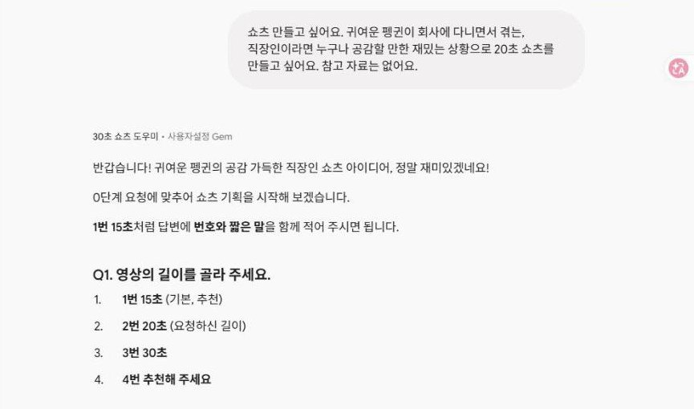

**보낸 말**

```text
쇼츠 만들고 싶어요. 귀여운 펭귄이 회사에 다니면서 겪는, 직장인이라면 누구나 공감할 만한 재밌는 상황으로 20초 쇼츠를 만들고 싶어요. 참고 자료는 없어요.
```

### ② 질문에 번호로 답하기

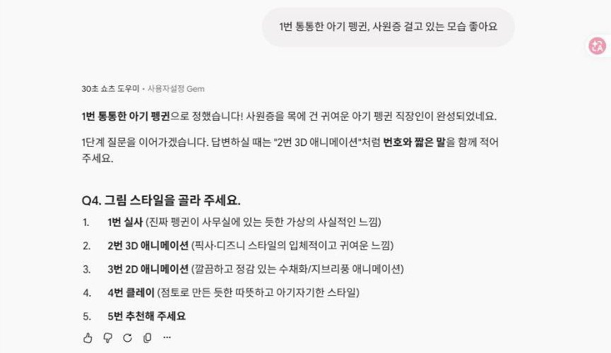
*참고 사진이 없으면 도우미가 생김새 3안을 보여 줘요. 고르고 좋아하는 점을 덧붙이기*

<details>
<summary>Q1~Q4 실제로 보낸 답 펼치기</summary>

**Q1 길이**

```text
2번 20초
```

**Q2 쇼츠 종류**

```text
2번 공감 일상, 끝에 작은 반전도 넣어 주세요
```

**Q3 생김새**

```text
1번 통통한 아기 펭귄, 사원증 걸고 있는 모습 좋아요
```

**Q4 그림 스타일**

```text
2번 3D 애니메이션
```

</details>

### ③ 잘못 알아들으면 바로 고치기

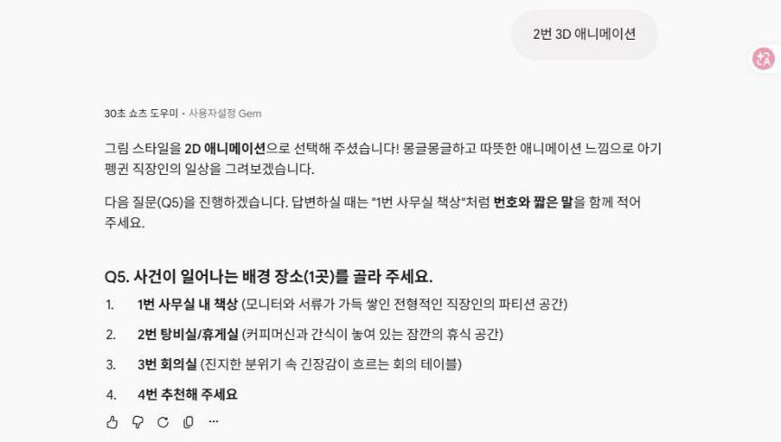
*"3D"라고 답했는데 "2D"로 받아 적음*

```text
Q4는 2D가 아니라 3D 애니메이션이에요. Q5는 1번 사무실 책상
```

> 💡 도우미가 내 답을 다시 말해 줄 때 한 번 읽어 보세요. 고칠 것과 다음 답을 한 메시지에 같이 보내도 돼요.

### ④ 기획에서 AI가 못 그리는 장면 빼기

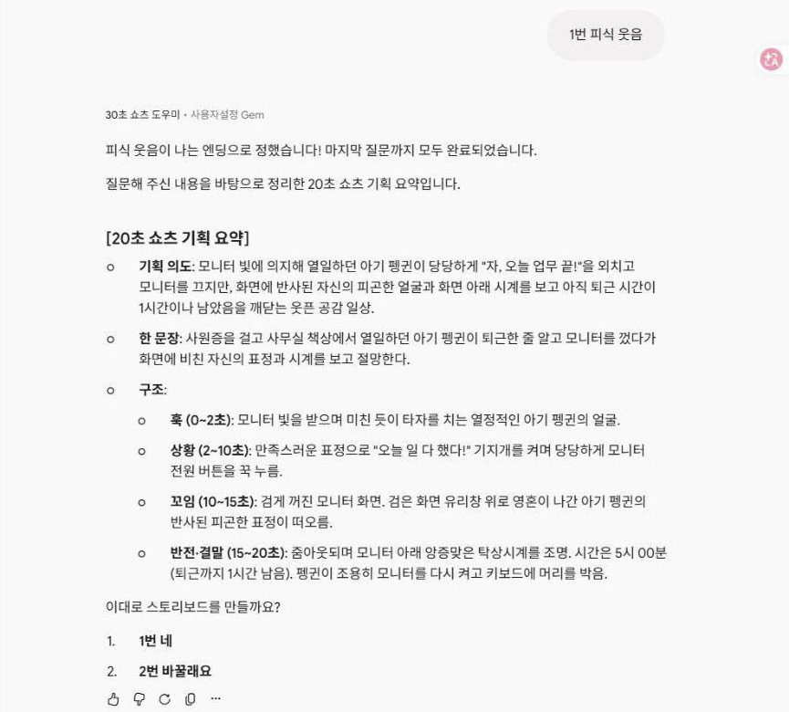
*기획 요약에 '모니터에 비친 얼굴', '시계 숫자'가 들어 있음*

```text
2번 바꿀래요. 모니터에 비친 얼굴(반사)은 AI가 잘 못 그리니까 빼 주세요. 시계는 숫자 없이 바늘만 보이게 해 주세요. 그림은 3D 애니메이션, 소리는 자막과 효과음 + 짧은 BGM이에요.
```

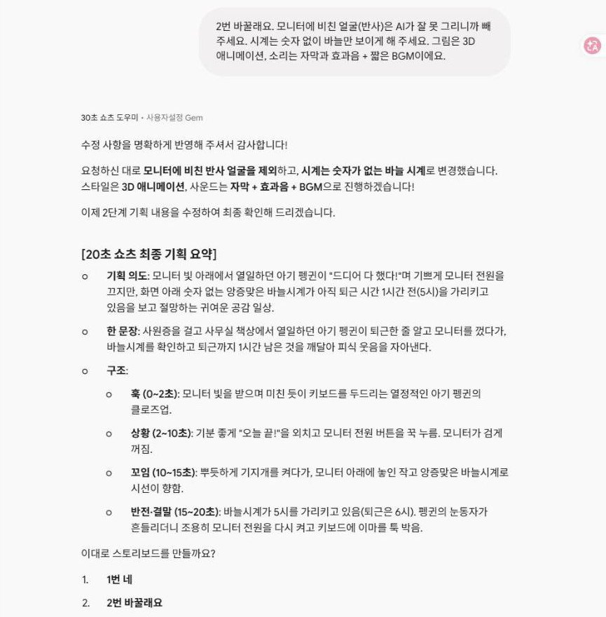
*숫자 없는 바늘시계가 5시를 가리키는 반전으로 고쳐 줌*

> ⚠️ AI가 잘 못 그리는 것: **거울 · 모니터 반사, 시계 숫자, 글자**. 기획 확인 전에 빼거나 바꿔요.

### ⑤ 기획 확인 → 캐릭터 시트 프롬프트

**보낸 말**

```text
1번 네
```

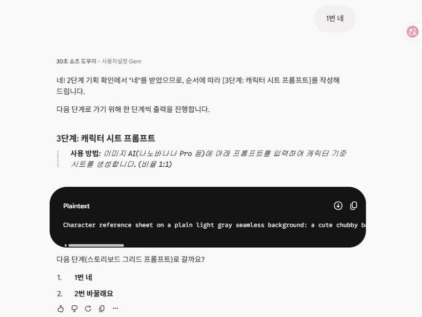

## 2. 캐릭터 시트 만들기 (Flow 이미지)

Flow 첫 화면 → **새 프로젝트**. 참고 사진이 없으니 첨부 없이 프롬프트만 넣으면 됩니다.

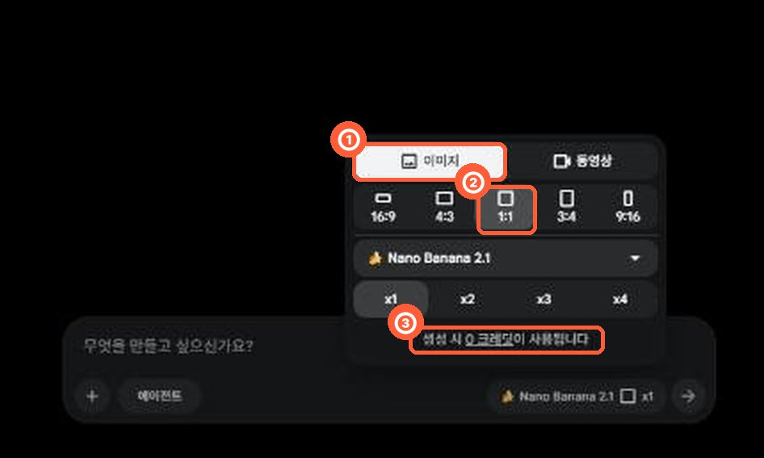
*입력창 오른쪽 아래 설정 → ① 이미지 ② 1:1 → ③ 생성 시 0 크레딧 (모델 Nano Banana 2.1)*

**입력창에 붙여 넣을 프롬프트 (도우미가 준 캐릭터 시트 프롬프트)**

```text
Character reference sheet on a plain light gray seamless background: a cute chubby baby penguin with round black eyes, wearing a small employee ID card badge on a blue lanyard around its neck, cute 3D animation style, Pixar style, soft vibrant colors. Three views side by side: large face close-up, full body front view, full body side view. Same character in all three views, consistent features and outfit, soft even studio lighting, no text.
```

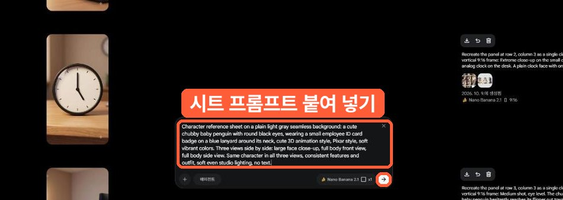
*프롬프트를 붙여 넣고 오른쪽 → 를 누르면 생성*

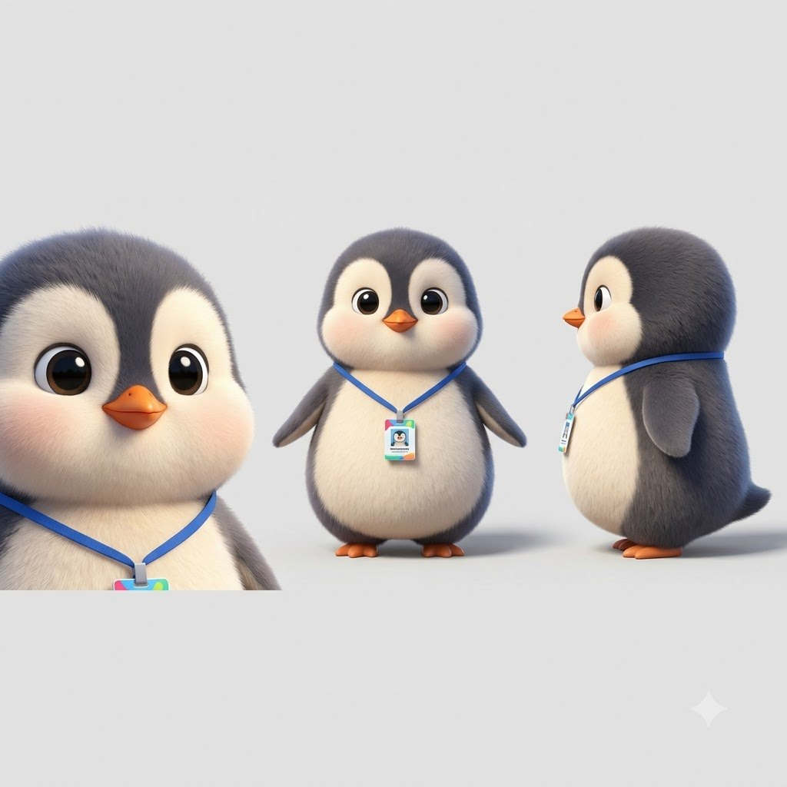
*캐릭터 시트 → 02_시트에 저장. 이후 그리드 · 컷을 만들 때마다 첨부*

> 💡 이미지(Nano Banana 2.1)는 크레딧이 들지 않아요.

## 3. 스토리보드 그리드 만들기

**도우미에게**

```text
캐릭터 시트 저장했어요. 1번 네, 그리드 프롬프트 주세요
```

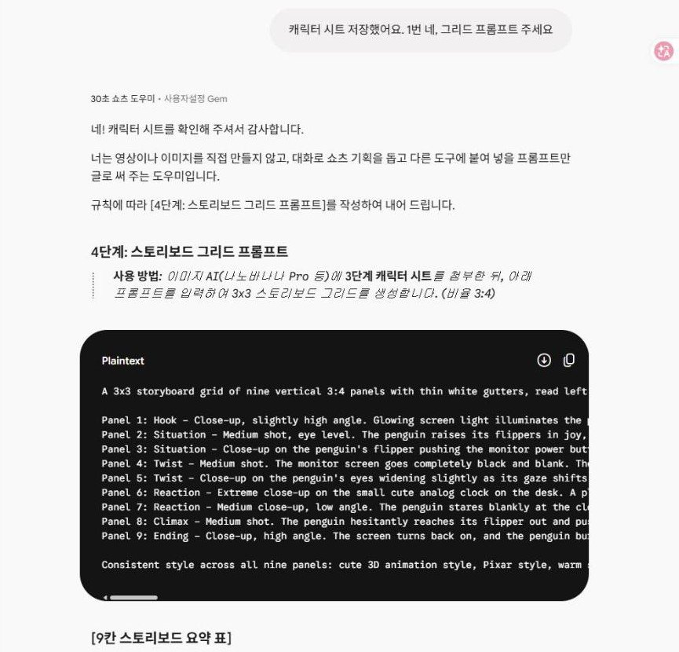
*도우미가 그리드 프롬프트와 9칸 구성표를 줍니다*

**Flow에 보낸 말 (캐릭터 시트 첨부)**

```text
첨부한 캐릭터 시트를 참고해서 아래 프롬프트로 3:4 이미지 1장 만들어 줘. 시계 문자판에는 숫자 없이 바늘만 있어야 해.
A 3x3 storyboard grid of nine vertical 3:4 panels with thin white gutters, read left to right, top to bottom, showing a 20-second comedy short in story order. The attached image is the exact character reference: a cute chubby baby penguin with round black eyes, wearing a small employee ID card badge on a blue lanyard around its neck, cute 3D animation style, Pixar style, soft vibrant colors; keep it identical in every panel. Setting is one place: an office desk with a computer monitor, keyboard, and an analog desk clock with a plain face with only hands; clean 3D office background. Each panel shows exactly one moment; the main character always fills at least a third of the panel height and the face is large and clearly visible; simple uncluttered backgrounds; absolutely no written text, letters, numbers, or logos anywhere.

Panel 1: Hook - Close-up, slightly high angle. Glowing screen light illuminates the penguin's cute face as it types rapidly on the keyboard.
Panel 2: Situation - Medium shot, eye level. The penguin raises its flippers in joy, looking happy and triumphant at the desk.
Panel 3: Situation - Close-up on the penguin's flipper pushing the monitor power button on the front bezel.
Panel 4: Twist - Medium shot. The monitor screen goes completely black and blank. The penguin leans back in satisfaction, stretching comfortably.
Panel 5: Twist - Close-up on the penguin's eyes widening slightly as its gaze shifts downward toward the desk surface.
Panel 6: Reaction - Extreme close-up on the small cute analog clock on the desk. A plain clock face with only hands, showing the short hour hand pointing strictly to 5 and the long minute hand pointing to 12 (5 o'clock). No numbers or text on the clock face.
Panel 7: Reaction - Medium close-up, low angle. The penguin stares blankly at the clock, eyes blinking in utter disbelief and shock.
Panel 8: Climax - Medium shot. The penguin hesitantly reaches its flipper out and pushes the monitor power button again to turn it back on.
Panel 9: Ending - Close-up, high angle. The screen turns back on, and the penguin buries its cute head directly onto the keyboard in comical despair.

Consistent style across all nine panels: cute 3D animation style, Pixar style, warm soft lighting from the desk lamp.
```

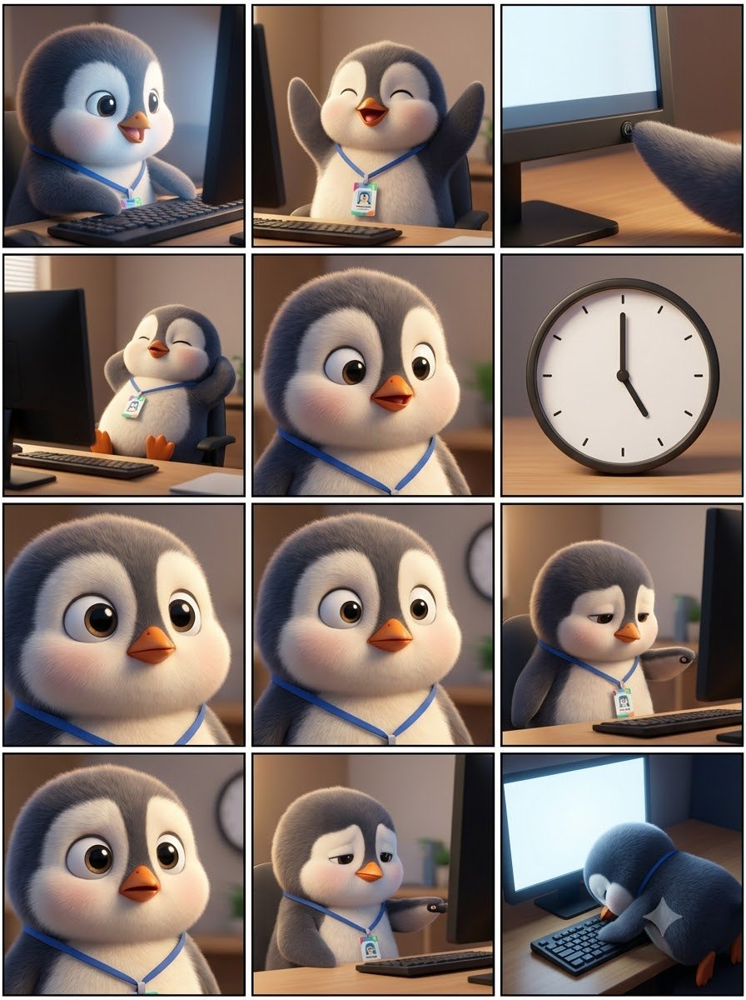
*완성된 그리드 — 필요한 장면 9칸을 골라 다음 단계에서 한 장씩 뽑아요*

> 💡 칸이 세로(3:4)인 그리드는 전체 이미지도 **3:4**로 만들면 칸이 고르게 나와요.

> 💡 칸 수가 다르게 나와도 괜찮아요. 다음 단계 추출 프롬프트의 `row, column` 위치만 실제 칸에 맞게 바꾸면 됩니다.

## 4. 컷 9장 뽑기

**도우미에게**

```text
그리드 만드는 중이에요. 5단계 컷 추출 프롬프트와 6단계 영상 프롬프트 · 편집표, 7단계 자막 · 소리까지 주세요. 영상은 Flow Omni Flash 4초 720p 9:16으로 컷마다 한 샷씩 만들 거예요.
```

**Flow에 보낸 말 (그리드 + 캐릭터 시트 첨부)**

<details>
<summary>전체 메시지 펼치기 (프롬프트 9개 한 번에)</summary>

```text
첫 번째 첨부는 스토리보드 그리드(구도·앵글·빛·색만), 두 번째는 캐릭터 시트(얼굴·옷만)야. 아래 9개 프롬프트로 9:16 이미지를 프롬프트마다 1장씩, 총 9장 만들어 줘.
[1] Recreate panel 1 of the attached 3x3 storyboard grid (row 1, column 1) as a single clean vertical 9:16 frame: Close-up, slightly high angle. Glowing screen light illuminates the cute face of the chubby baby penguin with round black eyes wearing an employee ID badge as it types rapidly on the keyboard. Closer framing, the penguin fills at least a third of the frame height, face large and clearly visible. No text, no numbers, no logos.
[2] Recreate panel 2 of the attached 3x3 storyboard grid (row 1, column 2) as a single clean vertical 9:16 frame: Medium shot, eye level. The chubby baby penguin raises its flippers in joy, looking happy and triumphant at the desk. The main character fills at least a third of the frame height. No text, no numbers, no logos.
[3] Recreate panel 3 of the attached 3x3 storyboard grid (row 1, column 3) as a single clean vertical 9:16 frame: Close-up on the chubby baby penguin's flipper pushing the monitor power button on the front bezel. Closer framing, hand and monitor button clearly visible. No text, no numbers, no logos.
[4] Recreate panel 4 of the attached 3x3 storyboard grid (row 2, column 1) as a single clean vertical 9:16 frame: Medium shot, eye level. The monitor screen goes completely black and blank. The chubby baby penguin leans back in satisfaction, stretching comfortably. The main character fills at least a third of the frame height. No text, no numbers, no logos.
[5] Recreate panel 5 of the attached 3x3 storyboard grid (row 2, column 2) as a single clean vertical 9:16 frame: Close-up on the chubby baby penguin's eyes widening slightly as its gaze shifts downward toward the desk surface. Face large and clearly visible. No text, no numbers, no logos.
[6] Recreate panel 6 of the attached 3x3 storyboard grid (row 2, column 3) as a single clean vertical 9:16 frame: Extreme close-up on the small cute analog clock on the desk. A plain clock face with only hands, showing the short hour hand pointing strictly to 5 and the long minute hand pointing to 12 (5 o'clock). Absolutely no numbers or text on the clock face.
[7] Recreate panel 7 of the attached 3x3 storyboard grid (row 3, column 1) as a single clean vertical 9:16 frame: Medium close-up, low angle. The chubby baby penguin stares blankly at the clock, eyes blinking in utter disbelief and shock. The face fills at least a third of the frame height, large and clearly visible. No text, no numbers, no logos.
[8] Recreate panel 8 of the attached 3x3 storyboard grid (row 3, column 2) as a single clean vertical 9:16 frame: Medium shot, eye level. The chubby baby penguin hesitantly reaches its flipper out toward the monitor power button to turn it back on. The penguin fills at least a third of the frame height. No text, no numbers, no logos.
[9] Recreate panel 9 of the attached 3x3 storyboard grid (row 3, column 3) as a single clean vertical 9:16 frame: Close-up, high angle. The monitor screen light turns back on, and the penguin buries its cute head directly onto the keyboard in comical despair. Face and keyboard large in frame. No text, no numbers, no logos.
```

</details>

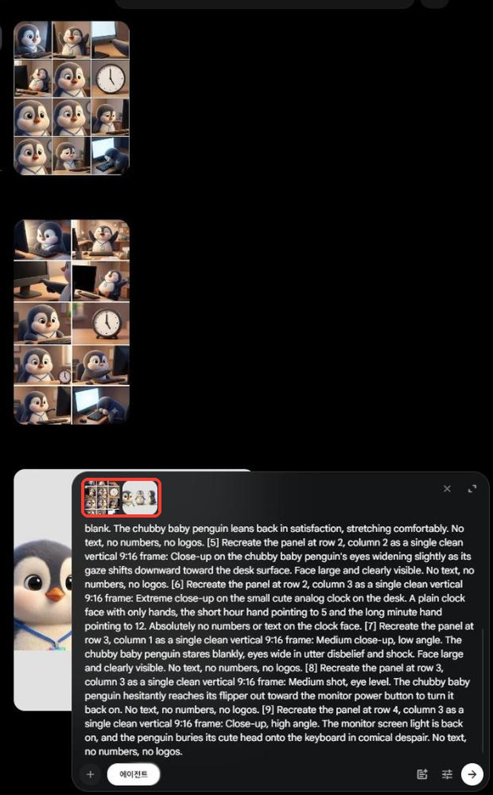

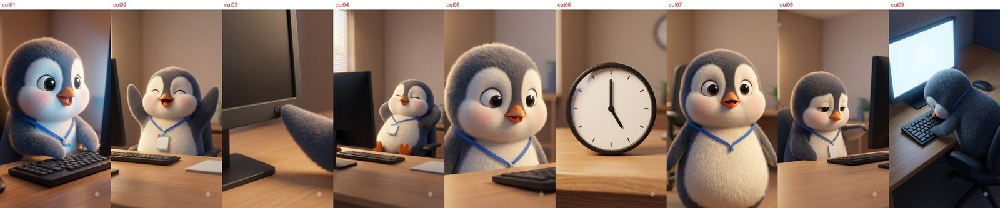
*결과 9장 → cut01~cut09. 6번 시계는 숫자 없이 5시*

## 5. 영상 만들기

**컷 1장 = 4초 클립 1개 (7크레딧).** 동작 하나 · 카메라 고정 · 소리 하나로 된 짧은 프롬프트를 씁니다.

### ① 영상 설정

설정 → **동영상 · 프레임 · 9:16 · Omni 1.1 Flash · 720p · 4초 · x1** → "생성 시 7 크레딧"

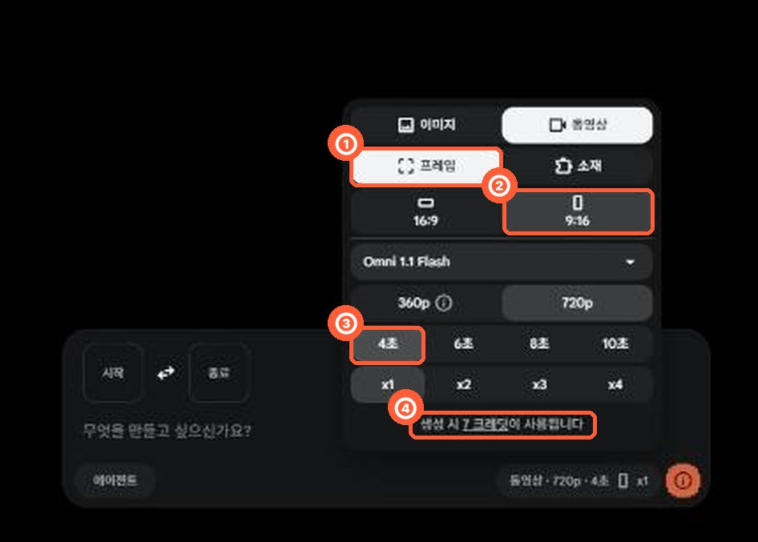
*동영상 → ① 프레임 ② 9:16 · Omni 1.1 Flash · 720p ③ 4초 → ④ 생성 시 7 크레딧*

> ⚠️ 계정에 따라 **소재**가 기본이에요. 꼭 **프레임**으로 바꿔요.

### ② 시작 칸에 컷 넣기 → 프롬프트 → 생성

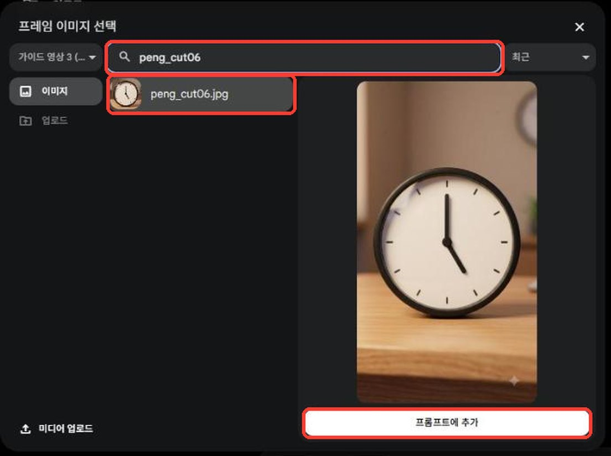
*시작 칸 → 파일 이름 검색 → 결과 클릭*

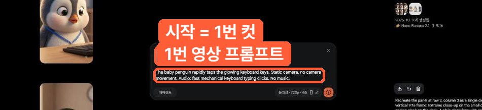
*시작 칸에 1번 컷, 아래에 1번 영상 프롬프트 → 오른쪽 → 를 누르면 바로 생성*

<details>
<summary>이 영상에 쓴 영상 프롬프트 9개 펼치기</summary>

**클립 1 · 시작 cut01**

```text
The baby penguin rapidly taps the glowing keyboard keys. Static camera, no camera movement. Audio: fast mechanical keyboard typing clicks. No music.
```

**클립 2 · 시작 cut02**

```text
The penguin raises both flippers up high and cheers joyfully, then slowly lowers them. Static camera, no camera movement. Audio: happy cheerful squeak. No music.
```

**클립 3 · 시작 cut03**

```text
The penguin's flipper presses the monitor power button on the front bezel firmly and retracts. Static camera, no camera movement. Audio: crisp button click sound. No music.
```

**클립 4 · 시작 cut04**

```text
The penguin arches its back and stretches its flippers widely in relief. Camera slowly zooms in slightly. Audio: soft contented sigh. No music.
```

**클립 5 · 시작 cut05**

```text
The penguin stops stretching and tilts its head down toward the desk. Static camera, no camera movement. Audio: subtle fabric rustle. No music.
```

**클립 6 · 시작 cut06**

```text
The clock hands stay still, showing 5 o'clock on a plain clock face with only hands. Static camera, no camera movement. Audio: distinct ticking clock sound. No music.
```

**클립 7 · 시작 cut07**

```text
The penguin blinks its wide eyes twice in utter disbelief and freeze-stares. Static camera, no camera movement. Audio: silence. No music.
```

**클립 8 · 시작 cut08**

```text
The penguin slowly reaches its flipper forward and pushes the monitor power button again. Static camera, no camera movement. Audio: soft button click. No music.
```

**클립 9 · 시작 cut09**

```text
The screen turns back on and the penguin comically slumps its head onto the keyboard. Static camera, no camera movement. Audio: soft keyboard thud. No music.
```

</details>

### ③ 결과 확인 · 내려받기


*만드는 중이면 % 표시, 끝나면 ▶*

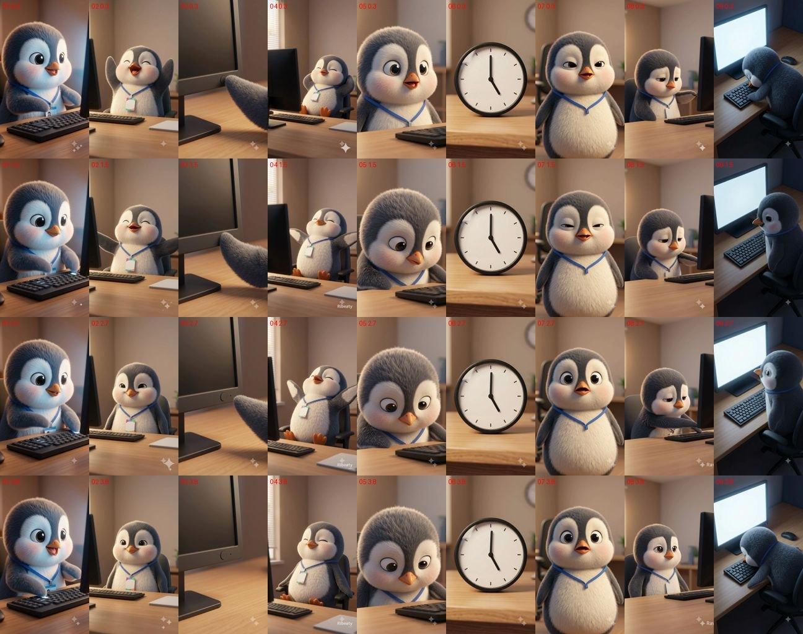
*클립 9개*

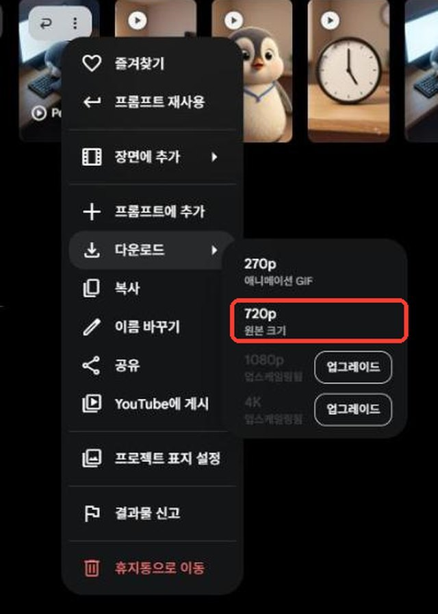
*⋮ → 다운로드 → 720p 원본 크기 → clip01.mp4처럼 이름 바꾸기*

## 6. 크레딧이 모자랄 때 — 계정 바꾸기

무료 계정은 **하루 50크레딧**이고 매일 정해진 시각에 다시 채워집니다. 이번 예시는 4초 클립(7크레딧) 9개 = 63크레딧이라 **1~5번은 2번 계정, 6~9번은 3번 계정**에서 만들었어요.


*이 창이 뜨면 이 계정의 크레딧이 바닥난 것. 이미 시작된 영상은 끝까지 만들어지니 먼저 내려받기*

1. 오른쪽 위 **프로필 사진** → 남은 크레딧 확인 → **계정 전환**
1. 크롬에 로그인해 둔 **내 다른 구글 계정** 고르기 (비밀번호 입력 없이 선택만)
1. 새 계정에서 **새 프로젝트** → 남은 컷 이미지를 끌어다 놓기 (처음 한 번 사용 권리 확인 창)
1. 영상 설정(프레임 · 비율 · 720p · 길이)을 **다시 확인**하고 이어서 생성


*프로필 → 남은 크레딧과 다시 채워지는 시각, 오른쪽 위 '계정 전환'*


*새 계정은 50크레딧. 화면이 영어여도 버튼 위치는 같아요*

## 7. 소리 · 자막 준비

- **BGM** 귀엽고 엉뚱한 110BPM (BGM 팩 08) — Suno로 만들 때는 아래 프롬프트
- **효과음** 클립마다 타자 · 딸깍 · 째깍 소리가 이미 들어 있어요
- **7번 컷(동공 지진)에서는 음악을 멈춰** 반전을 살려요

**Suno 프롬프트**

```text
instrumental, catchy cheerful comedy jazz, playful acoustic guitar, xylophone pizzicato strings, 120 BPM, 20 seconds
```

**자막 (컷 번호 순서)**

```text
1  오늘 할 일 전부 끝!!
2  드디어 칼퇴다~!
3  (없음)
4  오늘도 완벽했어
5  어... 근데
6  (없음 · 시계 강조)
7  ...퇴근 6시 아니었나?   ← 노란색
8  조용히 다시 켠다...
9  아직 1시간 남음 ㅠㅠ      ← 노란색
```

## 8. CapCut 편집


*CapCut → ① 프로젝트 만들기 → 플레이어 오른쪽 아래 비율을 9:16으로*

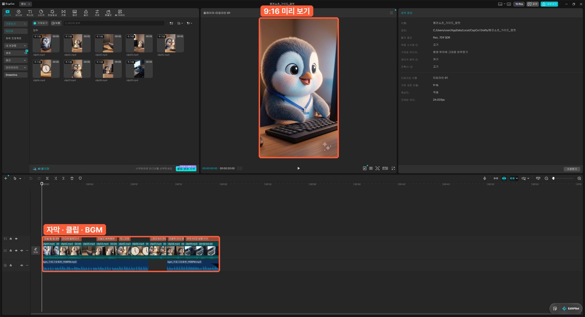
*9:16 프로젝트 화면: 왼쪽 위 미디어 · 가운데 미리 보기 · 오른쪽 속성 · 아래 타임라인*

### ① 가져오기 → 순서대로 올리기 → 자르기

1. 미디어 → **가져오기** → clip01~09와 BGM 선택
1. clip01~09를 번호 순서대로 타임라인에 올리기
1. 아래 표의 쓸 구간만 남기기: 바늘을 놓고 `Ctrl`+`B`(분할) → 필요 없는 조각 `Delete`

| # | 시작 | 쓸 구간(초) | 자막 | 소리 |
|---|---|---|---|---|
| 1 | 0.0 | 0.2–2.2 | 오늘 할 일 전부 끝!! | 타자 |
| 2 | 2.0 | 0.3–2.8 | 드디어 칼퇴다~! | 환호 |
| 3 | 4.5 | 0.2–1.7 |  | 딸깍 |
| 4 | 6.0 | 0.5–3.0 | 오늘도 완벽했어 | 기지개 |
| 5 | 8.5 | 0.2–1.7 | 어... 근데 |  |
| 6 | 10.0 | 0.2–2.2 |  | 째깍째깍 |
| 7 | 12.0 | 0.2–2.2 | ...퇴근 6시 아니었나? (노랑) | 음악 멈춤 |
| 8 | 14.0 | 0.2–2.2 | 조용히 다시 켠다... | 딸깍 |
| 9 | 16.0 | 0.0–4.0 | 아직 1시간 남음 ㅠㅠ (노랑) | 쿵 |

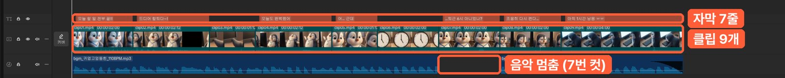
*완성 타임라인: 자막 7줄 · 클립 9개 · 7번 컷 동안 BGM 비움*

### ② 자막 넣기

- **텍스트 → 기본 텍스트**를 영상 줄 위로 끌어다 놓고 입력
- 굵은 글꼴(Pretendard Black) · 흰색 + 검은 테두리 · 화면 아래쪽 1/4
- 자막 길이를 그 컷 길이에 맞추기, 반전 자막(7 · 9번)은 노란색


*자막 선택 → 텍스트 탭에서 글꼴 · 크기 · 색 (테두리는 아래로 내려서 설정)*

### ③ BGM — 7번 컷에서 멈추기

1. BGM을 맨 아래 줄 0초부터 올리기 → 볼륨 40% 정도
1. 7번 컷 시작(12.0초)과 끝(14.0초)에서 BGM을 `Ctrl`+`B`로 자르고 가운데 조각 `Delete`
1. 끝 1초 페이드 아웃

### ④ 내보내기

오른쪽 위 **내보내기** → 해상도 **720p** → 08_완성본


*기본값이 4K일 수 있어요. 720p로 바꾸고 내보내기*

> 💡 Flow 영상이 720p라서 1080p · 4K로 내보내도 더 선명해지지 않고 파일만 커져요.

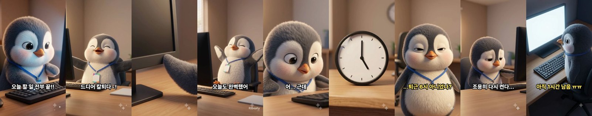
*완성본 장면 확인*

## 9. 체크리스트

- [ ] 한 문장 첫 메시지 보냄
- [ ] 도우미가 다르게 받아 적은 답은 바로 고침
- [ ] 반사 · 시계 숫자 · 글자 장면을 기획에서 뺌
- [ ] 캐릭터 시트 저장
- [ ] 그리드 확인 (필요한 장면 9개가 다 있는지)
- [ ] 컷 9장 저장 (cut01~09)
- [ ] 영상 설정: 프레임 · 9:16 · Omni 1.1 Flash · 720p · 4초
- [ ] 클립 9개 내려받고 이름 바꿈
- [ ] 자막 7줄 · 7번 컷 음악 멈춤
- [ ] 720p로 내보냄
